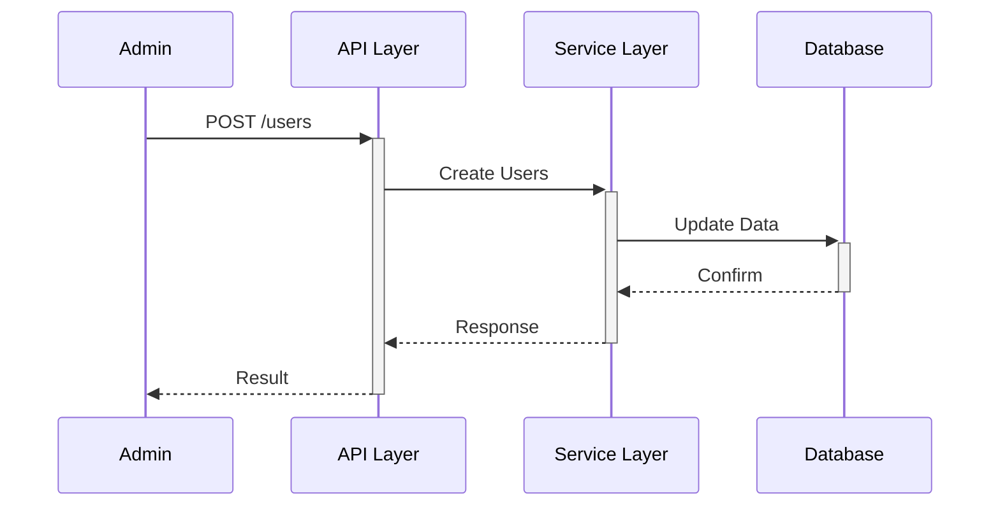

<p align="center">
  
</p>

# RE-cue

*Cue your software RE-development journey*

RE-cue will assist in reverse engineering software products based on source code evaluation. RE-cue was born out of dealing with the complexities of "brownfield" development. Software development is hardest when you enter an existing project and are asked to maintain or improve a project that you are inheriting in an unknown state. That is where RE-cue comes in. RE-cue will review an existing code base and generate architectural documentation for code owners.

## Important Disclaimer

**⚠️ AUTHORIZED USE ONLY - CODE OWNERS EXCLUSIVELY ⚠️**

**RE-cue is intended to be used BY and FOR OWNERS OF THE SOURCE CODE to be analyzed. RE-cue is designed exclusively for legitimate code owners to analyze, document, and understand their own codebases.**

**🚫 PROHIBITED USES:**
- Reverse engineering copyrighted software without proper authorization
- Analysis of patented algorithms or proprietary code without ownership rights
- Any use on code where you do not hold explicit ownership or authorized access rights
- Commercial or competitive analysis of third-party software

**✅ INTENDED USES:**
- Analysis of your own proprietary code
- Documentation of legacy systems you own or maintain
- Understanding inherited codebases within your organization
- Internal code auditing and documentation for owned projects

>**LEGAL NOTICE:** This project is provided "as is" without warranty of any kind, either expressed or implied, including but not limited to the implied warranties of merchantability and fitness for a particular purpose. No warranties are made or to be inferred regarding the accuracy, completeness, reliability, or suitability of this software for any purpose. Users are solely responsible for ensuring their use complies with all applicable laws, including but not limited to copyright, patent, and trade secret laws. Use at your own risk and legal responsibility.

## Overview

RE-cue is a comprehensive reverse engineering toolkit designed to help software teams understand and document their existing codebases. This suite analyzes source code to generate detailed documentation and specifications, making it easier to maintain, extend, and modernize legacy systems.

**Key Capabilities:**
- **Feature Specifications** (spec.md) - Business-focused documentation of existing functionality
- **Implementation Plans** (plan.md) - Technical analysis and architectural documentation
- **Data Model Documentation** (data-model.md) - Comprehensive data structure analysis
- **API Contracts** (api-spec.json) - OpenAPI 3.0 specifications for existing endpoints
- **Use Case Analysis** (use-cases.md) - ✨ **NEW** Actor identification, system boundaries, and business process documentation with transaction/validation/workflow analysis
- **Interactive Use Case Refinement** - ✨ **NEW** Edit and improve generated use cases through an interactive text-based interface
- **Business Process Visualization** (diagrams.md) - ✨ **NEW** Mermaid.js diagrams: flowcharts, sequence diagrams, component diagrams, ER diagrams, and architecture overviews

**Primary Use Cases:**
- � **Legacy System Documentation** - Generate comprehensive docs for undocumented codebases
- 🔄 **Brownfield Project Onboarding** - Help new team members understand inherited projects
- 📋 **Code Modernization** - Create foundation documentation for refactoring efforts
- � **System Analysis** - Understand complex codebases through automated analysis

## Why Use RE-cue?

🎯 **Automated Documentation** - Transform source code into readable specifications  
📋 **Standardized Output** - Consistent documentation formats across projects  
🚀 **Rapid Understanding** - Quickly grasp complex legacy systems  
📊 **Multiple Formats** - Generate various documentation types from single analysis  
📝 **Business-Friendly** - Creates documentation accessible to technical and non-technical stakeholders  
✨ **Business Context Analysis** - Extracts transaction boundaries, validation rules, and workflow patterns from Spring Boot annotations

## ✨ NEW: Use Case Analysis Feature

The Python version now includes comprehensive use case analysis that automatically:

### 🎯 **Actor Identification**
- Discovers system actors from security annotations (`@PreAuthorize`, `@Secured`)
- Maps roles to system boundaries (Admin Console, Customer Portal, API)
- Identifies external systems and third-party integrations

### 🏗️ **Business Process Detection**
- **Transaction Analysis**: Extracts `@Transactional` boundaries with propagation and isolation levels
- **Validation Rules**: Parses Jakarta/Hibernate validation annotations (`@NotNull`, `@Size`, `@Email`, `@Pattern`, etc.)
- **Workflow Patterns**: Identifies async operations (`@Async`), scheduled tasks (`@Scheduled`), and retry logic (`@Retryable`)

### 📋 **Enhanced Use Case Documentation**
Generates use-cases.md with:
- **Preconditions**: Derived from transaction and validation requirements
- **Postconditions**: Based on transaction commits and workflow completions
- **Extension Scenarios**: Realistic failure cases from validation rules and workflow patterns
- **Business Context Metrics**: Transaction boundaries, validation rules, workflow patterns, derived business rules

### 📊 **Example Output**

```markdown
## UC-001: Create Order

**Primary Actor**: Customer  
**System Boundary**: Customer Portal  
**Goal**: Submit a new product order

### Business Context
- **Transaction Boundaries**: 3
- **Validation Rules**: 8
- **Workflow Patterns**: 2
- **Business Rules**: 12

### Preconditions
- User must be authenticated with CUSTOMER role
- Shopping cart must not be empty
- Payment information must be valid (validated: card number format, expiration date)
- Shipping address must be complete (validated: required fields, postal code format)

### Main Success Scenario
1. Customer reviews items in cart
2. System validates cart contents and pricing
3. Customer enters payment information
4. System processes payment asynchronously
5. System creates order (REQUIRES_NEW transaction)
6. System sends confirmation email

### Postconditions
- Order record committed to database
- Payment transaction completed
- Confirmation email queued for delivery
- Inventory updated

### Extensions
- **2a**: Cart contains out-of-stock items → System notifies customer and removes unavailable items
- **3a**: Payment card fails validation → System displays field-level errors
- **4a**: Payment processing times out → System retries with exponential backoff (max 3 attempts)
- **5a**: Order creation fails → System rolls back transaction and notifies customer
```

### 🔧 **Usage**

Generate use case documentation:
```bash
# Python version (recommended for use cases)
python3 -m reverse_engineer --use-cases ~/projects/my-spring-app

# With verbose output
python3 -m reverse_engineer --use-cases --verbose ~/projects/my-spring-app

# Phased analysis (resumable)
python3 -m reverse_engineer --use-cases --phased ~/projects/my-spring-app

# Interactively refine generated use cases
python3 -m reverse_engineer --refine-use-cases re-my-spring-app/phase4-use-cases.md
```

See [docs/PHASE5-BUSINESS-CONTEXT-SUMMARY.md](docs/PHASE5-BUSINESS-CONTEXT-SUMMARY.md) for complete feature documentation and [docs/INTERACTIVE-USE-CASE-REFINEMENT.md](docs/INTERACTIVE-USE-CASE-REFINEMENT.md) for interactive refinement guide.

## ✨ NEW: Business Process Visualization

The Python version now includes comprehensive diagram generation using Mermaid.js syntax that automatically creates:

### 📊 **Diagram Types**

- **Flowcharts**: Visualize use case scenarios with decision points and alternative paths
- **Sequence Diagrams**: Show actor-system interactions and message flows  
- **Component Diagrams**: Display system architecture and component relationships
- **Entity Relationship Diagrams**: Illustrate data model structures and relationships
- **Architecture Diagrams**: Provide high-level system architecture overviews

### 🔧 **Usage**

Generate visualization diagrams:
```bash
# Generate all diagram types
recue --diagrams ~/projects/my-spring-app

# Generate specific diagram type
recue --diagrams --diagram-type flowchart ~/projects/my-spring-app
recue --diagrams --diagram-type sequence ~/projects/my-spring-app
recue --diagrams --diagram-type component ~/projects/my-spring-app
recue --diagrams --diagram-type er ~/projects/my-spring-app
recue --diagrams --diagram-type architecture ~/projects/my-spring-app

# Combined with use cases
recue --use-cases --diagrams ~/projects/my-spring-app

# Full documentation with diagrams
recue --spec --plan --use-cases --diagrams --description "Project Analysis"
```

### 📋 **Example Output**

Generated diagrams use Mermaid.js syntax that renders directly on GitHub:

````markdown
### Sequence Diagram: Admin Interactions


````

### 👀 **Viewing Diagrams**

- **GitHub**: Mermaid diagrams render automatically in GitHub Markdown files
- **VS Code**: Use "Markdown Preview Mermaid Support" extension
- **Online**: Copy/paste to https://mermaid.live/ for interactive editing
- **Export**: Use Mermaid CLI to export as PNG/SVG/PDF

See [docs/features/business-process-visualization.md](docs/features/business-process-visualization.md) for complete diagram documentation.

## Supported Frameworks

RE-cue automatically detects and analyzes multiple technology stacks:

| Framework | Language | Version | Status | Guide |
|-----------|----------|---------|--------|-------|
| **Spring Boot** | Java | 2.x, 3.x | ✅ Full Support | [Java Spring Guide](docs/frameworks/java-spring-guide.md) |
| **Ruby on Rails** | Ruby | 6.x, 7.x | ✅ Full Support | [Rails Guide](docs/frameworks/ruby-rails-guide.md) |
| **Laravel** | PHP | 8.x, 9.x, 10.x, 11.x | ✅ Full Support | [Laravel Guide](docs/frameworks/php-laravel-guide.md) |
| **Express** | Node.js | 4.x+ | 🚧 In Development | [Node.js Guide](docs/frameworks/nodejs-guide.md) |
| **NestJS** | TypeScript | 9.x+ | 🚧 In Development | [Node.js Guide](docs/frameworks/nodejs-guide.md) |
| **Django** | Python | 3.x, 4.x | 🚧 In Development | [Python Guide](docs/frameworks/python-guide.md) |
| **Flask** | Python | 2.x, 3.x | 🚧 In Development | [Python Guide](docs/frameworks/python-guide.md) |
| **FastAPI** | Python | 0.95+ | 🚧 In Development | [Python Guide](docs/frameworks/python-guide.md) |
| **ASP.NET Core** | C# | 6.0+ | 🚧 Planned | [.NET Guide](docs/frameworks/dotnet-guide.md) |

**Framework Detection** - RE-cue automatically identifies your framework by analyzing:
- Build files (`pom.xml`, `package.json`, `requirements.txt`, `Gemfile`, `composer.json`, etc.)
- Project structure and directory conventions
- Framework-specific configuration files

**Manual Selection** - Override auto-detection when needed:
```bash
recue --spec --framework php_laravel --path ~/projects/my-laravel-app
```

See [docs/frameworks/README.md](docs/frameworks/README.md) for complete framework support documentation.

## Available Versions

RE-cue v1.0.1 is available in multiple distribution formats:

### 📦 **GitHub Action** (Recommended for CI/CD)
```yaml
- uses: cue-3/re-cue/.github/actions/analyze-codebase@v1
  with:
    project-path: ./
    generate-spec: true
    generate-plan: true
```
See [docs/developer-guides/GITHUB-ACTION-GUIDE.md](docs/developer-guides/GITHUB-ACTION-GUIDE.md) for complete usage guide.

### 🐍 **Python Package** (Recommended for Scripting & CLI)
- Cross-platform (Windows, macOS, Linux)
- Modular and extensible
- Interactive progress with 8 analysis stages
- Enhanced business context analysis (transactions, validations, workflows)
- Phased analysis with state persistence
- Multi-framework support (Java Spring, Node.js, Python, .NET)
- Install via pip: `pip install -e reverse-engineer-python/`
- See [reverse-engineer-python/README-PYTHON.md](reverse-engineer-python/README-PYTHON.md) for details

### 💻 **VS Code Extension** v1.0.1 (Recommended for IDE Integration)
- **⚠️ Requires Python Package** - Extension wraps Python CLI for analysis
- Right-click context menu to analyze files/folders/workspace
- View results in dedicated side panels (5 organized views)
- Navigate to definitions with click-through
- Inline documentation preview on hover (endpoints, models, services, actors)
- CodeLens integration showing use case/actor references
- Auto-update on save with real-time status bar
- Direct source code parsing (Java, TypeScript, JavaScript, Python)
- Background code indexing with file watchers
- Quick Actions menu for common workflows
- Install: `cd vscode-extension && npm install && npm run compile`
- See [docs/user-guides/VSCODE-EXTENSION.md](docs/user-guides/VSCODE-EXTENSION.md) for comprehensive guide

### 🐚 **Bash Script** (Original - Legacy)
- Fast, zero-dependency single script
- Perfect for local analysis and Unix environments
- Interactive progress with 5 analysis stages
- Located in `reverse-engineer-bash/reverse-engineer.sh`
- Limited to spec, plan, data-model, and API contract generation

### 🐳 **Docker Container** (Coming Soon)
- Isolated execution environment
- Pre-configured with all dependencies
- Perfect for containerized workflows

**Which to use?** See [docs/PACKAGING-STRATEGY.md](docs/PACKAGING-STRATEGY.md) for detailed comparison.

### Feature Comparison

| Feature | Bash | Python CLI | VS Code Extension | GitHub Action |
|---------|------|------------|-------------------|---------------|
| **Platforms** | Unix/Linux/macOS | All | All (with VS Code) | GitHub-hosted |
| **Dependencies** | None | Python 3.6+ | **Python 3.6+ + VS Code** | Python 3.6+ |
| **Progress Tracking** | 5 stages | 8 stages | Real-time status bar | GitHub Actions logs |
| **Interactive Wizard** | ❌ | ✅ | ✅ Quick pick menu | ❌ |
| **Configuration Profiles** | ❌ | ✅ | ✅ VS Code settings | ✅ Workflow YAML |
| **Spec Generation** | ✅ | ✅ | ✅ | ✅ |
| **Plan Generation** | ✅ | ✅ | ✅ | ✅ |
| **Data Model** | ✅ | ✅ | ✅ | ✅ |
| **API Contracts** | ✅ | ✅ | ✅ | ✅ |
| **Use Cases** | ❌ | ✅ | ✅ | ✅ |
| **Business Context** | ❌ | ✅ | ✅ | ✅ |
| **Visual Diagrams** | ❌ | ✅ | ✅ | ✅ |
| **Actor Detection** | ❌ | ✅ | ✅ | ✅ |
| **Transaction Analysis** | ❌ | ✅ | ✅ | ✅ |
| **Validation Rules** | ❌ | ✅ | ✅ | ✅ |
| **Workflow Patterns** | ❌ | ✅ | ✅ | ✅ |
| **Phased Analysis** | ❌ | ✅ | ✅ | ✅ |
| **State Persistence** | ❌ | ✅ | ✅ | ✅ |
| **Parallel Processing** | ❌ | ✅ | ✅ | ✅ |
| **Incremental Analysis** | ❌ | ✅ | ✅ | ✅ |
| **Large Codebase (1000+ files)** | ⚠️ Slow | ✅ Optimized | ✅ Optimized | ✅ Optimized |
| **Test Coverage** | ❌ | ✅ 305+ tests | TypeScript tests | ✅ |
| **Extensibility** | Limited | High | High | Medium |
| **Right-Click Analysis** | ❌ | ❌ | ✅ | ❌ |
| **Side Panel Results** | ❌ | ❌ | ✅ (5 views) | ❌ |
| **Inline Hover Docs** | ❌ | ❌ | ✅ | ❌ |
| **CodeLens References** | ❌ | ❌ | ✅ | ❌ |
| **Navigate to Definition** | ❌ | ❌ | ✅ | ❌ |
| **Auto-Update on Save** | ❌ | ❌ | ✅ | ❌ |
| **Background Indexing** | ❌ | ❌ | ✅ | ❌ |
| **File Watchers** | ❌ | ❌ | ✅ | ❌ |
| **Direct Code Parsing** | ❌ | ❌ | ✅ (no Python exec) | ❌ |
| **Quick Actions Menu** | ❌ | ❌ | ✅ | ❌ |

**Performance:** Python CLI and VS Code Extension include optimizations for large codebases with **5-6x speedup** on repeated analysis through incremental processing and parallel file analysis.

**Recommendation**: 
- Use **VS Code Extension** for seamless in-editor analysis with right-click support, inline documentation, and interactive navigation (requires Python CLI installed)
- Use **Python CLI** for scripting, automation, **large batch processing**, and non-IDE workflows
- Use **GitHub Action** for automated documentation in CI/CD pipelines
- Use **Bash** for quick one-off analysis on Unix systems without Python

## Project Structure

```
re-cue/
├── reverse-engineer-bash/
│   └── reverse-engineer.sh       # Bash version (original)
├── reverse-engineer-python/      # Python version (new)
│   ├── reverse_engineer/         # Python package
│   │   ├── cli.py                # Command-line interface
│   │   ├── analyzer.py           # Project analysis with business context
│   │   ├── generators.py         # Document generators
│   │   └── utils.py              # Utility functions
│   ├── tests/                    # Comprehensive test suite
│   │   ├── test_integration_full_pipeline.py  # Integration tests
│   │   └── test_business_process_identifier.py  # Unit tests
│   ├── setup.py                  # Package configuration
│   └── README-PYTHON.md          # Python version docs
├── vscode-extension/             # VS Code extension (NEW)
│   ├── src/                      # TypeScript source
│   │   ├── extension.ts          # Extension entry point
│   │   ├── analysisManager.ts    # Analysis coordination
│   │   └── providers/            # Tree view, hover, CodeLens providers
│   ├── package.json              # Extension manifest
│   └── README.md                 # Extension documentation
├── prompts/
│   └── recue.reverse.prompt.md # GitHub Copilot integration
├── install.sh                    # Bash version installer
├── README.md                     # This file
└── docs/                         # Additional documentation
    ├── TROUBLESHOOTING.md        # 70+ issues and solutions
    ├── PHASE5-BUSINESS-CONTEXT-SUMMARY.md  # Business context feature
    ├── PHASE6-TESTING-DOCUMENTATION-SUMMARY.md  # Testing details
    └── USE-CASE-IMPLEMENTATION-STATUS.md  # Feature roadmap
```

## Quick Start

### 5-Minute Quick Start

**New to RE-cue?** Get started in 5 minutes:

#### Option 1: Interactive Configuration Wizard (Recommended for First-Time Users)

```bash
# 1. Install Python version
pip install -e reverse-engineer-python/

# 2. Launch the interactive wizard
recue --wizard

# The wizard will guide you through:
# - Project path selection
# - Framework auto-detection
# - Document generation options
# - Output preferences
# - Saving configuration as a reusable profile
```

#### Option 2: Configuration File (Recommended for Teams)

```bash
# 1. Install Python version
pip install -e reverse-engineer-python/

# 2. Create .recue.yaml in your project root
cat > .recue.yaml << EOF
description: "My project description"
generation:
  spec: true
  plan: true
  use_cases: true
  diagrams: true
EOF

# 3. Run RE-cue (automatically finds and uses .recue.yaml)
recue

# 4. Commit config to share with your team
git add .recue.yaml
git commit -m "Add RE-cue configuration"
```

#### Option 3: Command-Line Interface

```bash
# 1. Install Python version
pip install -e reverse-engineer-python/

# 2. Navigate to your project
cd ~/projects/my-spring-app

# 3. Generate all documentation
recue --spec --plan --data-model --api-contract --use-cases --diagrams

# 4. Review generated files
ls -la re-my-spring-app/
```

**That's it!** Your documentation (including visual diagrams) is now in the `re-my-spring-app/` directory.

**Next Steps:**
- 📄 Learn about [Configuration Files](docs/user-guides/configuration-file.md) for team-wide settings
- 🧙 Try the [Interactive Configuration Wizard](docs/features/configuration-wizard.md) for guided setup
- 📖 Read the [Getting Started Guide](docs/user-guides/GETTING-STARTED.md) for detailed walkthrough
- 📚 Explore the [Complete User Guide](docs/user-guides/USER-GUIDE.md) for all features
- ✅ Review [Best Practices](docs/user-guides/BEST-PRACTICES.md) for production usage

## Integration Options

### Option 1: GitHub Action (Recommended for CI/CD)

Add to your workflow file (`.github/workflows/analyze.yml`):

```yaml
name: Code Analysis
on: [push, pull_request]

jobs:
  analyze:
    runs-on: ubuntu-latest
    steps:
      - uses: actions/checkout@v3
      
      - name: Analyze Codebase
        uses: cue-3/re-cue/.github/actions/re-cue@v1
        with:
          project-path: ./
          description: "Analyze codebase for documentation"
          generate-spec: true
          generate-plan: true
          generate-data-model: true
          generate-api-contract: true
          generate-use-cases: true
          commit-changes: false
      
      - name: Upload Documentation
        uses: actions/upload-artifact@v3
        with:
          name: specifications
          path: specs/001-reverse/
```

**Or use `generate-all` for comprehensive documentation:**

```yaml
      - name: Analyze Codebase (All Docs)
        uses: cue-3/re-cue/.github/actions/re-cue@v1
        with:
          project-path: ./
          description: "Complete project documentation"
          generate-all: true
```

See [docs/GITHUB-ACTION-GUIDE.md](docs/GITHUB-ACTION-GUIDE.md) for advanced usage patterns.

### Option 2: Local Installation

#### Install Bash Script

```bash
# Clone the reverse engineering toolkit
git clone https://github.com/cue-3/re-cue.git

# Install into your project (only requires .github directory)
cd re-cue
./install.sh ~/projects/my-app
```

This integrates the toolkit into your project structure:
```
your-project/
├── .github/
│   ├── scripts/
│   │   └── reverse-engineer.sh     # ← Installed here
│   └── prompts/
│       └── recue.reverse.prompt.md  # ← Installed here
└── specs/
    └── 001-reverse/                # ← Generated specs appear here
```

**Note:** The install script only requires a `.github` directory in your project, which is standard for any GitHub repository.

#### Install Python Package

```bash
# Install from source
pip install -e reverse-engineer-python/

# Or install from PyPI (coming soon)
pip install re-cue

# Run analysis
recue --spec --plan --use-cases ~/projects/my-app
```

### Step 2: Analyze Your Codebase

**Manual Script Usage:**
```bash
# Generate complete documentation
./.github/scripts/reverse-engineer.sh --spec --plan --data-model --api-contract

# Or generate specific components
./.github/scripts/reverse-engineer.sh --spec      # Feature specification only
./.github/scripts/reverse-engineer.sh --plan  # Plan only
./.github/scripts/reverse-engineer.sh --data-model  # Data model only
./.github/scripts/reverse-engineer.sh --api-contract  # API contract only
```

**GitHub Copilot Integration:**
```
/recue.reverse
```

This triggers GitHub Copilot to automatically:
1. Generate a concise branch name: `reverse-engineer-spec`
2. Run `./.github/scripts/reverse-engineer.sh --spec`
3. Run `./.github/scripts/reverse-engineer.sh --plan`
4. Run `./.github/scripts/reverse-engineer.sh --data-model`
5. Run `./.github/scripts/reverse-engineer.sh --api-contract`
6. Provide status updates for each generated file

### Step 3: Review and Use Generated Documentation

```bash
# Review generated specifications
code specs/001-reverse/

# Use generated specs as foundation for new features
./.specify/scripts/bash/create-new-feature.sh "user authentication"

# Maintain API contracts alongside feature development
./.github/scripts/reverse-engineer.sh --api-contract
```

## GitHub Copilot Integration

The installed prompt at `.github/prompts/recue.reverse.prompt.md` enables advanced AI-assisted reverse engineering workflows.

### Using the `/recue.reverse` Command

Simply type in any GitHub Copilot chat:
```
/recue.reverse
```

### Automated Workflow

When you use the `/recue.reverse` command, GitHub Copilot automatically:

1. **Generates Branch Name** - Creates a descriptive branch name like `reverse-engineer-spec`
2. **Runs Specification Generation** - Executes `--spec` flag to create feature specification
3. **Runs Plan Generation** - Executes `--plan` flag to create implementation plan
4. **Runs Data Model Analysis** - Executes `--data-model` flag to document data structures
5. **Runs API Contract Generation** - Executes `--api-contract` flag to create OpenAPI specification
6. **Provides Status Updates** - Reports completion of each generation step

### Generated Files

After running `/recue.reverse`, you'll find comprehensive documentation in:

```
specs/001-reverse/
├── spec.md              # Feature specification with user stories
├── plan.md              # Technical implementation plan
├── data-model.md        # Data model documentation
├── diagrams.md          # Visual diagrams (Mermaid.js) - NEW
├── use-cases.md         # Use case analysis with business context (Python version)
└── contracts/
    └── api-spec.json    # OpenAPI 3.0 specification
```

### AI-Enhanced Analysis

The prompt provides context to GitHub Copilot for:
- **Business-focused specifications** - Generates user-centric documentation
- **Testable requirements** - Creates measurable acceptance criteria
- **Technology-agnostic specifications** - Focuses on WHAT and WHY, not HOW
- **Use case analysis** - Identifies actors, boundaries, and business processes
- **Business context extraction** - Analyzes transactions, validations, and workflows
- **Consistent documentation patterns** - Follows established documentation best practices

## Key Features

### 🧙 **Interactive Configuration Wizard** (NEW)

Guided setup experience for first-time users:

- **Step-by-Step Configuration** - Interactive prompts guide you through all options
- **Automatic Framework Detection** - Identifies your technology stack automatically
- **Configuration Profiles** - Save and reuse configurations across projects
- **Smart Defaults** - Sensible defaults based on detected project type
- **Zero Learning Curve** - No need to memorize command-line flags

```bash
# Launch the wizard
recue --wizard

# Load a saved profile
recue --load-profile spring-boot-full

# List all saved profiles
recue --list-profiles
```

See [Configuration Wizard Guide](docs/features/configuration-wizard.md) for complete documentation.

### 🎯 **Comprehensive Documentation Output**

Generated documentation covers all aspects of your codebase:

- **spec.md** - Feature specification with user stories and acceptance criteria
- **plan.md** - Technical implementation plan with architecture details
- **data-model.md** - Complete data structure and relationship documentation
- **diagrams.md** - Visual diagrams with Mermaid.js (flowcharts, sequence, ER, architecture) - NEW
- **use-cases.md** - Use case analysis with business context (Python version)
- **contracts/** - OpenAPI 3.0 specifications for API endpoints

### 📤 **Export Options** (NEW)

Export your documentation to different formats:

- **HTML Export** - Generate responsive HTML documentation with:
  - 📱 Responsive design for mobile, tablet, and desktop
  - 🔍 Full-text search functionality
  - 🌙 Dark mode support
  - 📑 Table of contents navigation
  - 🖨️ Print-friendly CSS
  
  ```bash
  reverse-engineer --spec --plan --html --html-title "My Project Docs"
  ```

- **Confluence Export** - Publish directly to Confluence wiki:
  - Automatic Markdown to Confluence format conversion
  - Page hierarchy management
  - Update existing pages or create new ones
  
  ```bash
  reverse-engineer --spec --plan --confluence \
    --confluence-url https://your-domain.atlassian.net/wiki \
    --confluence-space DOC
  ```

- **Jira Export** - ✨ **NEW** Create Jira issues from use cases:
  - Automatic use case to issue conversion
  - Rich formatted descriptions with scenarios and acceptance criteria
  - Batch export all use cases to your project backlog
  
  ```bash
  reverse-engineer --use-cases --jira \
    --jira-url https://your-domain.atlassian.net \
    --jira-project PROJ
  ```

See [HTML Export Guide](docs/user-guides/html-export-guide.md) and [Jira Export Guide](docs/user-guides/jira-export-guide.md) for detailed instructions.

### 🔗 **GitHub Copilot Integration**

Includes a specialized prompt (`prompts/recue.reverse.prompt.md`) that enables GitHub Copilot to:
- **Automate reverse engineering workflows** - Use `/recue.reverse` to trigger automated analysis
- **Generate comprehensive documentation** - Creates spec.md, plan.md, data-model.md, diagrams.md, use-cases.md, and api-spec.json files
- **Maintain documentation consistency** - Follows established documentation standards
- **Enhance AI-assisted analysis** - Provides context for better AI understanding of reverse engineering tasks

The prompt integrates seamlessly with GitHub Copilot to run the reverse engineering script automatically.

### ⚡ **Workflow Acceleration**

Perfect for various documentation needs:

1. **Legacy Analysis** - Automatically document existing codebases
2. **Specification Generation** - Create comprehensive specs from code
3. **API Contract Creation** - Generate OpenAPI specs for API documentation
4. **Documentation Standardization** - Maintain consistent documentation across projects

## Usage Patterns

### 🔄 **Brownfield Project Onboarding**

Transform existing projects with comprehensive documentation:

```bash
# Step 1: Reverse engineer existing codebase
./.github/scripts/reverse-engineer.sh --spec --plan --data-model --api-contract

# Step 2: Review and refine generated specifications
code specs/001-reverse/
# Edit specs to match your team's standards

# Step 3: Use as foundation for future development
# Generated docs provide baseline understanding for new features
```

### 📚 **Documentation Modernization**

Bring outdated or missing documentation up to current standards:

```bash
# Generate comprehensive documentation from current code
./.github/scripts/reverse-engineer.sh --spec --plan --data-model

# Use generated docs as starting point for specification-driven development
# Maintain and update documentation alongside code changes
```

### 🔧 **API Contract Management**

Maintain OpenAPI specifications for your APIs:

```bash
# Generate initial API contract from existing endpoints
./.github/scripts/reverse-engineer.sh --api-contract

# Update contracts as new features are developed
# Integrates with contract-first development practices
```

## Common Workflows

### Pre-Development Analysis
```bash
# Before starting new features, understand existing codebase
./.github/scripts/reverse-engineer.sh --spec --plan
```

### Documentation Updates
```bash
# After implementing new features, update documentation
./.github/scripts/reverse-engineer.sh --spec --plan --data-model

# Update API contracts to reflect new endpoints
./.github/scripts/reverse-engineer.sh --api-contract
```

### Continuous Documentation
```bash
# After implementing features, ensure documentation is current
./.github/scripts/reverse-engineer.sh --spec --plan --data-model
```

## Advanced Usage

### Custom Output Locations

Generate documentation in specific directories:

```bash
# Generate specs in specific location
./.github/scripts/reverse-engineer.sh --spec --output specs/002-user-auth/spec.md

# Generate API contracts for specific features
./.github/scripts/reverse-engineer.sh --api-contract --output contracts/user-api.json
```

### Batch Processing

Analyze multiple modules for comprehensive documentation:

```bash
# Process each major component
for module in user-service order-service payment-service; do
  cd $module
  ../.github/scripts/reverse-engineer.sh --spec --plan --api-contract
  cd ..
done
```

### CI/CD Integration

Automate documentation generation in your CI/CD pipeline:

```yaml
# .github/workflows/update-docs.yml
name: Update Documentation
on:
  push:
    branches: [main]
jobs:
  generate-docs:
    runs-on: ubuntu-latest
    steps:
      - uses: actions/checkout@v3
      - uses: cue-3/re-cue/.github/actions/re-cue@v1
        with:
          generate-api-contract: true
          commit-changes: true
      - name: Commit updated contracts
        run: |
          git add specs/
          git commit -m "Update API contracts from code analysis"
          git push
```

## Requirements

### For Installation
- Project with a `.github/` directory (standard for GitHub repositories)
- Bash shell environment (macOS, Linux, WSL on Windows) for bash version
- Python 3.6+ for Python version
- Basic project structure with controllers, models, or services

### For Optimal Results
- Well-structured codebase with standard frameworks (Spring Boot, Vue.js, etc.)
- Proper annotations and naming conventions
- Configuration files (application.properties, package.json, etc.)

### For Use Case Analysis (Python version)
- **Spring Boot** projects with standard annotations
- Security annotations: `@PreAuthorize`, `@Secured`, `@RolesAllowed`
- Transaction annotations: `@Transactional` with propagation/isolation
- Validation annotations: `@NotNull`, `@Size`, `@Email`, `@Pattern`, `@Valid`
- Workflow annotations: `@Async`, `@Scheduled`, `@Retryable`

## 📚 Documentation & User Guides

### Comprehensive User Guides

**New to RE-cue?** Start with our complete guide collection:

- 🚀 **[Getting Started Guide](docs/user-guides/GETTING-STARTED.md)** - Install and run your first analysis in 5 minutes
- 📖 **[Complete User Guide](docs/user-guides/USER-GUIDE.md)** - Full reference for all features and workflows
- ⚡ **[Advanced Usage Guide](docs/user-guides/ADVANCED-USAGE.md)** - Power-user techniques and customization
- ✅ **[Best Practices Guide](docs/user-guides/BEST-PRACTICES.md)** - Proven patterns from experienced users

**[Browse All User Guides →](docs/user-guides/)**

### Quick Start by Experience

**Beginner** (First time using RE-cue)
```bash
# Install Python version
pip install -e reverse-engineer-python/

# Run your first analysis
recue --spec --plan --use-cases

# Read the Getting Started guide
open docs/user-guides/GETTING-STARTED.md
```

**Intermediate** (Know the basics, want to integrate)
- [CI/CD Integration](docs/user-guides/BEST-PRACTICES.md#cicd-integration)
- [Workflow Integration](docs/user-guides/USER-GUIDE.md#workflow-integration)
- [GitHub Action Guide](docs/developer-guides/GITHUB-ACTION-GUIDE.md)

**Advanced** (Power user, need customization)
- [Template Customization](docs/user-guides/ADVANCED-USAGE.md#template-system)
- [API Integration](docs/user-guides/ADVANCED-USAGE.md#api-integration)
- [Performance Tuning](docs/user-guides/ADVANCED-USAGE.md#performance-tuning)

### Additional Resources

- 📖 **Script Documentation**: See [reverse-engineer-bash/README.md](reverse-engineer-bash/README.md) for bash version details
- 🐍 **Python Documentation**: See [reverse-engineer-python/README-PYTHON.md](reverse-engineer-python/README-PYTHON.md) for Python version details
- ✨ **Use Case Feature**: See [docs/PHASE5-BUSINESS-CONTEXT-SUMMARY.md](docs/PHASE5-BUSINESS-CONTEXT-SUMMARY.md) for business context analysis
- 🔧 **Troubleshooting**: See [docs/TROUBLESHOOTING.md](docs/TROUBLESHOOTING.md) for 70+ common issues and solutions
- 🎯 **Framework Guides**: See [docs/frameworks/](docs/frameworks/) for framework-specific documentation
- 📊 **Implementation Status**: See [docs/USE-CASE-IMPLEMENTATION-STATUS.md](docs/USE-CASE-IMPLEMENTATION-STATUS.md) for feature roadmap
- 🐛 **Issues**: Report issues via [GitHub Issues](https://github.com/cue-3/re-cue/issues)
- 💬 **Community**: Join [discussions](https://github.com/cue-3/re-cue/discussions) for workflow questions

## Troubleshooting

### Common Issues

**No endpoints discovered?**
```bash
# Verify Spring annotations exist
grep -r "@RestController\|@GetMapping" ~/projects/my-app/src/main
```

**Analysis taking too long?**
```bash
# Use phased analysis for large projects
python3 -m reverse_engineer --use-cases --phased ~/projects/my-app
```

**No actors detected?**
```bash
# Check for security annotations
grep -r "@PreAuthorize\|@Secured" ~/projects/my-app/src
```

**Business context showing zeros?**
```bash
# Verify transaction and validation annotations
grep -r "@Transactional\|@NotNull\|@Valid" ~/projects/my-app/src
```

For comprehensive troubleshooting, see [docs/TROUBLESHOOTING.md](docs/TROUBLESHOOTING.md) with 70+ documented issues and solutions.

## Testing & Quality

The Python version includes comprehensive testing:

- **23 Automated Tests**: 8 integration + 15 unit tests
- **100% Pass Rate**: All tests passing
- **Full Pipeline Coverage**: End-to-end analysis validation
- **Error Handling**: Graceful handling of malformed code
- **State Management**: Persistent phased analysis
- **Performance**: Tested on various project sizes

Run tests:
```bash
cd reverse-engineer-python
python3 -m unittest discover tests/
```

See [docs/PHASE6-TESTING-DOCUMENTATION-SUMMARY.md](docs/PHASE6-TESTING-DOCUMENTATION-SUMMARY.md) for test details.

## Contributing

Help improve RE-cue reverse engineering toolkit:

1. **Template Enhancement** - Improve generated documentation templates
2. **Workflow Optimization** - Streamline documentation generation workflows  
3. **Prompt Engineering** - Enhance GitHub Copilot prompts for better analysis
4. **Documentation** - Expand examples and use cases
5. **Use Case Quality** - Improve business context extraction accuracy
6. **Framework Support** - Add support for Quarkus, Micronaut, Java EE, other frameworks
7. **Test Coverage** - Add more test cases for edge conditions
8. **Performance** - Optimize analysis for large codebases (1000+ files)

## Project Status

**Current Version**: v1.0.1 (Released)  
**Release Date**: January 2025  
**Distribution**: GitHub Action + PyPI Package (Ready) | Docker (Planned)  
**Latest Feature**: Multi-framework reverse engineering with business context analysis  
**Test Coverage**: 90+ tests across template system, analyzers, and integrations  
**Documentation**: Comprehensive guides for GitHub Action, packaging, and framework support  

### Release Highlights

**v1.0.1 - Universal Reverse Engineering Toolkit**
- ✅ GitHub Composite Action for CI/CD workflows
- ✅ PyPI-ready Python package with modern packaging (pyproject.toml)
- ✅ Multi-framework support (Java Spring Boot, Node.js, Python, .NET, Ruby)
- ✅ Intelligent framework detection and configuration
- ✅ Jinja2 template system with 90+ test cases
- ✅ Use case analysis with business context extraction
- ✅ Hugo documentation site at [cue-3.github.io/re-cue](https://cue-3.github.io/re-cue/)
- ✅ **Comprehensive user guides** - 3000+ lines across 4 detailed guides
  - [Getting Started Guide](docs/user-guides/GETTING-STARTED.md)
  - [Complete User Guide](docs/user-guides/USER-GUIDE.md)
  - [Advanced Usage Guide](docs/user-guides/ADVANCED-USAGE.md)
  - [Best Practices Guide](docs/user-guides/BEST-PRACTICES.md)

See [docs/CHANGELOG.md](docs/CHANGELOG.md) for complete release notes and [docs/USE-CASE-IMPLEMENTATION-STATUS.md](docs/USE-CASE-IMPLEMENTATION-STATUS.md) for roadmap.

---

**🚀 Simplify brownfield development with automated reverse engineering**
