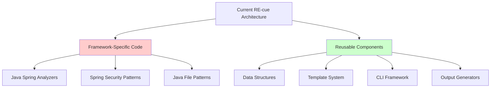
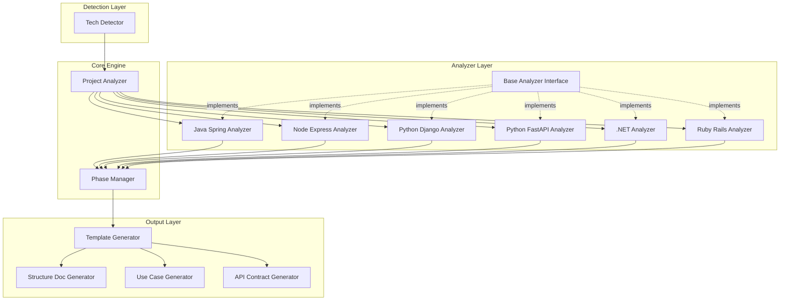
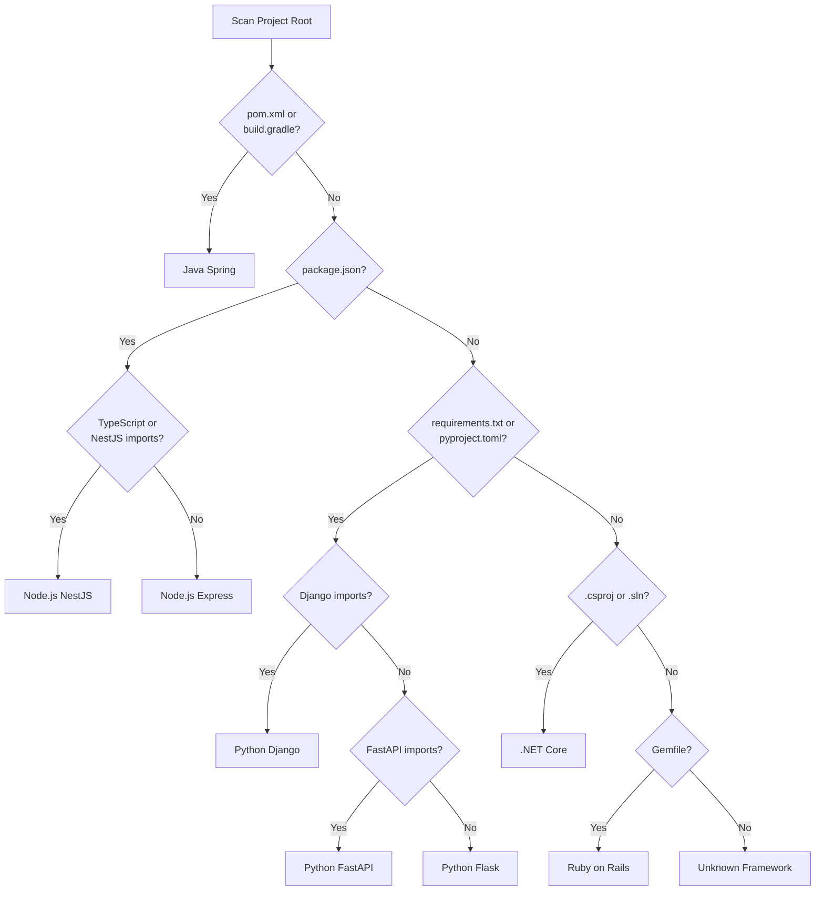
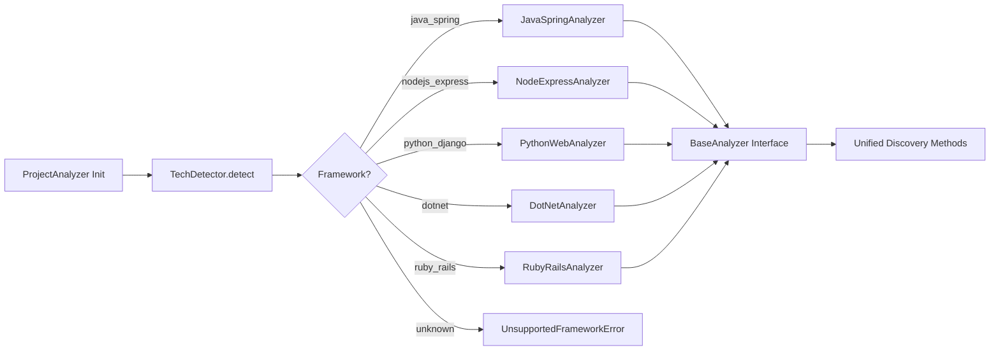
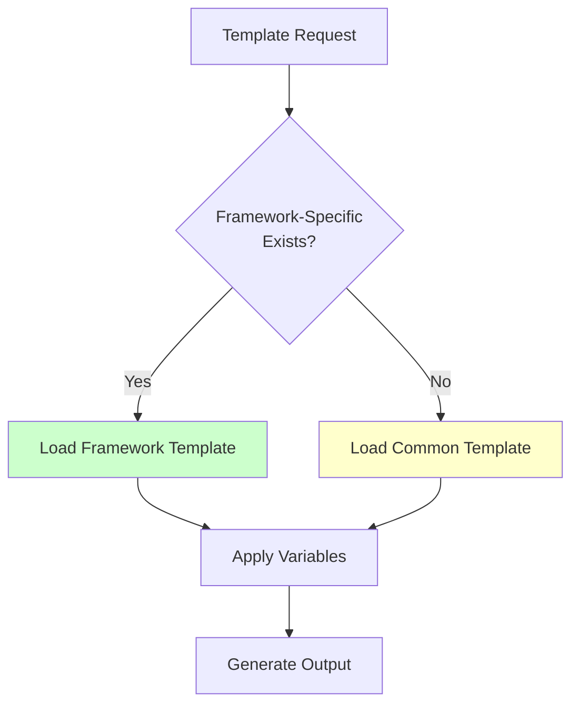
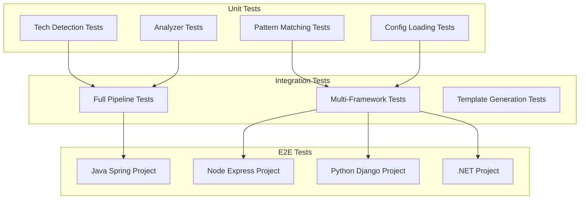
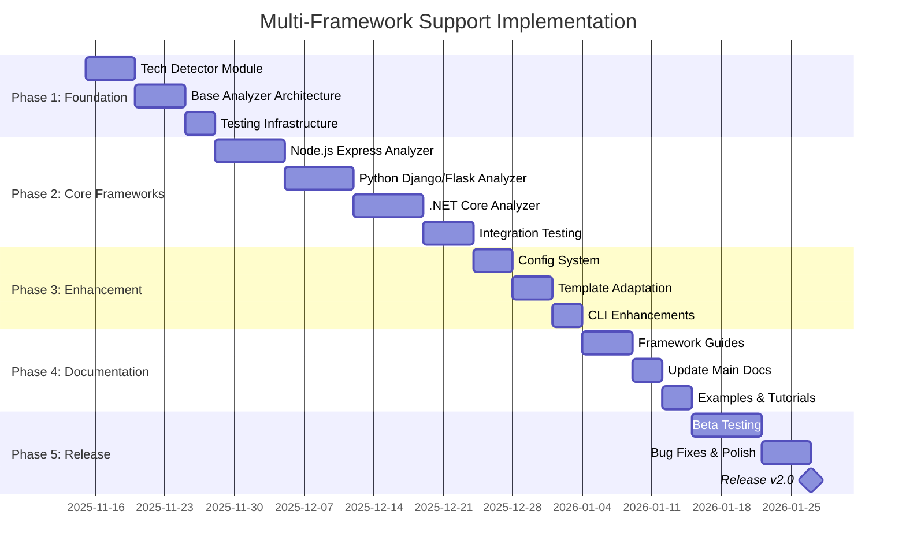
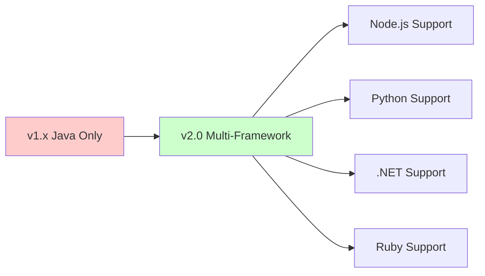
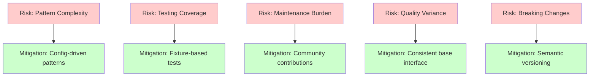

# Multi-Tech Stack Support Plan for RE-cue

## Executive Summary

This document outlines the comprehensive plan to transform RE-cue from a Java Spring-specific reverse engineering tool into a universal platform supporting multiple technology stacks including Node.js, Python, .NET, Ruby, and more.

## Current State Analysis

### Hardcoded Dependencies on Java Spring

RE-cue currently has deep integration with Java Spring Boot:

- **SecurityPatternAnalyzer** - Spring Security annotations (`@PreAuthorize`, `@Secured`, `@RolesAllowed`)
- **ProjectAnalyzer.discover_endpoints()** - Searches for `*Controller.java`, Spring annotations (`@RestController`, `@GetMapping`)
- **CommunicationPatternDetector** - Spring-specific patterns (`@FeignClient`, `@KafkaListener`, `RabbitTemplate`)
- **File search patterns** - Hardcoded to Java file extensions (`.java`)
- **Package structure assumptions** - `src/main/java`, controller/service/repository directories
- **Annotation parsing** - Spring Boot, JPA, Spring Security specific

### Reusable Components

The following components are framework-agnostic and can be reused:

- Core data structures (`Actor`, `SystemBoundary`, `UseCase`, `Relationship`)
- Template system (markdown generation)
- CLI framework and phase management
- File discovery and content reading utilities
- Output generators (markdown, JSON)



## Architecture Overview



## Phase 1: Architecture Refactoring (Foundation)

### 1.1 Create Technology Detector Module

**New File Structure:**
```
reverse_engineer/
├── detectors/
│   ├── __init__.py
│   └── tech_detector.py       # Auto-detect project tech stack
```

**Capabilities:**
- Analyze `pom.xml`, `build.gradle` → Java/Spring
- Analyze `package.json`, `tsconfig.json` → Node.js/TypeScript/Express/NestJS
- Analyze `requirements.txt`, `setup.py`, `pyproject.toml` → Python/Django/Flask/FastAPI
- Analyze `Gemfile`, `config.ru` → Ruby/Rails/Sinatra
- Analyze `go.mod`, `go.sum` → Go
- Analyze `.csproj`, `.sln` → .NET/C#

**Detection Logic:**



### 1.2 Create Analyzer Plugin Architecture

**New File Structure:**
```
reverse_engineer/
├── analyzers/
│   ├── __init__.py
│   ├── base_analyzer.py            # Abstract base class
│   ├── java_spring_analyzer.py     # Current logic moved here
│   ├── nodejs_analyzer.py          # New
│   ├── python_analyzer.py          # New
│   ├── dotnet_analyzer.py          # New
│   └── ruby_analyzer.py            # New
```

**Base Analyzer Interface:**

```python
from abc import ABC, abstractmethod
from typing import List, Dict
from dataclasses import dataclass

class BaseAnalyzer(ABC):
    """Abstract base class for framework-specific analyzers."""
    
    def __init__(self, repo_root: Path, verbose: bool = False):
        self.repo_root = repo_root
        self.verbose = verbose
        self.endpoints = []
        self.models = []
        self.services = []
        self.actors = []
        self.boundaries = []
        self.use_cases = []
    
    @abstractmethod
    def discover_endpoints(self) -> List[Endpoint]:
        """Discover API endpoints from framework-specific patterns."""
        pass
    
    @abstractmethod
    def discover_models(self) -> List[Model]:
        """Discover data models from framework-specific patterns."""
        pass
    
    @abstractmethod
    def discover_services(self) -> List[Service]:
        """Discover backend services."""
        pass
    
    @abstractmethod
    def discover_actors(self) -> List[Actor]:
        """Discover actors based on security and access patterns."""
        pass
    
    @abstractmethod
    def discover_system_boundaries(self) -> List[SystemBoundary]:
        """Discover system boundaries and architectural layers."""
        pass
    
    @abstractmethod
    def extract_use_cases(self) -> List[UseCase]:
        """Extract use cases from business logic."""
        pass
    
    def get_security_patterns(self) -> Dict:
        """Get framework-specific security patterns."""
        return {}
    
    def get_endpoint_patterns(self) -> Dict:
        """Get framework-specific endpoint patterns."""
        return {}
    
    def get_model_patterns(self) -> Dict:
        """Get framework-specific model patterns."""
        return {}
```

## Phase 2: Technology-Specific Implementations

### 2.1 Java Spring Analyzer (Refactor Existing Code)

**Implementation:**
```python
class JavaSpringAnalyzer(BaseAnalyzer):
    """Analyzer for Java Spring Boot projects."""
    
    # File patterns
    controller_patterns = ["*Controller.java"]
    model_patterns = ["*.java"]  # in model/entity directories
    service_patterns = ["*Service.java"]
    
    # Annotation patterns
    endpoint_annotations = [
        "@RestController", "@Controller",
        "@GetMapping", "@PostMapping", "@PutMapping", 
        "@DeleteMapping", "@PatchMapping", "@RequestMapping"
    ]
    
    security_annotations = [
        "@PreAuthorize", "@Secured", "@RolesAllowed",
        "@PermitAll", "@DenyAll"
    ]
    
    model_annotations = [
        "@Entity", "@Table", "@Document",
        "@Embeddable", "@MappedSuperclass"
    ]
    
    service_annotations = [
        "@Service", "@Component", "@Repository"
    ]
    
    def discover_endpoints(self) -> List[Endpoint]:
        """Discover REST endpoints from Spring controllers."""
        # Move existing logic here
        pass
```

### 2.2 Node.js/Express Analyzer (New)

**Implementation:**
```python
class NodeExpressAnalyzer(BaseAnalyzer):
    """Analyzer for Node.js Express/NestJS projects."""
    
    # File patterns
    route_patterns = [
        "*routes.js", "*routes.ts", 
        "*controller.js", "*controller.ts",
        "*/routes/*.js", "*/routes/*.ts"
    ]
    
    model_patterns = [
        "*model.js", "*model.ts",
        "*/models/*.js", "*/models/*.ts",
        "*/schemas/*.js", "*/schemas/*.ts"
    ]
    
    # Pattern detection (Express)
    express_endpoint_patterns = [
        r"app\.(get|post|put|delete|patch)\(['\"](.+?)['\"]\s*,",
        r"router\.(get|post|put|delete|patch)\(['\"](.+?)['\"]\s*,",
    ]
    
    # Pattern detection (NestJS decorators)
    nestjs_endpoint_patterns = [
        r"@(Get|Post|Put|Delete|Patch)\(['\"](.+?)['\"]\)",
        r"@Controller\(['\"](.+?)['\"]\)"
    ]
    
    # Security patterns
    security_patterns = [
        r"passport\.authenticate",
        r"@UseGuards\(",
        r"requireAuth|isAuthenticated",
        r"checkRole\(|hasRole\(",
        r"@Roles\("
    ]
    
    def discover_endpoints(self) -> List[Endpoint]:
        """Discover routes from Express/NestJS files."""
        endpoints = []
        
        # Search for route files
        for pattern in self.route_patterns:
            for file_path in self.repo_root.rglob(pattern):
                if self._is_test_file(file_path):
                    continue
                    
                content = file_path.read_text()
                
                # Try Express patterns
                endpoints.extend(self._parse_express_routes(content, file_path))
                
                # Try NestJS patterns
                endpoints.extend(self._parse_nestjs_routes(content, file_path))
        
        return endpoints
```

### 2.3 Python Django/Flask/FastAPI Analyzer (New)

**Implementation:**
```python
class PythonWebAnalyzer(BaseAnalyzer):
    """Analyzer for Python web frameworks (Django/Flask/FastAPI)."""
    
    # File patterns
    route_patterns = ["views.py", "routes.py", "endpoints.py", "api.py"]
    model_patterns = ["models.py", "schemas.py"]
    
    # Framework detection
    framework_indicators = {
        'django': [
            'from django', 
            '@admin.register', 
            'models.Model',
            'path(', 're_path('
        ],
        'flask': [
            'from flask', 
            '@app.route', 
            '@blueprint.route',
            'Flask(__name__)'
        ],
        'fastapi': [
            'from fastapi', 
            '@app.get', '@app.post',
            'APIRouter()',
            'FastAPI()'
        ]
    }
    
    # Endpoint patterns by framework
    django_patterns = [
        r"@api_view\(\[(.*?)\]\)",
        r"path\(['\"](.+?)['\"]\s*,",
        r"re_path\(r['\"](.+?)['\"]\s*,"
    ]
    
    flask_patterns = [
        r"@app\.route\(['\"](.+?)['\"]\s*,?\s*methods=\[(.*?)\]",
        r"@blueprint\.route\(['\"](.+?)['\"]\s*,?\s*methods=\[(.*?)\]"
    ]
    
    fastapi_patterns = [
        r"@app\.(get|post|put|delete|patch)\(['\"](.+?)['\"]\)",
        r"@router\.(get|post|put|delete|patch)\(['\"](.+?)['\"]\)"
    ]
    
    # Security patterns
    django_security = [
        r"@login_required",
        r"@permission_required",
        r"@user_passes_test"
    ]
    
    flask_security = [
        r"@login_required",
        r"@roles_required",
        r"@roles_accepted"
    ]
    
    fastapi_security = [
        r"Depends\(.*auth.*\)",
        r"Security\(",
        r"@requires\("
    ]
    
    def discover_endpoints(self) -> List[Endpoint]:
        """Discover routes from Python web frameworks."""
        # Detect which framework
        framework = self._detect_framework()
        
        if framework == 'django':
            return self._parse_django_routes()
        elif framework == 'flask':
            return self._parse_flask_routes()
        elif framework == 'fastapi':
            return self._parse_fastapi_routes()
        
        return []
```

### 2.4 .NET/C# Analyzer (New)

**Implementation:**
```python
class DotNetAnalyzer(BaseAnalyzer):
    """Analyzer for .NET/ASP.NET Core projects."""
    
    # File patterns
    controller_patterns = ["*Controller.cs"]
    model_patterns = ["*Model.cs", "*/Models/*.cs", "*/Entities/*.cs"]
    service_patterns = ["*Service.cs", "*/Services/*.cs"]
    
    # Endpoint patterns
    endpoint_patterns = [
        r"\[Http(Get|Post|Put|Delete|Patch)\(",
        r"\[Route\(['\"](.+?)['\"]\)\]"
    ]
    
    # Security patterns
    security_patterns = [
        r"\[Authorize\(",
        r"\[AllowAnonymous\]",
        r"RequireAuthorization",
        r"\[Authorize\(Roles\s*=\s*['\"](.+?)['\"]\)\]"
    ]
    
    # Model patterns
    model_patterns_regex = [
        r"public\s+class\s+(\w+)",
        r"\[Table\(['\"](.+?)['\"]\)\]",
        r"public\s+\w+\s+(\w+)\s*\{\s*get;\s*set;\s*\}"
    ]
    
    def discover_endpoints(self) -> List[Endpoint]:
        """Discover API endpoints from ASP.NET Core controllers."""
        endpoints = []
        
        for file_path in self.repo_root.rglob("*Controller.cs"):
            if self._is_test_file(file_path):
                continue
            
            content = file_path.read_text()
            controller_name = file_path.stem.replace("Controller", "")
            
            # Extract base route
            base_route = self._extract_base_route(content)
            
            # Find HTTP method attributes
            for match in re.finditer(
                r"\[Http(Get|Post|Put|Delete|Patch)(?:\(['\"](.+?)['\"]\))?\]",
                content
            ):
                method = match.group(1).upper()
                path = match.group(2) or ""
                full_path = f"{base_route}/{path}".replace("//", "/")
                
                # Check for authorization
                authenticated = self._check_authorization(content, match.start())
                
                endpoints.append(Endpoint(
                    method=method,
                    path=full_path,
                    controller=controller_name,
                    authenticated=authenticated
                ))
        
        return endpoints
```

## Phase 3: Unified Discovery Engine

### 3.1 Update ProjectAnalyzer

```python
from .detectors.tech_detector import TechDetector
from .analyzers import (
    JavaSpringAnalyzer,
    NodeExpressAnalyzer,
    PythonWebAnalyzer,
    DotNetAnalyzer,
    RubyRailsAnalyzer
)

class ProjectAnalyzer:
    """Main analyzer that delegates to framework-specific analyzers."""
    
    def __init__(self, repo_root: Path, description: str = "", verbose: bool = False):
        self.repo_root = repo_root
        self.description = description
        self.verbose = verbose
        
        # Auto-detect technology stack
        self.tech_stack = TechDetector(repo_root, verbose).detect()
        
        if self.verbose:
            print(f"Detected framework: {self.tech_stack.name}")
            print(f"Primary language: {self.tech_stack.language}")
        
        # Load appropriate analyzer
        self.analyzer = self._load_analyzer()
        
    def _load_analyzer(self) -> BaseAnalyzer:
        """Load the appropriate framework-specific analyzer."""
        analyzer_map = {
            'java_spring': JavaSpringAnalyzer,
            'nodejs_express': NodeExpressAnalyzer,
            'nodejs_nestjs': NodeExpressAnalyzer,  # Uses same analyzer
            'python_django': PythonWebAnalyzer,
            'python_flask': PythonWebAnalyzer,     # Uses same analyzer
            'python_fastapi': PythonWebAnalyzer,   # Uses same analyzer
            'dotnet': DotNetAnalyzer,
            'ruby_rails': RubyRailsAnalyzer,
        }
        
        analyzer_class = analyzer_map.get(self.tech_stack.framework_id)
        
        if not analyzer_class:
            raise UnsupportedFrameworkError(
                f"Framework '{self.tech_stack.name}' is not yet supported. "
                f"Supported frameworks: {', '.join(analyzer_map.keys())}"
            )
        
        return analyzer_class(self.repo_root, self.verbose)
    
    # Delegate all discovery methods to the tech-specific analyzer
    def discover_endpoints(self):
        """Discover API endpoints."""
        return self.analyzer.discover_endpoints()
    
    def discover_models(self):
        """Discover data models."""
        return self.analyzer.discover_models()
    
    def discover_services(self):
        """Discover backend services."""
        return self.analyzer.discover_services()
    
    def discover_actors(self):
        """Discover actors."""
        return self.analyzer.discover_actors()
    
    def discover_system_boundaries(self):
        """Discover system boundaries."""
        return self.analyzer.discover_system_boundaries()
    
    def extract_use_cases(self):
        """Extract use cases."""
        return self.analyzer.extract_use_cases()
    
    @property
    def endpoints(self):
        return self.analyzer.endpoints
    
    @property
    def models(self):
        return self.analyzer.models
    
    @property
    def services(self):
        return self.analyzer.services
    
    @property
    def actors(self):
        return self.analyzer.actors
```

**Analyzer Selection Flow:**



## Phase 4: Configuration System

### 4.1 Create Framework Definitions

**Directory Structure:**
```
reverse_engineer/
├── config/
│   ├── frameworks/
│   │   ├── java_spring.yaml
│   │   ├── nodejs_express.yaml
│   │   ├── python_django.yaml
│   │   ├── python_fastapi.yaml
│   │   ├── dotnet.yaml
│   │   └── ruby_rails.yaml
```

**Example: `java_spring.yaml`**
```yaml
framework:
  id: "java_spring"
  name: "Java Spring Boot"
  language: "java"
  version_detection:
    - file: "pom.xml"
      pattern: "<artifactId>spring-boot</artifactId>"
    - file: "build.gradle"
      pattern: "spring-boot"

file_patterns:
  controllers:
    - "*Controller.java"
    - "*RestController.java"
  models:
    - "*/model/*.java"
    - "*/entity/*.java"
    - "*/domain/*.java"
  services:
    - "*Service.java"
    - "*ServiceImpl.java"
  repositories:
    - "*Repository.java"

annotations:
  endpoints:
    rest_controller: "@RestController"
    controller: "@Controller"
    mappings:
      - "@GetMapping"
      - "@PostMapping"
      - "@PutMapping"
      - "@DeleteMapping"
      - "@PatchMapping"
      - "@RequestMapping"
  
  security:
    authorization:
      - "@PreAuthorize"
      - "@Secured"
      - "@RolesAllowed"
    access:
      - "@PermitAll"
      - "@DenyAll"
  
  models:
    jpa:
      - "@Entity"
      - "@Table"
      - "@Embeddable"
    mongodb:
      - "@Document"
      - "@DBRef"
  
  services:
    - "@Service"
    - "@Component"
    - "@Repository"

directory_structure:
  source_root: "src/main/java"
  test_root: "src/test/java"
  resources: "src/main/resources"
  
security_patterns:
  role_extraction:
    - pattern: "hasRole\\('([^']+)'\\)"
      group: 1
    - pattern: 'ROLE_([A-Z_]+)'
      group: 1
```

**Example: `nodejs_express.yaml`**
```yaml
framework:
  id: "nodejs_express"
  name: "Node.js Express"
  language: "javascript"
  version_detection:
    - file: "package.json"
      patterns:
        - '"express":'
        - '"@nestjs/core":'

file_patterns:
  routes:
    - "*routes.js"
    - "*routes.ts"
    - "*controller.js"
    - "*controller.ts"
    - "*/routes/*.js"
    - "*/routes/*.ts"
  models:
    - "*model.js"
    - "*model.ts"
    - "*/models/*.js"
    - "*/models/*.ts"
    - "*/schemas/*.js"
  services:
    - "*service.js"
    - "*service.ts"
    - "*/services/*.js"

patterns:
  endpoints:
    express:
      - "app\\.(get|post|put|delete|patch)\\(['\"](.+?)['\"]"
      - "router\\.(get|post|put|delete|patch)\\(['\"](.+?)['\"]"
    nestjs:
      - "@(Get|Post|Put|Delete|Patch)\\(['\"](.+?)['\"]\\)"
      - "@Controller\\(['\"](.+?)['\"]\\)"
  
  security:
    - "passport\\.authenticate"
    - "@UseGuards\\("
    - "requireAuth|isAuthenticated"
    - "checkRole\\(|hasRole\\("
    - "@Roles\\("
  
  models:
    mongoose:
      - "new Schema\\("
      - "mongoose\\.model\\("
    sequelize:
      - "sequelize\\.define\\("
      - "DataTypes\\."
    typeorm:
      - "@Entity\\("
      - "@Column\\("

directory_structure:
  source_root: "src"
  routes: "src/routes"
  controllers: "src/controllers"
  models: "src/models"
  services: "src/services"
```

**Example: `python_django.yaml`**
```yaml
framework:
  id: "python_django"
  name: "Python Django"
  language: "python"
  version_detection:
    - file: "requirements.txt"
      pattern: "django"
    - file: "manage.py"
      pattern: "django"

file_patterns:
  views:
    - "views.py"
    - "*/views/*.py"
  models:
    - "models.py"
    - "*/models/*.py"
  urls:
    - "urls.py"
    - "*/urls.py"
  serializers:
    - "serializers.py"
    - "*/serializers/*.py"

patterns:
  endpoints:
    function_views:
      - "@api_view\\(\\[(.+?)\\]\\)"
    class_views:
      - "class\\s+(\\w+)\\(.*APIView\\)"
    url_patterns:
      - "path\\(['\"](.+?)['\"]"
      - "re_path\\(r['\"](.+?)['\"]"
  
  security:
    decorators:
      - "@login_required"
      - "@permission_required"
      - "@user_passes_test"
    mixins:
      - "LoginRequiredMixin"
      - "PermissionRequiredMixin"
  
  models:
    - "class\\s+(\\w+)\\(models\\.Model\\)"
    - "models\\.(CharField|IntegerField|ForeignKey)"

directory_structure:
  apps: "*/apps/*"
  models: "*/models.py"
  views: "*/views.py"
  urls: "*/urls.py"
```

### 4.2 Configuration Loader

```python
import yaml
from pathlib import Path
from dataclasses import dataclass
from typing import List, Dict, Optional

@dataclass
class FrameworkConfig:
    """Framework configuration loaded from YAML."""
    id: str
    name: str
    language: str
    file_patterns: Dict[str, List[str]]
    patterns: Dict[str, List[str]]
    annotations: Optional[Dict] = None
    directory_structure: Optional[Dict[str, str]] = None
    
    @classmethod
    def load(cls, framework_id: str) -> 'FrameworkConfig':
        """Load framework configuration from YAML file."""
        config_dir = Path(__file__).parent / "config" / "frameworks"
        config_file = config_dir / f"{framework_id}.yaml"
        
        if not config_file.exists():
            raise FileNotFoundError(f"Configuration not found: {framework_id}")
        
        with open(config_file) as f:
            data = yaml.safe_load(f)
        
        return cls(
            id=data['framework']['id'],
            name=data['framework']['name'],
            language=data['framework']['language'],
            file_patterns=data.get('file_patterns', {}),
            patterns=data.get('patterns', {}),
            annotations=data.get('annotations'),
            directory_structure=data.get('directory_structure')
        )
```

## Phase 5: Template Adaptation

### 5.1 Framework-Aware Templates

**Directory Structure:**
```
reverse_engineer/
├── templates/
│   ├── common/                    # Shared templates
│   │   ├── phase1-structure.md
│   │   ├── phase2-actors.md
│   │   ├── phase3-boundaries.md
│   │   └── phase4-use-cases.md
│   └── frameworks/                # Framework-specific sections
│       ├── java_spring/
│       │   ├── endpoint_section.md
│       │   ├── security_section.md
│       │   └── annotations_guide.md
│       ├── nodejs/
│       │   ├── endpoint_section.md
│       │   ├── middleware_section.md
│       │   └── route_guards.md
│       ├── python/
│       │   ├── endpoint_section.md
│       │   ├── decorator_section.md
│       │   └── view_patterns.md
│       └── dotnet/
│           ├── endpoint_section.md
│           ├── attribute_section.md
│           └── middleware_section.md
```

### 5.2 Update Generators

```python
class StructureDocGenerator(BaseGenerator):
    """Generator for Phase 1: Project Structure documentation."""
    
    def __init__(self, analyzer, tech_stack):
        super().__init__(analyzer)
        self.tech_stack = tech_stack
    
    def _load_template(self, template_name: str) -> str:
        """Load template with framework-specific override support."""
        # Try framework-specific template first
        framework_template = self._get_framework_template(template_name)
        if framework_template:
            return framework_template
        
        # Fall back to common template
        return self._get_common_template(template_name)
    
    def _get_framework_template(self, template_name: str) -> Optional[str]:
        """Try to load framework-specific template."""
        template_dir = Path(__file__).parent / "templates" / "frameworks"
        framework_dir = template_dir / self.tech_stack.framework_id
        template_path = framework_dir / template_name
        
        if template_path.exists():
            return template_path.read_text()
        
        return None
    
    def _get_common_template(self, template_name: str) -> str:
        """Load common template."""
        template_dir = Path(__file__).parent / "templates" / "common"
        template_path = template_dir / template_name
        
        if not template_path.exists():
            raise FileNotFoundError(f"Template not found: {template_path}")
        
        return template_path.read_text()
    
    def _build_endpoints_section(self) -> str:
        """Build endpoints section with framework-specific formatting."""
        if not self.analyzer.endpoints:
            return "*No endpoints discovered*"
        
        # Load framework-specific endpoint formatting
        endpoint_template = self._load_template("endpoint_section.md")
        
        # Apply template with framework-aware formatting
        return self._apply_endpoint_template(endpoint_template)
```

**Template Hierarchy:**



## Phase 6: Documentation Updates

### 6.1 Update Main README

Add to `README.md`:

````markdown
## Supported Frameworks

### ✅ Currently Supported

| Framework | Language | Version | Status |
|-----------|----------|---------|--------|
| **Spring Boot** | Java | 2.x, 3.x | ✅ Full Support |
| **Express** | Node.js | 4.x+ | ✅ Full Support |
| **NestJS** | TypeScript | 9.x+ | ✅ Full Support |
| **Django** | Python | 3.x, 4.x | ✅ Full Support |
| **Flask** | Python | 2.x, 3.x | ✅ Full Support |
| **FastAPI** | Python | 0.95+ | ✅ Full Support |
| **ASP.NET Core** | C# | 6.0+ | ✅ Full Support |
| **Ruby on Rails** | Ruby | 6.x, 7.x | ✅ Full Support |

### 🔄 Coming Soon

- **Go** - Gin, Echo frameworks
- **PHP** - Laravel, Symfony
- **Rust** - Actix, Rocket

### Framework Detection

RE-cue automatically detects your project's framework by analyzing:
- Build files (`pom.xml`, `package.json`, `requirements.txt`, etc.)
- Project structure
- Framework-specific files and imports
- Configuration files

You can also manually specify a framework:
```bash
reverse-engineer --spec --framework nodejs_express --path ~/projects/my-app
```

### Framework-Specific Examples

#### Java Spring Boot
```bash
reverse-engineer --spec --use-cases --path ~/projects/spring-app
```

#### Node.js Express
```bash
reverse-engineer --spec --use-cases --path ~/projects/express-app
```

#### Python Django
```bash
reverse-engineer --spec --use-cases --framework python_django --path ~/projects/django-app
```

#### .NET Core
```bash
reverse-engineer --spec --use-cases --path ~/projects/dotnet-app
```
````

### 6.2 Create Framework-Specific Guides

**New Documentation Files:**

```
docs/
├── frameworks/
│   ├── README.md                     # Framework support overview
│   ├── java-spring-guide.md          # Java Spring-specific guide
│   ├── nodejs-guide.md               # Node.js-specific guide
│   ├── python-guide.md               # Python-specific guide
│   ├── dotnet-guide.md               # .NET-specific guide
│   ├── ruby-guide.md                 # Ruby-specific guide
│   └── extending-frameworks.md       # Guide for adding new frameworks
```

**Example: `docs/frameworks/nodejs-guide.md`**

````markdown
# Node.js Framework Support

RE-cue provides comprehensive support for Node.js frameworks including Express and NestJS.

## Supported Features

### Express.js
- ✅ Route discovery from `app.get/post/put/delete`
- ✅ Router-based endpoint detection
- ✅ Middleware analysis
- ✅ Authentication pattern recognition (Passport.js)
- ✅ Model discovery (Mongoose, Sequelize, TypeORM)

### NestJS
- ✅ Controller decorator detection (`@Controller`, `@Get`, `@Post`)
- ✅ Guard-based security analysis (`@UseGuards`)
- ✅ Module boundary detection
- ✅ Service injection patterns
- ✅ Entity and DTO discovery

## Project Structure Requirements

### Express
```
project/
├── package.json
├── src/
│   ├── routes/           # Route definitions
│   ├── controllers/      # Business logic
│   ├── models/          # Data models
│   ├── middleware/      # Custom middleware
│   └── app.js           # Entry point
```

### NestJS
```
project/
├── package.json
├── tsconfig.json
├── src/
│   ├── modules/         # Feature modules
│   ├── controllers/     # HTTP controllers
│   ├── services/        # Business logic
│   ├── entities/        # Data models
│   ├── guards/          # Auth guards
│   └── main.ts          # Entry point
```

## Example Analysis

```bash
# Auto-detect and analyze
reverse-engineer --spec --use-cases --path ~/projects/my-express-app

# Force Express analyzer
reverse-engineer --spec --framework nodejs_express --path ~/projects/app
```

## Detected Patterns

### Endpoints
- Express: `app.get('/api/users', ...)`
- NestJS: `@Get('api/users')`

### Security
- `passport.authenticate('jwt', ...)`
- `@UseGuards(AuthGuard)`
- `requireAuth` middleware

### Models
- Mongoose: `new Schema({...})`
- TypeORM: `@Entity()`
````

## Phase 7: Testing Strategy

### 7.1 Test Project Structure

```
tests/
├── fixtures/
│   ├── java_spring_sample/
│   │   ├── pom.xml
│   │   ├── src/main/java/
│   │   │   └── com/example/
│   │   │       ├── controller/
│   │   │       ├── service/
│   │   │       └── model/
│   ├── nodejs_express_sample/
│   │   ├── package.json
│   │   ├── src/
│   │   │   ├── routes/
│   │   │   ├── controllers/
│   │   │   └── models/
│   ├── python_django_sample/
│   │   ├── requirements.txt
│   │   ├── manage.py
│   │   └── app/
│   │       ├── views.py
│   │       ├── models.py
│   │       └── urls.py
│   ├── python_fastapi_sample/
│   │   ├── requirements.txt
│   │   └── app/
│   │       ├── main.py
│   │       ├── routers/
│   │       └── models/
│   └── dotnet_sample/
│       ├── Project.csproj
│       └── Controllers/
```

### 7.2 Test Coverage



### 7.3 Integration Tests

```python
# tests/test_multi_framework.py
import unittest
from pathlib import Path
from reverse_engineer.detectors.tech_detector import TechDetector
from reverse_engineer.analyzer import ProjectAnalyzer

class TestFrameworkDetection(unittest.TestCase):
    """Test framework auto-detection."""
    
    def test_detect_java_spring(self):
        """Test Java Spring Boot detection."""
        project_path = Path(__file__).parent / "fixtures" / "java_spring_sample"
        detector = TechDetector(project_path)
        tech_stack = detector.detect()
        
        self.assertEqual(tech_stack.framework_id, "java_spring")
        self.assertEqual(tech_stack.language, "java")
    
    def test_detect_nodejs_express(self):
        """Test Node.js Express detection."""
        project_path = Path(__file__).parent / "fixtures" / "nodejs_express_sample"
        detector = TechDetector(project_path)
        tech_stack = detector.detect()
        
        self.assertEqual(tech_stack.framework_id, "nodejs_express")
        self.assertEqual(tech_stack.language, "javascript")
    
    def test_detect_python_django(self):
        """Test Python Django detection."""
        project_path = Path(__file__).parent / "fixtures" / "python_django_sample"
        detector = TechDetector(project_path)
        tech_stack = detector.detect()
        
        self.assertEqual(tech_stack.framework_id, "python_django")
        self.assertEqual(tech_stack.language, "python")

class TestJavaSpringAnalysis(unittest.TestCase):
    """Test Java Spring analyzer."""
    
    def setUp(self):
        self.project_path = Path(__file__).parent / "fixtures" / "java_spring_sample"
        self.analyzer = ProjectAnalyzer(self.project_path)
    
    def test_discover_endpoints(self):
        """Test endpoint discovery in Spring Boot project."""
        self.analyzer.discover_endpoints()
        self.assertGreater(len(self.analyzer.endpoints), 0)
        
        # Verify endpoint structure
        endpoint = self.analyzer.endpoints[0]
        self.assertIn(endpoint.method, ['GET', 'POST', 'PUT', 'DELETE', 'PATCH'])
        self.assertTrue(endpoint.path.startswith('/'))
    
    def test_discover_security_patterns(self):
        """Test security pattern detection."""
        self.analyzer.discover_actors()
        self.assertGreater(len(self.analyzer.actors), 0)

class TestNodeJSAnalysis(unittest.TestCase):
    """Test Node.js analyzer."""
    
    def setUp(self):
        self.project_path = Path(__file__).parent / "fixtures" / "nodejs_express_sample"
        self.analyzer = ProjectAnalyzer(self.project_path)
    
    def test_discover_express_routes(self):
        """Test Express route discovery."""
        self.analyzer.discover_endpoints()
        self.assertGreater(len(self.analyzer.endpoints), 0)
    
    def test_discover_middleware_patterns(self):
        """Test middleware and authentication detection."""
        self.analyzer.discover_actors()
        # Should detect authenticated vs public endpoints
        auth_endpoints = [e for e in self.analyzer.endpoints if e.authenticated]
        self.assertGreater(len(auth_endpoints), 0)
```

## Phase 8: CLI Enhancements

### 8.1 Framework Commands

**New CLI Options:**

```bash
# Auto-detect framework (default behavior)
reverse-engineer --spec --path ~/projects/my-app

# List supported frameworks
reverse-engineer --list-frameworks

# Show detected framework info
reverse-engineer --detect --path ~/projects/my-app

# Force specific framework
reverse-engineer --spec --framework nodejs_express --path ~/projects/my-app

# Framework-specific options
reverse-engineer --spec --framework python_django \
  --django-settings myapp.settings \
  --path ~/projects/django-app

reverse-engineer --spec --framework nodejs_express \
  --entry-point src/app.js \
  --path ~/projects/express-app
```

### 8.2 CLI Output Examples

```bash
$ reverse-engineer --list-frameworks

Supported Frameworks:
  java_spring        Java Spring Boot (2.x, 3.x)
  nodejs_express     Node.js Express (4.x+)
  nodejs_nestjs      NestJS (9.x+)
  python_django      Python Django (3.x, 4.x)
  python_flask       Python Flask (2.x, 3.x)
  python_fastapi     Python FastAPI (0.95+)
  dotnet             ASP.NET Core (6.0+)
  ruby_rails         Ruby on Rails (6.x, 7.x)

$ reverse-engineer --detect --path ~/projects/my-app

Analyzing project structure...
✓ Detected framework: Node.js Express
  Language: JavaScript/TypeScript
  Version: 4.18.2
  Entry point: src/app.js
  Routes detected: 15 endpoints
  Models detected: 8 data models
```

### 8.3 Updated CLI Implementation

```python
# cli.py
import argparse
from .detectors.tech_detector import TechDetector

def create_parser():
    parser = argparse.ArgumentParser(
        description="RE-cue: Reverse Engineering Toolkit for Multiple Frameworks"
    )
    
    # Framework detection and selection
    framework_group = parser.add_argument_group('Framework Options')
    framework_group.add_argument(
        '--list-frameworks',
        action='store_true',
        help='List all supported frameworks'
    )
    framework_group.add_argument(
        '--detect',
        action='store_true',
        help='Detect and display project framework information'
    )
    framework_group.add_argument(
        '--framework',
        type=str,
        choices=[
            'java_spring', 'nodejs_express', 'nodejs_nestjs',
            'python_django', 'python_flask', 'python_fastapi',
            'dotnet', 'ruby_rails'
        ],
        help='Force specific framework analyzer'
    )
    
    # Existing arguments
    parser.add_argument('--path', type=str, help='Project path to analyze')
    parser.add_argument('--spec', action='store_true', help='Generate specification')
    parser.add_argument('--use-cases', action='store_true', help='Generate use cases')
    # ... other arguments ...
    
    return parser

def list_frameworks():
    """Display supported frameworks."""
    frameworks = [
        ("java_spring", "Java Spring Boot", "2.x, 3.x"),
        ("nodejs_express", "Node.js Express", "4.x+"),
        ("nodejs_nestjs", "NestJS", "9.x+"),
        ("python_django", "Python Django", "3.x, 4.x"),
        ("python_flask", "Python Flask", "2.x, 3.x"),
        ("python_fastapi", "Python FastAPI", "0.95+"),
        ("dotnet", "ASP.NET Core", "6.0+"),
        ("ruby_rails", "Ruby on Rails", "6.x, 7.x"),
    ]
    
    print("\nSupported Frameworks:")
    for fw_id, name, versions in frameworks:
        print(f"  {fw_id:<20} {name} ({versions})")

def detect_framework(project_path: Path):
    """Detect and display framework information."""
    print("\nAnalyzing project structure...")
    detector = TechDetector(project_path, verbose=True)
    tech_stack = detector.detect()
    
    print(f"✓ Detected framework: {tech_stack.name}")
    print(f"  Language: {tech_stack.language}")
    if tech_stack.version:
        print(f"  Version: {tech_stack.version}")
    # Display additional detection info
```

## Implementation Timeline



## Implementation Priority

### High Priority (Wave 1)
1. **Node.js Express** - Very common in modern web apps, large adoption
2. **Python FastAPI/Flask** - Growing popularity, microservices trend
3. **.NET Core** - Enterprise adoption, Microsoft ecosystem

**Estimated Timeline:** 6-8 weeks

### Medium Priority (Wave 2)
4. **NestJS** - Modern TypeScript framework, growing adoption
5. **Python Django** - Mature framework with strong conventions
6. **Ruby on Rails** - Convention over configuration, established community

**Estimated Timeline:** 4-6 weeks after Wave 1

### Future Consideration (Wave 3)
7. **Go frameworks** (Gin, Echo) - Performance-critical applications
8. **PHP frameworks** (Laravel, Symfony) - Legacy system support
9. **Rust frameworks** (Actix, Rocket) - Emerging ecosystem

**Estimated Timeline:** TBD based on community demand

## Migration Strategy

### Backward Compatibility

1. **No Breaking Changes** - Keep existing Java Spring functionality intact
2. **Gradual Rollout** - Add frameworks incrementally without disrupting current users
3. **Maintain CLI Interface** - Existing commands continue to work
4. **Auto-detection Default** - Seamless experience for existing projects

### User Communication



### Version Strategy

- **v1.x** - Java Spring only (current)
- **v2.0** - Multi-framework support (Node.js, Python, .NET)
- **v2.1+** - Additional frameworks and enhancements

## Success Metrics

### Technical Metrics
- ✅ Auto-detection accuracy > 95%
- ✅ Support 5+ frameworks by v2.0
- ✅ Maintain analysis quality across frameworks
- ✅ Test coverage > 80% for all analyzers
- ✅ Performance: Analysis time < 30 seconds for medium projects

### User Experience Metrics
- ✅ CLI remains simple and intuitive
- ✅ Generated output quality consistent across frameworks
- ✅ Documentation comprehensive and framework-specific
- ✅ Error messages clear and actionable
- ✅ Framework detection transparent and overridable

### Community Metrics
- 📈 Increased adoption across different language communities
- 📈 Contributions from multiple framework ecosystems
- 📈 GitHub stars and forks growth
- 📈 Issue resolution time < 48 hours

## Risks and Mitigation



### Key Risks

1. **Pattern Complexity** - Each framework has unique patterns
   - *Mitigation:* Use YAML config files for pattern definitions

2. **Testing Coverage** - Multiple frameworks to test
   - *Mitigation:* Create comprehensive fixture projects

3. **Maintenance Burden** - Supporting many frameworks
   - *Mitigation:* Encourage community contributions, clear extension guide

4. **Quality Variance** - Analysis quality may vary by framework
   - *Mitigation:* Consistent base analyzer interface, quality benchmarks

5. **Breaking Changes** - Risk of disrupting existing users
   - *Mitigation:* Semantic versioning, deprecation warnings, migration guide

## Community Engagement

### Contribution Opportunities

1. **Add New Framework Support** - Follow `extending-frameworks.md` guide
2. **Improve Pattern Detection** - Enhance framework-specific patterns
3. **Add Test Fixtures** - Contribute sample projects
4. **Improve Documentation** - Framework-specific guides and examples

### Framework Support Requests

Users can request framework support by:
1. Opening GitHub issue with framework details
2. Providing sample project for testing
3. Contributing analyzer implementation
4. Funding development through sponsorship

## Conclusion

This plan transforms RE-cue from a specialized Java Spring tool into a universal reverse engineering platform. The plugin architecture, configuration system, and framework-aware templates provide a solid foundation for supporting multiple technology stacks while maintaining code quality and user experience.

**Key Benefits:**
- 🎯 Broader market reach across language ecosystems
- 🔧 Maintainable architecture through abstraction
- 📈 Community-driven framework additions
- ✅ Consistent user experience across frameworks
- 🚀 Foundation for future enhancements

**Next Steps:**
1. Review and approve plan
2. Create GitHub project board for tracking
3. Begin Phase 1 implementation
4. Regular progress updates and demos
