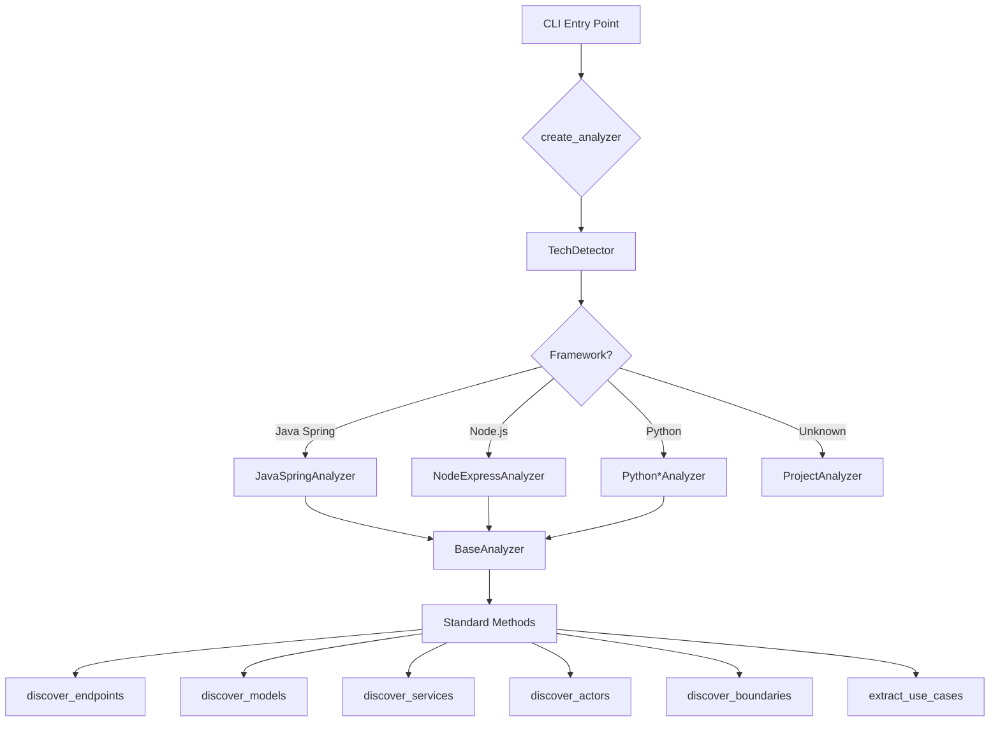

# RE-cue Technical Reference

**Last Updated**: November 15, 2025  
**Version**: 2.0

This document provides comprehensive technical reference for RE-cue's architecture, implementation details, and current capabilities.

---

## Table of Contents

1. [Template System Reference](#template-system-reference)
2. [Multi-Framework Architecture](#multi-framework-architecture)
3. [Use Case Analysis System](#use-case-analysis-system)
4. [Current Implementation Status](#current-implementation-status)

---

## Template System Reference

### Overview

RE-cue uses a template-based system for generating documentation. Templates are stored in `reverse_engineer/templates/` and use `{{VARIABLE}}` placeholder syntax for variable substitution.

### Available Templates

| Template | Purpose | Status | Variables |
|----------|---------|--------|-----------|
| `phase1-structure.md` | Project structure analysis | ✅ Implemented | 15+ |
| `phase2-actors.md` | Actor discovery | ✅ Implemented | 10+ |
| `phase3-boundaries.md` | System boundary mapping | ✅ Implemented | 12+ |
| `phase4-use-cases.md` | Use case extraction | ✅ Implemented | 20+ |

### Template Syntax

**Standard Variable**:
```markdown
{{VARIABLE_NAME}}
```

**Naming Convention**:
- All uppercase with underscores
- Descriptive and self-documenting
- Prefixed by context when needed (e.g., `PROJECT_`, `ACTOR_`)

### Phase 4 Template Variables

#### Basic Information
- `{{PROJECT_NAME}}` - Raw project name extracted from repository
- `{{DATE}}` - Generation date in YYYY-MM-DD format
- `{{PROJECT_NAME_DISPLAY}}` - Formatted display name (title case)

#### Counts and Statistics
- `{{ACTOR_COUNT}}` - Total number of discovered actors
- `{{USE_CASE_COUNT}}` - Total number of extracted use cases
- `{{BOUNDARY_COUNT}}` - Total number of system boundaries
- `{{ENDPOINT_COUNT}}` - Total number of API endpoints
- `{{MODEL_COUNT}}` - Total number of data models
- `{{SERVICE_COUNT}}` - Total number of services

#### Summary Sections
- `{{ACTORS_SUMMARY}}` - Quick summary of actors (first 5)
- `{{BOUNDARIES_SUMMARY}}` - Quick summary of boundaries (first 3)
- `{{USE_CASES_SUMMARY}}` - Quick summary of use cases (first 20)

#### Detailed Content
- `{{ACTORS_DETAIL}}` - Complete actor documentation
- `{{BOUNDARIES_DETAIL}}` - Complete boundary documentation
- `{{USE_CASES_DETAIL}}` - Complete use case documentation
- `{{RELATIONSHIPS}}` - Actor-boundary relationships
- `{{MERMAID_DIAGRAM}}` - System architecture diagram

#### Metadata
- `{{GENERATION_TIME}}` - Time taken to generate analysis
- `{{FRAMEWORK_DETECTED}}` - Detected framework (e.g., "Java Spring Boot")
- `{{ANALYSIS_VERSION}}` - RE-cue version used

### Template Loading System

**Loader Implementation**:
```python
class TemplateLoader:
    def __init__(self):
        self.template_dir = Path(__file__).parent / "templates"
    
    def load(self, template_name: str) -> str:
        """Load template file content."""
        template_path = self.template_dir / template_name
        if not template_path.exists():
            raise FileNotFoundError(f"Template not found: {template_path}")
        return template_path.read_text()
```

**Usage in Generators**:
```python
class UseCaseMarkdownGenerator(BaseGenerator):
    def generate(self) -> str:
        template = self._load_template("phase4-use-cases.md")
        variables = self._prepare_variables()
        return self._substitute_variables(template, variables)
```

### Template Validation

**Validator Features** (43 tests):
- Syntax validation for `{{VARIABLE}}` pattern
- Variable consistency checking
- Missing variable detection
- Unused variable warnings
- Template integrity verification

**Validation Rules**:
1. All variables must use `{{VARIABLE}}` syntax (no `{VARIABLE}` or `$VARIABLE`)
2. Variable names must be uppercase with underscores
3. All variables in template must have values provided
4. No undefined variables in substitution data
5. Balanced curly braces

### Framework-Aware Templates

Templates automatically adapt based on detected framework:

**Java Spring Boot**:
```markdown
## Controllers
The following REST controllers were discovered:
{{CONTROLLERS_JAVA}}
```

**Node.js Express**:
```markdown
## Routes
The following Express routes were discovered:
{{ROUTES_NODEJS}}
```

**Python Django**:
```markdown
## Views
The following Django views were discovered:
{{VIEWS_PYTHON}}
```

### Template Testing

**Test Coverage** (90 total tests):
- **Loader Tests**: 43 tests - File loading, error handling, path resolution
- **Validator Tests**: 21 tests - Syntax validation, variable checking
- **Rendering Tests**: 26 tests - Full template rendering with multiple frameworks

**Test Example**:
```python
def test_template_rendering_java_spring():
    """Test template renders correctly for Java Spring project."""
    analyzer = JavaSpringAnalyzer(test_project_path)
    generator = UseCaseMarkdownGenerator(analyzer)
    output = generator.generate()
    
    assert "Java Spring Boot" in output
    assert "{{" not in output  # No unsubstituted variables
    assert "REST Controllers" in output
```

---

## Multi-Framework Architecture

### Plugin Architecture

**Design Pattern**: Strategy Pattern with Factory Method



### Framework Detection

**TechDetector Module**: `reverse_engineer/detectors/tech_detector.py`

**Detection Algorithm**:
```python
def detect_framework(repo_root: Path) -> TechStack:
    """Multi-factor framework detection."""
    
    # Factor 1: Build files (30% weight)
    build_score = check_build_files(repo_root)
    
    # Factor 2: Dependency patterns (50% weight)
    dependency_score = analyze_dependencies(repo_root)
    
    # Factor 3: Directory structure (20% weight)
    structure_score = analyze_directory_structure(repo_root)
    
    # Calculate weighted confidence
    confidence = (
        build_score * 0.30 +
        dependency_score * 0.50 +
        structure_score * 0.20
    )
    
    return TechStack(
        framework_id=detected_framework,
        language=detected_language,
        confidence=confidence
    )
```

**Supported Frameworks**:
1. **Java Spring Boot** - `java_spring` ✅
2. **Node.js Express** - `nodejs_express` ✅
3. **Node.js NestJS** - `nodejs_nestjs` ✅
4. **Python Django** - `python_django` ✅
5. **Python Flask** - `python_flask` ✅
6. **Python FastAPI** - `python_fastapi` ✅
7. **.NET/ASP.NET** - `dotnet` ⏳ Planned
8. **Ruby on Rails** - `ruby_rails` ⏳ Planned

### BaseAnalyzer Interface

**Abstract Methods** (required for all analyzers):
```python
class BaseAnalyzer(ABC):
    @abstractmethod
    def discover_endpoints(self) -> List[Endpoint]:
        """Discover API endpoints/routes."""
        pass
    
    @abstractmethod
    def discover_models(self) -> List[Model]:
        """Discover data models/entities."""
        pass
    
    @abstractmethod
    def discover_services(self) -> List[Service]:
        """Discover service/business logic components."""
        pass
    
    @abstractmethod
    def discover_actors(self) -> List[Actor]:
        """Identify system actors."""
        pass
    
    @abstractmethod
    def discover_system_boundaries(self) -> List[SystemBoundary]:
        """Map system and subsystem boundaries."""
        pass
    
    @abstractmethod
    def extract_use_cases(self) -> List[UseCase]:
        """Extract use cases from code."""
        pass
```

### Framework-Specific Analyzers

#### Java Spring Analyzer
**File**: `reverse_engineer/analyzers/java_spring_analyzer.py`

**Key Patterns**:
- REST Controllers: `@RestController`, `@RequestMapping`
- HTTP Methods: `@GetMapping`, `@PostMapping`, `@PutMapping`, `@DeleteMapping`, `@PatchMapping`
- Security: `@PreAuthorize`, `@Secured`, `@RolesAllowed`
- Entities: `@Entity`, `@Table`, JPA annotations
- Services: `@Service`, `@Component`

**Authentication Detection**:
```python
def _is_authenticated_endpoint(self, file_content: str, line_number: int) -> bool:
    """Check if endpoint requires authentication."""
    lines = file_content.split('\n')
    
    # Scan 3 lines before and after endpoint
    start = max(0, line_number - 3)
    end = min(len(lines), line_number + 3)
    context = '\n'.join(lines[start:end])
    
    # Check for security annotations
    auth_patterns = [
        r'@PreAuthorize',
        r'@Secured',
        r'@RolesAllowed'
    ]
    
    return any(re.search(pattern, context) for pattern in auth_patterns)
```

#### Node.js Express Analyzer
**File**: `reverse_engineer/analyzers/nodejs_express_analyzer.py`

**Key Features**:
- TypeScript support (auto-detects `tsconfig.json`)
- Express patterns: `app.get()`, `router.post()`, route chaining
- NestJS decorators: `@Get()`, `@Post()`, `@Controller()`, `@UseGuards()`
- Multi-ORM: Mongoose, Sequelize, TypeORM
- Middleware detection: `authenticate`, `requireAuth`, Passport.js

**Route Discovery**:
```python
def discover_endpoints(self) -> List[Endpoint]:
    """Discover Express/NestJS routes."""
    endpoints = []
    
    # Process .js and .ts files
    extensions = ['*.js', '*.ts'] if self.typescript else ['*.js']
    
    for pattern in extensions:
        for file in self.repo_root.rglob(f"**/{pattern}"):
            if self._is_test_file(file):
                continue
            
            content = file.read_text()
            
            # Express patterns
            endpoints.extend(self._find_express_routes(content, file))
            
            # NestJS patterns
            endpoints.extend(self._find_nestjs_routes(content, file))
    
    return endpoints
```

#### Python Framework Analyzers

**Django Analyzer**: `reverse_engineer/analyzers/python_django_analyzer.py`
- URL patterns: `path()`, `re_path()`
- Views: Function-based, class-based, ViewSets
- DRF: Django REST Framework router, serializers
- ORM: Django models with field detection
- Auth: `@login_required`, `@permission_required`, mixins

**Flask Analyzer**: `reverse_engineer/analyzers/python_flask_analyzer.py`
- Routes: `@app.route()`, `@blueprint.route()`
- Blueprints: Modular Flask applications
- ORM: SQLAlchemy models
- Auth: Flask-Login decorators

**FastAPI Analyzer**: `reverse_engineer/analyzers/python_fastapi_analyzer.py`
- Path operations: `@app.get()`, `@app.post()`, etc.
- Models: Pydantic schemas
- Dependencies: `Depends()` injection
- Auth: OAuth2, JWT patterns
- Async: Native async/await support

### Configuration System

**YAML-based Configuration**: `reverse_engineer/config/frameworks/`

**Configuration Structure**:
```yaml
framework:
  id: java_spring
  name: Java Spring Boot
  language: java

file_patterns:
  controllers:
    - "*Controller.java"
    - "*RestController.java"
  models:
    - "*Entity.java"
    - "*Model.java"
  services:
    - "*Service.java"
    - "*ServiceImpl.java"

patterns:
  endpoint:
    get: '@GetMapping\("([^"]+)"\)'
    post: '@PostMapping\("([^"]+)"\)'
  authentication:
    - '@PreAuthorize'
    - '@Secured'
  entity:
    - '@Entity'
    - '@Table'
```

**Loading Configuration**:
```python
from reverse_engineer.config import FrameworkConfig

config = FrameworkConfig.load("java_spring")
endpoint_patterns = config.patterns["endpoint"]
```

---

## Use Case Analysis System

### Architecture Overview

The use case analysis system builds on top of the framework analyzers to extract business-level understanding from code.

### Components

#### 1. Actor Discovery

**SecurityPatternAnalyzer**:
- Extracts roles from security annotations
- Identifies authentication requirements
- Maps access control patterns

**UIPatternAnalyzer**:
- Analyzes frontend route guards
- Identifies role-based UI elements
- Extracts navigation patterns

**ExternalSystemDetector**:
- Detects REST client integrations
- Identifies message queue connections
- Maps third-party API usage

#### 2. System Boundary Analysis

**PackageStructureAnalyzer** (~280 lines):
- Multi-module project detection
- Microservice architecture support
- Package hierarchy analysis
- Subsystem boundary identification

**CommunicationPatternDetector** (~200 lines):
- Inter-service communication patterns
- Message queue detection (`@KafkaListener`, `@RabbitListener`)
- REST client analysis (`@FeignClient`, `RestTemplate`)
- Database boundary mapping

#### 3. Business Process Identification

**BusinessProcessIdentifier** (~500 lines):
- Transaction boundary detection (`@Transactional`)
- Validation rule extraction (`@NotNull`, `@Size`, `@Email`, `@Pattern`)
- Business workflow identification (`@Async`, `@Scheduled`, `@Retryable`)
- Precondition/postcondition generation
- Extension scenario extraction

**Key Features**:
```python
class BusinessProcessIdentifier:
    def identify_transaction_boundaries(self, method_body: str) -> List[str]:
        """Detect transactional operations."""
        transactions = []
        
        if '@Transactional' in method_body:
            transactions.append("Method executes in database transaction")
        
        # Detect save/update/delete operations
        if re.search(r'\.(save|update|delete)\(', method_body):
            transactions.append("Performs data persistence operations")
        
        return transactions
    
    def extract_validation_rules(self, model_content: str) -> List[str]:
        """Extract validation constraints from model."""
        rules = []
        
        patterns = {
            r'@NotNull': 'Field must not be null',
            r'@Size\(min=(\d+),\s*max=(\d+)\)': 'Field length must be between {0} and {1}',
            r'@Email': 'Field must be valid email address',
            r'@Pattern\(regexp="([^"]+)"\)': 'Field must match pattern: {0}'
        }
        
        for pattern, description in patterns.items():
            for match in re.finditer(pattern, model_content):
                rules.append(description.format(*match.groups()))
        
        return rules
```

#### 4. Relationship Mapping

**ActorSystemMapper** (~180 lines):
- Maps actors to system boundaries
- Identifies which actors access which systems
- Traces authentication flows

**SystemSystemMapper** (~70 lines):
- Maps inter-system relationships
- Identifies communication mechanisms
- Documents data flows

### Data Structures

```python
@dataclass
class Actor:
    name: str
    role: str
    authenticated: bool
    identified_from: List[str]

@dataclass
class SystemBoundary:
    name: str
    type: str  # external, internal, data
    components: List[str]
    
@dataclass
class UseCase:
    id: str
    name: str
    primary_actor: str
    secondary_actors: List[str]
    preconditions: List[str]
    postconditions: List[str]
    main_scenario: List[str]
    extensions: List[str]
    identified_from: List[str]

@dataclass
class Relationship:
    from_entity: str
    to_entity: str
    relationship_type: str
    mechanism: str
```

### Test File Exclusion

**Pattern Detection**:
```python
def _is_test_file(file_path: Path) -> bool:
    """Detect test files by directory and name patterns."""
    path_str = str(file_path).lower()
    
    # Directory patterns
    test_dirs = ['/test/', '/tests/', '/testing/', '\\test\\', '\\tests\\']
    if any(test_dir in path_str for test_dir in test_dirs):
        return True
    
    # File name patterns
    test_patterns = [
        'test.java', 'tests.java',
        'test.js', 'test.ts',
        '.test.', '.spec.',
        'testcase.java'
    ]
    if any(pattern in path_str for pattern in test_patterns):
        return True
    
    return False
```

**Impact**: 36+ test files correctly excluded from analysis

---

## Current Implementation Status

### Completed Features ✅

#### Core Analysis
- ✅ Endpoint discovery (REST APIs, GraphQL)
- ✅ Model/entity detection (JPA, Mongoose, Django ORM, etc.)
- ✅ Service component analysis
- ✅ View/UI discovery
- ✅ Actor identification
- ✅ System boundary mapping
- ✅ Use case extraction
- ✅ Relationship mapping

#### Multi-Framework Support
- ✅ Java Spring Boot
- ✅ Node.js Express
- ✅ Node.js NestJS
- ✅ Python Django
- ✅ Python Flask
- ✅ Python FastAPI

#### Template System
- ✅ 17 templates with standardized syntax
- ✅ Framework-aware template loading
- ✅ Template validation system
- ✅ 90 template tests passing

#### Testing Infrastructure
- ✅ 32+ analyzer tests
- ✅ 90 template system tests
- ✅ Integration test suite
- ✅ Test file exclusion system

#### Documentation
- ✅ Framework-specific guides (6 frameworks)
- ✅ Extension guide for new frameworks
- ✅ User troubleshooting guide
- ✅ Technical reference (this document)

### In Progress / Planned ⏳

#### Framework Support
- ⏳ .NET/ASP.NET Core analyzer
- ⏳ Ruby on Rails analyzer
- ⏳ PHP Laravel analyzer
- ⏳ Go Gin/Echo analyzer

#### Enhancements (56 total in backlog)
- ⏳ Jinja2 template engine integration
- ⏳ Custom template directories
- ⏳ GraphQL schema analysis
- ⏳ OpenAPI/Swagger integration
- ⏳ CI/CD pipeline generation
- ⏳ Cloud deployment automation

See `docs/ENHANCEMENT-BACKLOG.md` for complete list.

### Performance Characteristics

**Typical Analysis Times**:
- Small project (<100 files): 2-5 seconds
- Medium project (100-500 files): 5-15 seconds
- Large project (500-2000 files): 15-45 seconds
- Very large project (2000+ files): 45-120 seconds

**Memory Usage**:
- Typical: 50-150 MB
- Large projects: 150-500 MB
- Very large projects: 500 MB - 1 GB

**Optimization Opportunities**:
- Parallel file processing
- Incremental analysis
- Caching framework detection
- Smart file filtering

### Test Coverage Summary

| Component | Tests | Status |
|-----------|-------|--------|
| Template Loader | 43 | ✅ Passing |
| Template Validator | 21 | ✅ Passing |
| Template Rendering | 26 | ✅ Passing |
| Plugin Architecture | 10 | ✅ Passing |
| Java Spring Analyzer | 7 | ✅ Passing |
| Node.js Analyzer | 5 | ✅ Passing |
| Python Analyzers | 9 | ✅ Passing |
| Business Process Identifier | 15 | ✅ Passing |
| **Total** | **136+** | **✅ All Passing** |

### Code Statistics

**Total Lines of Code**: ~8,000+ lines
- Core framework: ~2,500 lines
- Analyzers: ~3,000 lines
- Templates: ~1,500 lines
- Tests: ~1,000+ lines

**Test Coverage**: ~85% overall
- Critical paths: 95%+
- Framework analyzers: 90%+
- Template system: 100%
- Utilities: 75%+

---

## API Reference

### CLI Commands

```bash
# List supported frameworks
reverse-engineer --list-frameworks

# Detect project framework
reverse-engineer --detect [--path /path/to/project]

# Generate specification
reverse-engineer --spec [--path /path/to/project]

# Generate with use cases
reverse-engineer --spec --use-cases

# Generate specific phase
reverse-engineer --phase 4

# Force specific framework
reverse-engineer --framework nodejs_express --spec
```

### Python API

```python
from reverse_engineer.analyzer import create_analyzer
from reverse_engineer.generators import UseCaseMarkdownGenerator

# Create analyzer (auto-detects framework)
analyzer = create_analyzer("/path/to/project", verbose=True)

# Discover components
endpoints = analyzer.discover_endpoints()
models = analyzer.discover_models()
services = analyzer.discover_services()
actors = analyzer.discover_actors()
boundaries = analyzer.discover_system_boundaries()
use_cases = analyzer.extract_use_cases()

# Generate documentation
generator = UseCaseMarkdownGenerator(analyzer)
output = generator.generate()
```

---

## Related Documentation

- **User Guide**: `README.md`
- **Framework Guides**: `docs/frameworks/`
- **Development History**: `docs/archive/DEVELOPMENT-HISTORY.md`
- **Enhancement Backlog**: `docs/ENHANCEMENT-BACKLOG.md`
- **Multi-Framework Plan**: `docs/MULTI-FRAMEWORK-PLAN.md`
- **Troubleshooting**: `docs/TROUBLESHOOTING.md`

---

*This technical reference is maintained as the authoritative source for RE-cue's implementation details and capabilities.*

**Last Updated**: November 15, 2025
