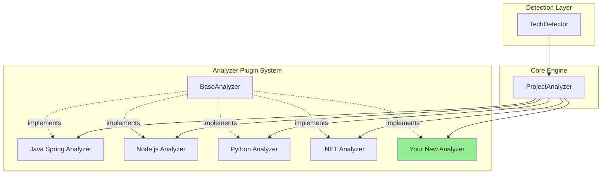

# Extending RE-cue: Adding New Framework Support

This guide explains how to add support for new web frameworks to RE-cue. Whether you're adding support for a new language ecosystem or a specific framework within an existing language, this guide will walk you through the process.

## Overview

Adding framework support involves:
1. Creating a framework analyzer class
2. Defining detection patterns
3. Creating framework-specific templates (optional)
4. Writing tests
5. Updating documentation

## Architecture Overview



## Step 1: Create Framework Analyzer

### 1.1 Create Analyzer File

Create a new file in `reverse_engineer/analyzers/`:

```bash
touch reverse_engineer/analyzers/ruby_rails_analyzer.py
```

### 1.2 Implement BaseAnalyzer

```python
from pathlib import Path
from typing import List
import re
from .base_analyzer import BaseAnalyzer
from ..models import Endpoint, Model, Service, Actor

class RubyRailsAnalyzer(BaseAnalyzer):
    """Analyzer for Ruby on Rails projects."""
    
    # Class-level framework identification
    framework_id = "ruby_rails"
    
    def __init__(self, repo_root: Path, verbose: bool = False):
        super().__init__(repo_root, verbose)
        
        # File patterns specific to Rails
        self.controller_patterns = ["*_controller.rb", "controllers/*.rb"]
        self.model_patterns = ["*.rb"]  # in models/ directory
        self.route_file = "config/routes.rb"
        
    def discover_endpoints(self) -> List[Endpoint]:
        """Discover Rails routes and controller actions."""
        endpoints = []
        
        # Find all controllers
        controllers_dir = self.repo_root / "app" / "controllers"
        if not controllers_dir.exists():
            return endpoints
        
        for controller_file in controllers_dir.rglob("*_controller.rb"):
            if self._is_test_file(controller_file):
                continue
            
            content = controller_file.read_text()
            controller_name = controller_file.stem.replace("_controller", "")
            
            # Extract actions (def method_name)
            action_pattern = r'^\s*def\s+(\w+)'
            for match in re.finditer(action_pattern, content, re.MULTILINE):
                action = match.group(1)
                
                # Skip private methods and common non-action methods
                if action in ['initialize', 'set_user', 'authorize_user']:
                    continue
                
                # Determine HTTP method from Rails conventions
                method = self._rails_action_to_http_method(action)
                
                # Build path from controller and action
                path = f"/{controller_name}"
                if action not in ['index', 'create']:
                    path += f"/{action}"
                
                # Check for authentication
                authenticated = self._check_authentication(content)
                
                endpoints.append(Endpoint(
                    method=method,
                    path=path,
                    controller=controller_name,
                    action=action,
                    authenticated=authenticated
                ))
        
        return endpoints
    
    def discover_models(self) -> List[Model]:
        """Discover ActiveRecord models."""
        models = []
        models_dir = self.repo_root / "app" / "models"
        
        if not models_dir.exists():
            return models
        
        for model_file in models_dir.rglob("*.rb"):
            if self._is_test_file(model_file):
                continue
            
            content = model_file.read_text()
            
            # Check for ActiveRecord::Base inheritance
            if "ActiveRecord::Base" not in content and "ApplicationRecord" not in content:
                continue
            
            model_name = model_file.stem.capitalize()
            
            # Extract associations
            associations = []
            association_patterns = [
                r'has_many\s+:(\w+)',
                r'has_one\s+:(\w+)',
                r'belongs_to\s+:(\w+)',
            ]
            
            for pattern in association_patterns:
                for match in re.finditer(pattern, content):
                    associations.append(match.group(1))
            
            models.append(Model(
                name=model_name,
                file_path=str(model_file),
                associations=associations
            ))
        
        return models
    
    def discover_services(self) -> List[Service]:
        """Discover Rails services and concerns."""
        services = []
        
        # Check for services directory
        services_dir = self.repo_root / "app" / "services"
        if services_dir.exists():
            for service_file in services_dir.rglob("*.rb"):
                service_name = service_file.stem
                services.append(Service(
                    name=service_name,
                    file_path=str(service_file),
                    type="service"
                ))
        
        return services
    
    def _rails_action_to_http_method(self, action: str) -> str:
        """Map Rails action names to HTTP methods."""
        action_mapping = {
            'index': 'GET',
            'show': 'GET',
            'new': 'GET',
            'edit': 'GET',
            'create': 'POST',
            'update': 'PUT',
            'destroy': 'DELETE'
        }
        return action_mapping.get(action, 'GET')
    
    def _check_authentication(self, content: str) -> bool:
        """Check for authentication filters in controller."""
        auth_patterns = [
            r'before_action\s+:authenticate',
            r'before_action\s+:require_login',
            r'skip_before_action\s+:authenticate',
        ]
        
        for pattern in auth_patterns:
            if re.search(pattern, content):
                return True
        
        return False
```

### 1.3 Required Methods

Every analyzer must implement these abstract methods from `BaseAnalyzer`:

```python
@abstractmethod
def discover_endpoints(self) -> List[Endpoint]:
    """Discover API endpoints from framework-specific patterns."""
    pass

@abstractmethod
def discover_models(self) -> List[Model]:
    """Discover data models from framework-specific patterns."""
    pass

@abstractmethod
def discover_services(self) -> List[Service]:
    """Discover backend services."""
    pass

@abstractmethod
def discover_actors(self) -> List[Actor]:
    """Discover actors based on security and access patterns."""
    pass

@abstractmethod
def discover_system_boundaries(self) -> List[SystemBoundary]:
    """Discover system boundaries and architectural layers."""
    pass

@abstractmethod
def extract_use_cases(self) -> List[UseCase]:
    """Extract use cases from business logic."""
    pass
```

## Step 2: Add Framework Detection

### 2.1 Update TechDetector

Edit `reverse_engineer/detectors/tech_detector.py`:

```python
def detect(self) -> TechStack:
    """Auto-detect project technology stack."""
    
    # Check for Ruby on Rails
    if self._is_ruby_rails():
        return TechStack(
            framework_id="ruby_rails",
            name="Ruby on Rails",
            language="ruby",
            version=self._detect_rails_version()
        )
    
    # ... other detection logic
    
def _is_ruby_rails(self) -> bool:
    """Detect Ruby on Rails project."""
    gemfile = self.repo_root / "Gemfile"
    
    if not gemfile.exists():
        return False
    
    content = gemfile.read_text()
    return "gem 'rails'" in content or 'gem "rails"' in content

def _detect_rails_version(self) -> str:
    """Extract Rails version from Gemfile.lock."""
    gemfile_lock = self.repo_root / "Gemfile.lock"
    
    if not gemfile_lock.exists():
        return "unknown"
    
    content = gemfile_lock.read_text()
    match = re.search(r'rails\s+\((\d+\.\d+\.\d+)', content)
    return match.group(1) if match else "unknown"
```

### 2.2 Register Analyzer

Update `reverse_engineer/analyzer.py`:

```python
from .analyzers import (
    JavaSpringAnalyzer,
    NodeExpressAnalyzer,
    PythonWebAnalyzer,
    DotNetAnalyzer,
    RubyRailsAnalyzer  # Add your analyzer
)

class ProjectAnalyzer:
    def _load_analyzer(self) -> BaseAnalyzer:
        """Load the appropriate framework-specific analyzer."""
        analyzer_map = {
            'java_spring': JavaSpringAnalyzer,
            'nodejs_express': NodeExpressAnalyzer,
            'python_django': PythonWebAnalyzer,
            'dotnet': DotNetAnalyzer,
            'ruby_rails': RubyRailsAnalyzer,  # Register your analyzer
        }
        
        analyzer_class = analyzer_map.get(self.tech_stack.framework_id)
        
        if not analyzer_class:
            raise UnsupportedFrameworkError(
                f"Framework '{self.tech_stack.name}' is not yet supported."
            )
        
        return analyzer_class(self.repo_root, self.verbose)
```

## Step 3: Create Framework Configuration (Optional)

### 3.1 Create YAML Configuration

Create `reverse_engineer/config/frameworks/ruby_rails.yaml`:

```yaml
framework:
  id: "ruby_rails"
  name: "Ruby on Rails"
  language: "ruby"
  version_detection:
    - file: "Gemfile"
      pattern: "gem ['\"]rails['\"]"
    - file: "Gemfile.lock"
      pattern: "rails \\((\\d+\\.\\d+\\.\\d+)\\)"

file_patterns:
  controllers:
    - "*_controller.rb"
    - "app/controllers/**/*.rb"
  models:
    - "app/models/*.rb"
    - "app/models/**/*.rb"
  views:
    - "app/views/**/*.erb"
    - "app/views/**/*.haml"
  routes:
    - "config/routes.rb"

patterns:
  endpoints:
    - "^\\s*def\\s+(\\w+)"  # Controller actions
    - "resources?\\s+:(\\w+)"  # RESTful routes
  
  authentication:
    - "before_action\\s+:authenticate"
    - "before_action\\s+:require_login"
    - "devise_for"
  
  authorization:
    - "authorize\\s+"
    - "before_action\\s+:authorize"
    - "can\\?\\s+"  # CanCanCan
  
  models:
    - "class\\s+(\\w+)\\s*<\\s*ActiveRecord::Base"
    - "class\\s+(\\w+)\\s*<\\s*ApplicationRecord"
  
  associations:
    - "has_many\\s+:(\\w+)"
    - "has_one\\s+:(\\w+)"
    - "belongs_to\\s+:(\\w+)"
    - "has_and_belongs_to_many\\s+:(\\w+)"

directory_structure:
  app_root: "app"
  controllers: "app/controllers"
  models: "app/models"
  views: "app/views"
  config: "config"
  db: "db"
```

## Step 4: Create Framework Templates (Optional)

### 4.1 Create Template Directory

```bash
mkdir -p reverse_engineer/templates/frameworks/ruby_rails
```

### 4.2 Create Framework-Specific Templates

Create `reverse_engineer/templates/frameworks/ruby_rails/endpoint_section.md`:

```markdown
## API Endpoints (Rails Controllers)

| Controller | Action | HTTP Method | Path | Authentication |
|------------|--------|-------------|------|----------------|
{{#each endpoints}}
| {{controller}} | {{action}} | {{method}} | {{path}} | {{#if authenticated}}✅ Required{{else}}❌ Public{{/if}} |
{{/each}}

### Rails-Specific Patterns

- **RESTful Resources**: Standard Rails conventions used
- **Nested Routes**: Controller namespacing detected
- **API Version**: {{api_version}}
```

## Step 5: Write Tests

### 5.1 Create Test Fixture

Create a sample project in `tests/fixtures/ruby_rails_sample/`:

```bash
tests/fixtures/ruby_rails_sample/
├── Gemfile
├── Gemfile.lock
├── config/
│   └── routes.rb
└── app/
    ├── controllers/
    │   ├── application_controller.rb
    │   └── users_controller.rb
    └── models/
        └── user.rb
```

### 5.2 Create Unit Tests

Create `tests/test_ruby_rails_analyzer.py`:

```python
import unittest
from pathlib import Path
from reverse_engineer.analyzers.ruby_rails_analyzer import RubyRailsAnalyzer

class TestRubyRailsAnalyzer(unittest.TestCase):
    """Test Ruby on Rails analyzer."""
    
    def setUp(self):
        self.project_path = Path(__file__).parent / "fixtures" / "ruby_rails_sample"
        self.analyzer = RubyRailsAnalyzer(self.project_path, verbose=False)
    
    def test_discover_endpoints(self):
        """Test endpoint discovery in Rails project."""
        endpoints = self.analyzer.discover_endpoints()
        
        self.assertGreater(len(endpoints), 0)
        
        # Verify endpoint structure
        endpoint = endpoints[0]
        self.assertIn(endpoint.method, ['GET', 'POST', 'PUT', 'DELETE'])
        self.assertTrue(endpoint.path.startswith('/'))
        self.assertIsNotNone(endpoint.controller)
    
    def test_discover_models(self):
        """Test ActiveRecord model discovery."""
        models = self.analyzer.discover_models()
        
        self.assertGreater(len(models), 0)
        
        # Verify model structure
        model = models[0]
        self.assertIsNotNone(model.name)
        self.assertTrue(model.file_path.endswith('.rb'))
    
    def test_rails_action_mapping(self):
        """Test Rails action to HTTP method mapping."""
        self.assertEqual(
            self.analyzer._rails_action_to_http_method('index'),
            'GET'
        )
        self.assertEqual(
            self.analyzer._rails_action_to_http_method('create'),
            'POST'
        )
        self.assertEqual(
            self.analyzer._rails_action_to_http_method('destroy'),
            'DELETE'
        )

if __name__ == '__main__':
    unittest.main()
```

### 5.3 Create Integration Tests

Create `tests/test_ruby_rails_integration.py`:

```python
import unittest
from pathlib import Path
from reverse_engineer.analyzer import ProjectAnalyzer
from reverse_engineer.detectors.tech_detector import TechDetector

class TestRubyRailsIntegration(unittest.TestCase):
    """Integration tests for Ruby on Rails support."""
    
    def setUp(self):
        self.project_path = Path(__file__).parent / "fixtures" / "ruby_rails_sample"
    
    def test_framework_detection(self):
        """Test Rails framework detection."""
        detector = TechDetector(self.project_path)
        tech_stack = detector.detect()
        
        self.assertEqual(tech_stack.framework_id, "ruby_rails")
        self.assertEqual(tech_stack.language, "ruby")
    
    def test_full_analysis_pipeline(self):
        """Test complete analysis workflow."""
        analyzer = ProjectAnalyzer(self.project_path)
        
        # Run analysis
        analyzer.discover_endpoints()
        analyzer.discover_models()
        analyzer.discover_actors()
        
        # Verify results
        self.assertGreater(len(analyzer.endpoints), 0)
        self.assertGreater(len(analyzer.models), 0)
```

## Step 6: Update Documentation

### 6.1 Create Framework Guide

Create `docs/frameworks/ruby-guide.md` following the pattern of existing guides.

### 6.2 Update Framework Overview

Update `docs/frameworks/README.md`:

```markdown
| Framework | Language | Version | Status | Guide |
|-----------|----------|---------|--------|-------|
| **Ruby on Rails** | Ruby | 6.x, 7.x | ✅ Full Support | [Ruby Guide](ruby-guide.md) |
```

### 6.3 Update Main README

Add Ruby on Rails to the supported frameworks list in `README.md`.

## Step 7: Update CLI

### 7.1 Add Framework Choice

Update `reverse_engineer/cli.py`:

```python
framework_group.add_argument(
    '--framework',
    type=str,
    choices=[
        'java_spring',
        'nodejs_express',
        'python_django',
        'dotnet',
        'ruby_rails',  # Add your framework
    ],
    help='Force specific framework analyzer'
)
```

## Testing Checklist

Before submitting your framework support:

- [ ] Framework detection works correctly
- [ ] Endpoint discovery finds all routes/controllers
- [ ] Model discovery identifies data models
- [ ] Security patterns are detected (authentication/authorization)
- [ ] Service layer components are identified
- [ ] All unit tests pass
- [ ] Integration tests pass
- [ ] Test fixture project is realistic
- [ ] Documentation is complete
- [ ] Examples are provided

## Common Patterns

### Pattern: Route Extraction

Most frameworks define routes in one of these ways:

1. **Annotations/Decorators**: Java Spring, Python FastAPI
2. **Function calls**: Express.js, Flask
3. **Configuration files**: Ruby on Rails, Django
4. **Attributes**: .NET

Example extraction:

```python
def extract_routes_from_config(self, config_file: Path) -> List[Endpoint]:
    """Extract routes from configuration file."""
    content = config_file.read_text()
    endpoints = []
    
    # Parse config (adjust regex for your framework)
    pattern = r'route\s+["\'](.+?)["\']\s+to:\s+["\'](\w+)#(\w+)["\']'
    for match in re.finditer(pattern, content):
        path, controller, action = match.groups()
        endpoints.append(Endpoint(
            method='GET',  # Determine from context
            path=path,
            controller=controller,
            action=action
        ))
    
    return endpoints
```

### Pattern: Security Detection

```python
def detect_security_patterns(self, content: str) -> Dict[str, Any]:
    """Detect authentication and authorization patterns."""
    return {
        'authenticated': bool(re.search(r'@auth|@login_required', content)),
        'roles': re.findall(r'role[s]?[:=]\s*["\'](\w+)["\']', content),
        'permissions': re.findall(r'permission[s]?[:=]\s*["\'](\w+)["\']', content)
    }
```

## Contributing

Once your framework support is complete:

1. Fork the repository
2. Create a feature branch: `git checkout -b feature/add-ruby-rails`
3. Commit your changes with clear messages
4. Run all tests: `python -m pytest tests/`
5. Push to your fork
6. Create a Pull Request

## Getting Help

- **GitHub Discussions**: Ask questions about extending RE-cue
- **Examples**: Look at existing analyzers for reference
- **Architecture**: See `docs/MULTI-FRAMEWORK-PLAN.md` for design details

---

**Related**: [Framework Overview](README.md) | [Java Spring](java-spring-guide.md) | [Node.js](nodejs-guide.md) | [Python](python-guide.md)
