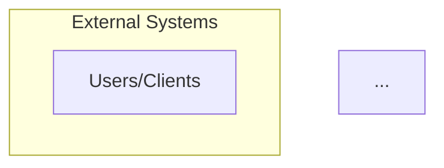
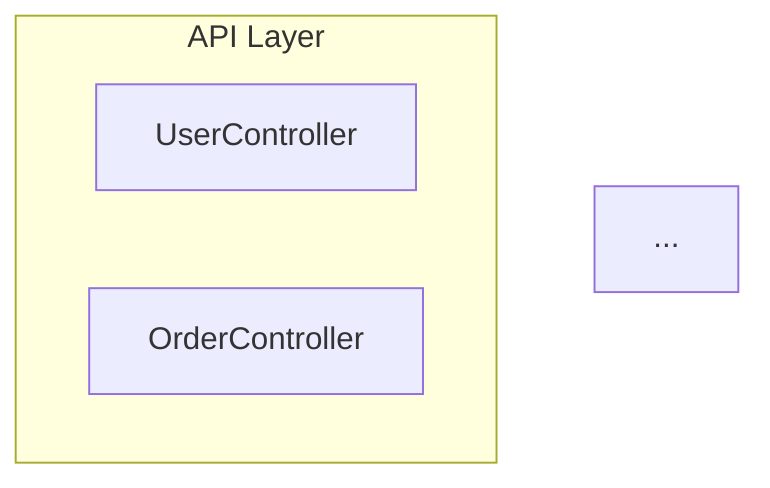
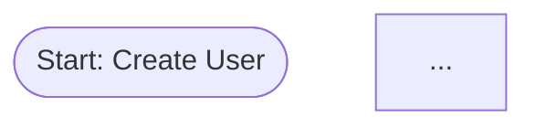
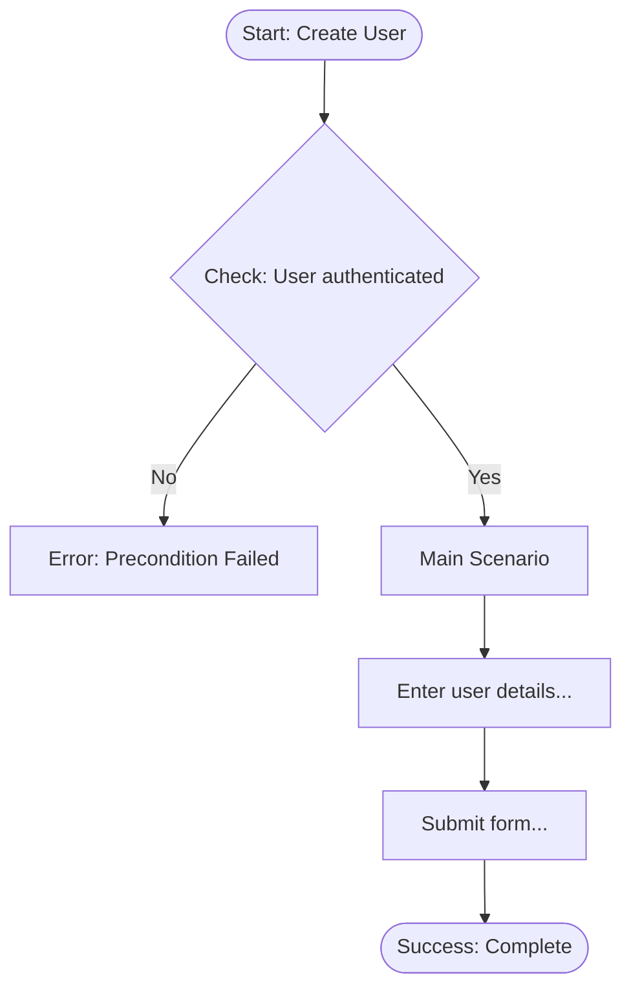
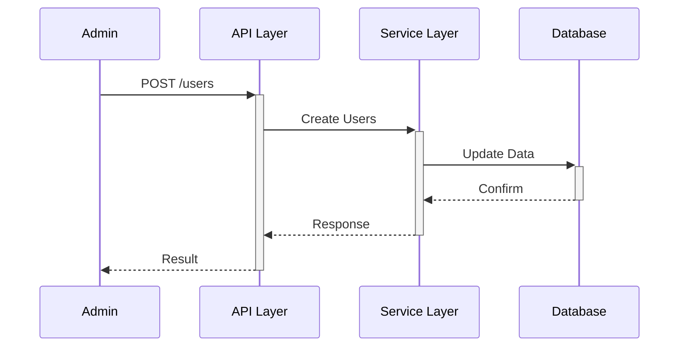
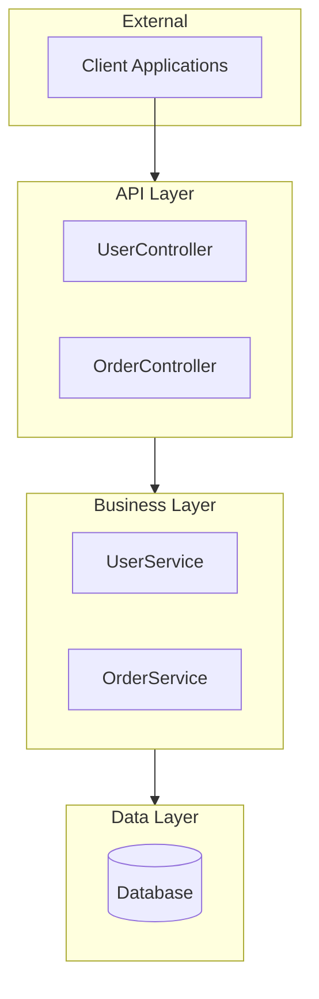
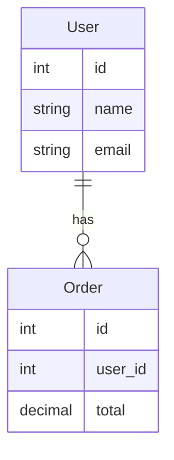
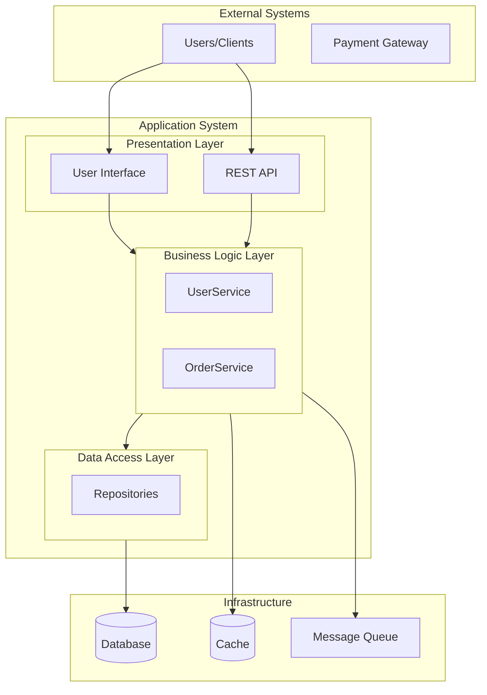

# Business Process Visualization

**Feature ID**: ENH-DOC-002  
**Status**: Implemented  
**Version**: 1.1.0

## Overview

The Business Process Visualization feature generates visual diagrams from reverse-engineered code analysis using Mermaid.js syntax. This feature provides multiple diagram types to help teams understand system architecture, workflows, and interactions.

## Features

### Diagram Types

1. **Flowcharts** - Use case scenario flows with decision points
2. **Sequence Diagrams** - Actor-system interactions showing request/response flows
3. **Component Diagrams** - System architecture and component relationships
4. **Entity Relationship Diagrams** - Data model relationships and structures
5. **Architecture Diagrams** - High-level system architecture overview

## Usage

### Generate All Diagrams

Generate all visualization diagrams in a single document:

```bash
recue --diagrams --path /path/to/project
```

This creates a `diagrams.md` file containing all diagram types with embedded Mermaid.js syntax.

### Generate Specific Diagram Types

Generate only specific diagram types:

```bash
# Generate only flowcharts
recue --diagrams --diagram-type flowchart --path /path/to/project

# Generate only sequence diagrams
recue --diagrams --diagram-type sequence --path /path/to/project

# Generate only component diagrams
recue --diagrams --diagram-type component --path /path/to/project

# Generate only ER diagrams
recue --diagrams --diagram-type er --path /path/to/project

# Generate only architecture diagrams
recue --diagrams --diagram-type architecture --path /path/to/project
```

### Combined Analysis

Generate diagrams along with other documentation:

```bash
# Full documentation with diagrams
recue --spec --plan --use-cases --diagrams --description "Project Analysis"

# Use cases with visualization
recue --use-cases --diagrams --path /path/to/project
```

## Output

### File Location

Diagrams are saved to: `<project-root>/re-<project-name>/diagrams.md`

### Format

The output file contains:
- Markdown-formatted document
- Embedded Mermaid.js code blocks
- Organized sections for each diagram type
- Descriptive headers and metadata

### Example Output Structure

```markdown
# Business Process Visualization

## Architecture Diagrams

### Architecture Overview



## Component Diagrams

### Component Diagram: System Architecture



## Sequence Diagrams

### Sequence Diagram: Admin Interactions

```mermaid
sequenceDiagram
    participant Admin as Admin
    participant API as API Layer
    ...
```

## Use Case Flowcharts

### Flowchart: Create User



## Entity Relationship Diagrams

### Entity Relationship Diagram

```mermaid
erDiagram
    User {
        int id
        string name
        string email
    }
    ...
```
```

## Viewing Diagrams

### GitHub

GitHub automatically renders Mermaid.js diagrams in Markdown files. Simply view the `diagrams.md` file in GitHub's web interface.

### Local Viewing

Several options for viewing diagrams locally:

1. **VS Code** with Markdown Preview Mermaid Support extension
2. **Mermaid Live Editor** - Copy/paste diagram code to https://mermaid.live/
3. **Documentation Tools** - Hugo, MkDocs, Docusaurus all support Mermaid
4. **Browser Extensions** - Mermaid diagram visualizer extensions

### Export Options

Convert Mermaid diagrams to images:

```bash
# Using Mermaid CLI
npm install -g @mermaid-js/mermaid-cli
mmdc -i diagrams.md -o diagrams.pdf

# Using online tools
# Visit https://mermaid.live/ and export as PNG/SVG
```

## Diagram Details

### Flowcharts

**Purpose**: Visualize use case execution flows with decision points and error paths

**Generated For**: Each identified use case (up to 15 per document)

**Includes**:
- Start and end nodes
- Precondition checks
- Main scenario steps (up to 5 steps shown)
- Success path
- Error handling (extension scenarios)

**Example**:


### Sequence Diagrams

**Purpose**: Show actor-system interactions and message flows

**Generated For**: Each actor with their associated endpoints (up to 10 actors)

**Includes**:
- Actor as initiator
- API layer
- Service layer
- Database interactions
- Request/response flows

**Example**:


### Component Diagrams

**Purpose**: Visualize system architecture and component organization

**Generated From**: 
- Detected system boundaries (preferred)
- Controllers and services (fallback)

**Includes**:
- Presentation layer
- Business logic layer
- Data access layer
- Component relationships

**Example**:


### Entity Relationship Diagrams

**Purpose**: Show data model relationships and structure

**Generated For**: All discovered models (up to 20 entities)

**Includes**:
- Entity definitions with fields
- Field types
- Relationships (detected from foreign keys)
- Cardinality indicators

**Example**:


### Architecture Diagrams

**Purpose**: Provide high-level system architecture overview

**Generated From**: All discovered components and layers

**Includes**:
- External systems
- Application layers (presentation, business, data)
- Infrastructure components (database, cache, queue)
- System boundaries
- Inter-layer communication

**Example**:


## Configuration

### Diagram Configuration

Customize diagram generation through the `DiagramConfig` class:

```python
from reverse_engineer.diagram_generator import DiagramConfig

config = DiagramConfig(
    include_flowcharts=True,           # Generate flowcharts
    include_sequence_diagrams=True,    # Generate sequence diagrams
    include_component_diagrams=True,   # Generate component diagrams
    include_er_diagrams=True,          # Generate ER diagrams
    include_architecture_diagrams=True,# Generate architecture diagrams
    max_actors_per_diagram=10,         # Max actors in sequence diagrams
    max_use_cases_per_diagram=15,      # Max use cases for flowcharts
    max_entities_per_diagram=20        # Max entities in ER diagrams
)
```

### Programmatic Usage

Use the diagram generator programmatically:

```python
from reverse_engineer.analyzer import ProjectAnalyzer
from reverse_engineer.diagram_generator import DiagramGenerator, DiagramConfig

# Create analyzer
analyzer = ProjectAnalyzer(project_path)
analyzer.analyze()

# Generate diagrams
config = DiagramConfig()
generator = DiagramGenerator(analyzer, config)

# All diagrams
all_diagrams = generator.generate_all_diagrams()

# Specific diagram type
flowcharts = generator.generate_specific_diagram('flowchart')
sequence = generator.generate_specific_diagram('sequence')
components = generator.generate_specific_diagram('component')
er = generator.generate_specific_diagram('er')
architecture = generator.generate_specific_diagram('architecture')
```

## Integration with Other Features

### Use Case Analysis

Diagrams complement use case documentation:

```bash
# Generate use cases with flowcharts
recue --use-cases --diagrams --path /path/to/project
```

This creates:
- `phase4-use-cases.md` - Textual use case documentation
- `diagrams.md` - Visual flowcharts for each use case

### 4+1 Architecture View

Diagrams provide visual support for 4+1 architecture documentation:

```bash
recue --use-cases --fourplusone --diagrams --path /path/to/project
```

This creates comprehensive documentation with both textual and visual representations.

### API Documentation

Sequence diagrams show API interaction flows:

```bash
recue --api-contract --diagrams --path /path/to/project
```

Combines OpenAPI specifications with visual sequence diagrams.

## Best Practices

### 1. Review Generated Diagrams

Generated diagrams are based on code analysis and may need refinement:
- Check actor-endpoint mappings
- Verify component relationships
- Review foreign key detection for ER diagrams

### 2. Use with Use Case Analysis

Diagrams are most valuable when combined with use case analysis:
```bash
recue --use-cases --diagrams
```

### 3. Customize for Large Projects

For large codebases, limit diagram complexity:
- Use `--diagram-type` to generate specific types
- Configure limits through `DiagramConfig`
- Focus on critical components first

### 4. Documentation Workflows

Integrate diagrams into documentation workflows:
- Commit diagrams with code changes
- Include in architecture decision records (ADRs)
- Use in onboarding materials
- Reference in technical design documents

## Limitations

### Current Limitations

1. **Heuristic-Based Detection**: Relationships and flows are detected heuristically
2. **Maximum Limits**: Diagrams have maximum element limits to maintain readability
3. **Mermaid.js Constraints**: Subject to Mermaid.js syntax limitations
4. **Static Analysis**: Based on static code analysis, not runtime behavior

### Future Enhancements

Planned improvements:
- **Interactive Diagrams**: Generate interactive HTML diagrams
- **Customizable Templates**: User-defined diagram templates
- **Relationship Refinement**: Manual relationship editing
- **Runtime Analysis**: Integration with runtime tracing
- **Export Formats**: Direct PNG/SVG/PDF export

## Troubleshooting

### No Diagrams Generated

**Problem**: Empty or missing diagrams in output

**Solutions**:
1. Ensure project has been analyzed: `--use-cases` flag generates required data
2. Check that project has relevant components (controllers, models, use cases)
3. Verify project path is correct
4. Run with `--verbose` to see analysis details

### Mermaid Syntax Errors

**Problem**: Diagrams don't render in viewers

**Solutions**:
1. Check for special characters in names (auto-sanitized, but check output)
2. Verify Mermaid.js version compatibility in viewer
3. Test syntax at https://mermaid.live/
4. Report issues with problematic diagrams

### Missing Relationships

**Problem**: ER diagram missing expected relationships

**Solutions**:
1. Ensure foreign key fields use common naming patterns (`*_id`, `*Id`)
2. Check that related entities are both discovered
3. Review model field analysis with `--verbose`

### Large Diagram Performance

**Problem**: Diagrams too complex or slow to render

**Solutions**:
1. Use specific diagram types: `--diagram-type component`
2. Reduce limits in configuration
3. Focus on specific subsystems
4. Split large systems into multiple analyses

## Examples

### Example 1: Spring Boot Application

```bash
# Analyze Spring Boot project
cd ~/projects/my-spring-app
recue --use-cases --diagrams

# Output:
# - phase1-structure.md
# - phase2-actors.md
# - phase3-boundaries.md
# - phase4-use-cases.md
# - diagrams.md (with all diagram types)
```

### Example 2: Ruby on Rails Application

```bash
# Analyze Rails project with specific diagrams
cd ~/projects/my-rails-app
recue --use-cases --diagrams --diagram-type sequence

# Output:
# - phase documents
# - diagrams.md (sequence diagrams only)
```

### Example 3: Node.js/Express Application

```bash
# Full documentation with diagrams
cd ~/projects/my-express-app
recue --spec --plan --api-contract --use-cases --diagrams \
     --description "E-commerce API"

# Output:
# - spec.md
# - plan.md
# - contracts/api-spec.json
# - phase documents
# - diagrams.md
```

## FAQ

**Q: Can I edit generated diagrams?**  
A: Yes, diagrams are in Mermaid.js text format and can be edited in any text editor.

**Q: Do diagrams work offline?**  
A: Diagrams are stored as text. Viewing requires a Mermaid.js-compatible viewer (VS Code, browser extensions, or online tools).

**Q: Can I customize diagram styles?**  
A: Mermaid.js supports themes and styling. Add style directives to the diagram code blocks.

**Q: Are diagrams versioned with code?**  
A: Yes, diagrams are text files that can be committed to version control.

**Q: Can I export diagrams to PNG/SVG?**  
A: Use Mermaid CLI (`mmdc`), online tools (mermaid.live), or IDE extensions to export diagrams.

## Related Features

- [Use Case Analysis](PHASE5-BUSINESS-CONTEXT-SUMMARY.md)
- [4+1 Architecture View](FOURPLUSONE-GENERATOR.md)
- [Enhanced Boundary Detection](enhanced-boundary-detection.md)
- [Interactive Use Case Refinement](INTERACTIVE-USE-CASE-REFINEMENT.md)

## References

- [Mermaid.js Documentation](https://mermaid.js.org/)
- [GitHub Mermaid Support](https://github.blog/2022-02-14-include-diagrams-markdown-files-mermaid/)
- [UML Diagram Best Practices](https://www.visual-paradigm.com/guide/uml-unified-modeling-language/uml-practical-guide/)

---

*Generated by RE-cue - Reverse Engineering Toolkit*
