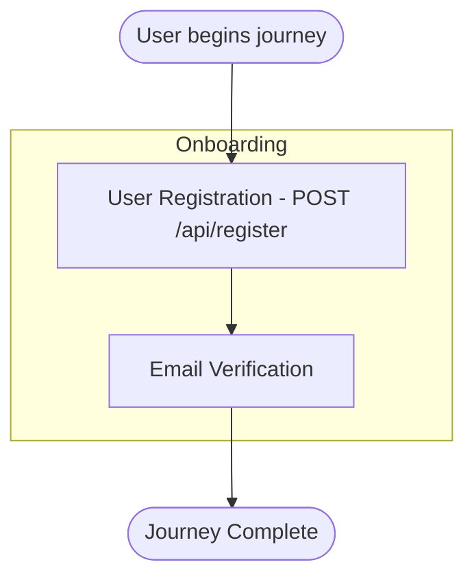
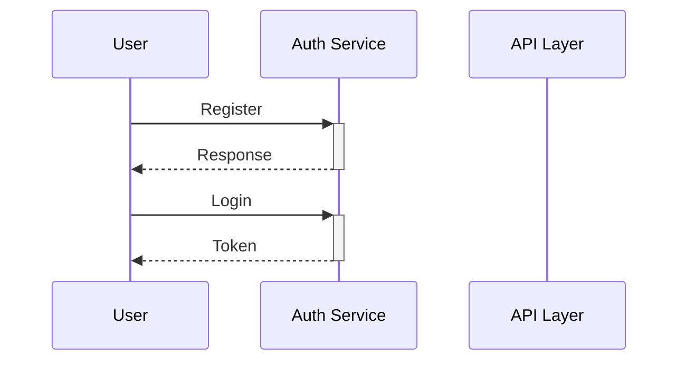

# User Journey Mapping

**Feature ID**: ENH-DOC-003  
**Status**: Implemented  
**Version**: 1.2.0

## Overview

The User Journey Mapping feature combines multiple use cases into end-to-end user journeys, providing comprehensive visualization and documentation of user workflows. This feature enables teams to understand how users interact with the system across multiple boundaries and features.

## Features

### Journey Identification

1. **Automatic Journey Discovery** - Analyzes use cases to identify coherent user journeys
2. **Theme-Based Grouping** - Groups related use cases by functional themes (authentication, commerce, etc.)
3. **Actor-Based Organization** - Creates separate journeys for each actor type
4. **Sequential Ordering** - Orders use cases based on precondition/postcondition dependencies

### Touchpoint Analysis

1. **Boundary Detection** - Identifies all system boundaries involved in a journey
2. **Interaction Mapping** - Maps each touchpoint to specific endpoints and use cases
3. **Cross-Boundary Flows** - Detects and documents flows that span multiple boundaries
4. **Data Exchange** - Documents data passed at each touchpoint

### Documentation Generation

1. **Journey Visualization** - Mermaid.js flowcharts and sequence diagrams
2. **Epic Generation** - Automatically generates epics from journeys
3. **User Story Mapping** - Creates user stories from touchpoints
4. **Complexity Analysis** - Assesses journey complexity (simple, medium, complex)

## Usage

### Generate User Journey Mapping

```bash
recue --journey --path /path/to/project
```

This creates two output files:
- `journey-map.md` - Markdown documentation with visualizations
- `journey-map.json` - JSON format for programmatic use

### Combined with Use Case Analysis

For best results, combine with use case analysis:

```bash
# Full analysis with journey mapping
recue --use-cases --journey --path /path/to/project

# Complete documentation suite
recue --use-cases --journey --fourplusone --diagrams --path /path/to/project
```

## Output

### File Location

Journey mapping documents are saved to: `<project-root>/re-<project-name>/journey-map.md`

### Document Structure

The generated documentation includes:

1. **Summary** - Overview metrics and complexity distribution
2. **Journey Overview** - Table of all identified journeys
3. **Journey Visualizations** - Mermaid diagrams for each journey
4. **Journey Details** - Detailed breakdown of stages and touchpoints
5. **Generated Epics** - Epics derived from journeys
6. **User Story Map** - User stories organized by journey
7. **Cross-Boundary Flows** - Analysis of inter-boundary interactions
8. **Recommendations** - Actionable suggestions for improvement

### Example Output

```markdown
# User Journey Mapping

## Summary

| Metric | Value |
|--------|-------|
| Total Journeys | 4 |
| Total Epics | 4 |
| Total User Stories | 15 |
| Total Touchpoints | 23 |

## Journey Overview

| ID | Journey | Actor | Stages | Touchpoints | Complexity |
|-----|---------|-------|--------|-------------|------------|
| JOURNEY-001 | User Authentication Journey | User | 2 | 5 | 🟡 Medium |
| JOURNEY-002 | User Commerce Journey | Customer | 4 | 12 | 🔴 Complex |
```

### Journey Visualization

Each journey includes flowchart visualizations:



For medium/complex journeys, sequence diagrams are also generated:



## Configuration

### Programmatic Usage

```python
from reverse_engineer.analyzer import ProjectAnalyzer
from reverse_engineer.generation.journey import JourneyGenerator

# Create analyzer
analyzer = ProjectAnalyzer(project_path)
analyzer.analyze()

# Generate journey mapping
generator = JourneyGenerator(analyzer)
markdown_output = generator.generate()
json_output = generator.generate(output_format="json")
```

### Analysis Configuration

The JourneyAnalyzer uses these configuration constants:

```python
MAX_STAGES_PER_JOURNEY = 8  # Maximum stages per journey
MAX_TOUCHPOINTS_PER_STAGE = 10  # Maximum touchpoints per stage
MAX_USE_CASES_PER_JOURNEY = 15  # Maximum use cases to combine
```

## Journey Identification Rules

### Theme Patterns

Use cases are grouped by common themes:

| Theme | Keywords |
|-------|----------|
| Authentication | login, logout, auth, signin, signup, register, password, session |
| User Management | user, profile, account, settings, preferences |
| Content Management | create, edit, delete, update, manage, content |
| Commerce | order, cart, checkout, payment, purchase, product |
| Communication | message, notification, email, chat, comment, share |
| Reporting | report, analytics, dashboard, statistics, export |
| Administration | admin, configure, system, moderate, approve |
| Search/Discovery | search, find, filter, browse, explore, list |

### Complexity Classification

| Complexity | Criteria |
|------------|----------|
| Simple | ≤2 use cases, ≤2 extensions |
| Medium | 3-5 use cases, 3-5 extensions |
| Complex | >5 use cases or >5 extensions |

## Epic Generation

Epics are automatically generated with:

- **Title**: Derived from journey name
- **Description**: Summarizes the journey's scope
- **Business Value**: Describes actor benefit
- **Acceptance Criteria**: Based on journey goals
- **Priority**: Mapped from complexity
- **Effort Estimate**: Based on use case count

### Priority Mapping

| Journey Complexity | Epic Priority |
|-------------------|---------------|
| Complex | High |
| Medium | Medium |
| Simple | Low |

### Effort Estimation

| Use Cases | Estimated Effort |
|-----------|------------------|
| 1-2 | 1 sprint |
| 3-5 | 2-3 sprints |
| >5 | 3+ sprints |

## User Story Format

Generated user stories follow the standard format:

> As a **[role]**, I want **[goal]**, so that **[benefit]**

Each story includes:
- Unique identifier (US-XXXX)
- Title from touchpoint
- Acceptance criteria (Given/When/Then)
- Priority based on sequence order
- Links to journey and stage

## Integration with Other Features

### Business Process Visualization (ENH-DOC-002)

Journey mapping builds on visualization capabilities:

```bash
recue --use-cases --journey --diagrams --path /path/to/project
```

### 4+1 Architecture View

Journey mapping complements architecture documentation:

```bash
recue --use-cases --journey --fourplusone --path /path/to/project
```

### Traceability Matrix

Link journeys to implementation:

```bash
recue --use-cases --journey --traceability --path /path/to/project
```

## Best Practices

### 1. Complete Use Case Analysis First

Journey mapping depends on quality use case data:

```bash
# First, generate use case analysis
recue --use-cases --path /path/to/project

# Then, add journey mapping
recue --journey --path /path/to/project
```

### 2. Review Generated Journeys

Validate the automatic journey grouping:
- Check actor assignments
- Verify stage boundaries
- Review touchpoint sequence

### 3. Use for Sprint Planning

Leverage generated epics and stories:
1. Import epics to backlog
2. Prioritize based on business value
3. Refine user story acceptance criteria
4. Size stories based on touchpoints

### 4. Stakeholder Communication

Share journey visualizations:
- Use flowcharts in design reviews
- Share sequence diagrams with developers
- Present complexity analysis to stakeholders

## Troubleshooting

### No Journeys Generated

**Problem**: Journey mapping produces no journeys

**Solutions**:
1. Ensure use case analysis has been run
2. Verify use cases have primary actors defined
3. Check that use case names follow common patterns
4. Run with `--verbose` to see analysis details

### Missing Touchpoints

**Problem**: Journeys have fewer touchpoints than expected

**Solutions**:
1. Verify endpoints are discovered
2. Check use case-endpoint name matching
3. Review endpoint controller associations

### Complex Journey Warnings

**Problem**: Too many complex journeys

**Solutions**:
1. Consider splitting large use cases
2. Review business process granularity
3. Separate distinct user workflows

## Examples

### Example 1: E-commerce Application

```bash
cd ~/projects/my-ecommerce-app
recue --use-cases --journey

# Generated journeys:
# - Customer Shopping Journey
# - Customer Checkout Journey
# - Admin Product Management Journey
```

### Example 2: SaaS Application

```bash
cd ~/projects/my-saas-app
recue --use-cases --journey --fourplusone

# Generated journeys:
# - User Onboarding Journey
# - User Subscription Journey
# - Admin User Management Journey
```

### Example 3: JSON Export for CI/CD

```bash
# Export journey data for analysis
recue --journey --path /path/to/project

# Parse JSON for metrics
cat journey-map.json | jq '.summary'
```

## JSON Schema

### Journey Object

```json
{
  "id": "JOURNEY-001",
  "name": "User Authentication Journey",
  "description": "End-to-end authentication workflow",
  "primary_actor": "User",
  "goal": "Successfully authenticate to the system",
  "complexity": "medium",
  "stage_count": 2,
  "touchpoint_count": 5,
  "use_case_ids": ["UC-001", "UC-002"],
  "boundaries_crossed": ["Auth Service", "User Service"],
  "preconditions": ["User has valid credentials"],
  "success_outcome": "User is authenticated",
  "stages": [...]
}
```

### Epic Object

```json
{
  "id": "EPIC-001",
  "title": "User Authentication Epic",
  "journey_id": "JOURNEY-001",
  "priority": "high",
  "estimated_effort": "2-3 sprints",
  "business_value": "Enables Users to securely access the system",
  "story_count": 5
}
```

### User Story Object

```json
{
  "id": "US-0001",
  "title": "User Login",
  "as_a": "registered user",
  "i_want": "to login to the system",
  "so_that": "I can access my account",
  "journey_id": "JOURNEY-001",
  "stage_id": "JOURNEY-001-STAGE-01",
  "priority": "high"
}
```

## Related Features

- [Business Process Visualization](business-process-visualization.md)
- [4+1 Architecture View](FOURPLUSONE-GENERATOR.md)
- [Requirements Traceability](requirements-traceability.md)
- [Integration Testing Guidance](integration-testing-guidance.md)

## References

- [User Story Mapping (Jeff Patton)](https://www.jpattonassociates.com/user-story-mapping/)
- [Journey Maps (Nielsen Norman Group)](https://www.nngroup.com/articles/customer-journey-mapping/)
- [Mermaid.js Documentation](https://mermaid.js.org/)

---

*Generated by RE-cue - Reverse Engineering Toolkit*
