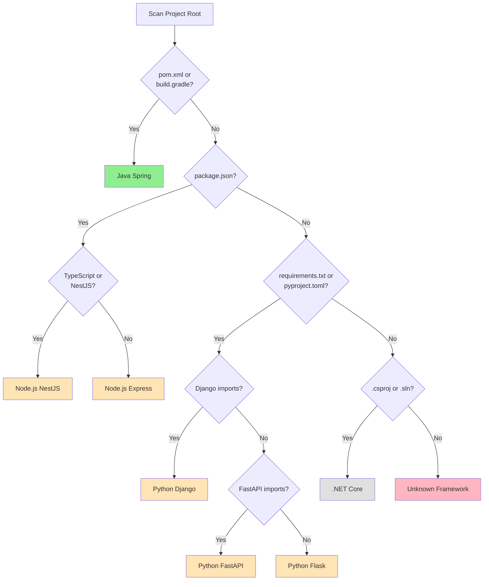

# Framework Support Overview

RE-cue is a universal reverse engineering tool that supports multiple technology stacks and web frameworks. This document provides an overview of supported frameworks and guides you to framework-specific documentation.

## Supported Frameworks

### ✅ Currently Supported

| Framework | Language | Version | Status | Guide |
|-----------|----------|---------|--------|-------|
| **Spring Boot** | Java | 2.x, 3.x | ✅ Full Support | [Java Spring Guide](java-spring-guide.md) |
| **Express** | Node.js | 4.x+ | 🚧 In Development | [Node.js Guide](nodejs-guide.md) |
| **NestJS** | TypeScript | 9.x+ | 🚧 In Development | [Node.js Guide](nodejs-guide.md) |
| **Django** | Python | 3.x, 4.x | 🚧 In Development | [Python Guide](python-guide.md) |
| **Flask** | Python | 2.x, 3.x | 🚧 In Development | [Python Guide](python-guide.md) |
| **FastAPI** | Python | 0.95+ | 🚧 In Development | [Python Guide](python-guide.md) |
| **ASP.NET Core** | C# | 6.0+ | 🚧 Planned | [.NET Guide](dotnet-guide.md) |
| **Ruby on Rails** | Ruby | 6.x, 7.x | 🚧 Planned | Coming Soon |

### 🔄 Planned Support

- **Go** - Gin, Echo frameworks
- **PHP** - Laravel, Symfony
- **Rust** - Actix, Rocket

## How Framework Detection Works

RE-cue automatically detects your project's framework by analyzing:

1. **Build files** - `pom.xml`, `package.json`, `requirements.txt`, `Gemfile`, `.csproj`
2. **Project structure** - Directory layouts, source organization
3. **Framework-specific files** - Configuration files, entry points
4. **Import patterns** - Framework-specific imports and dependencies



## Quick Start by Framework

### Java Spring Boot
```bash
# Auto-detect and analyze
reverse-engineer --spec --use-cases --path ~/projects/spring-app

# Force Spring analyzer
reverse-engineer --spec --framework java_spring --path ~/projects/spring-app
```

### Node.js Express
```bash
# Auto-detect and analyze
reverse-engineer --spec --use-cases --path ~/projects/express-app

# Force Express analyzer
reverse-engineer --spec --framework nodejs_express --path ~/projects/express-app
```

### Python Django
```bash
# Auto-detect and analyze
reverse-engineer --spec --use-cases --path ~/projects/django-app

# Force Django analyzer
reverse-engineer --spec --framework python_django --path ~/projects/django-app
```

### Python FastAPI
```bash
# Auto-detect and analyze
reverse-engineer --spec --use-cases --path ~/projects/fastapi-app

# Force FastAPI analyzer
reverse-engineer --spec --framework python_fastapi --path ~/projects/fastapi-app
```

### .NET Core
```bash
# Auto-detect and analyze
reverse-engineer --spec --use-cases --path ~/projects/dotnet-app

# Force .NET analyzer
reverse-engineer --spec --framework dotnet --path ~/projects/dotnet-app
```

## Common CLI Commands

### List Supported Frameworks
```bash
reverse-engineer --list-frameworks
```

Output:
```
Supported Frameworks:
  java_spring        Java Spring Boot (2.x, 3.x)
  nodejs_express     Node.js Express (4.x+)
  nodejs_nestjs      NestJS (9.x+)
  python_django      Python Django (3.x, 4.x)
  python_flask       Python Flask (2.x, 3.x)
  python_fastapi     Python FastAPI (0.95+)
  dotnet             ASP.NET Core (6.0+)
  ruby_rails         Ruby on Rails (6.x, 7.x)
```

### Detect Framework
```bash
reverse-engineer --detect --path ~/projects/my-app
```

Output:
```
Analyzing project structure...
✓ Detected framework: Node.js Express
  Language: JavaScript/TypeScript
  Version: 4.18.2
  Entry point: src/app.js
  Routes detected: 15 endpoints
  Models detected: 8 data models
```

### Force Specific Framework
```bash
# Use this if auto-detection fails or for edge cases
reverse-engineer --spec --framework nodejs_express --path ~/projects/app
```

## Framework-Specific Features

### What Gets Analyzed

Each framework analyzer detects:

| Feature | Java Spring | Node.js | Python | .NET |
|---------|-------------|---------|--------|------|
| **API Endpoints** | ✅ | ✅ | ✅ | ✅ |
| **HTTP Methods** | ✅ | ✅ | ✅ | ✅ |
| **Route Patterns** | ✅ | ✅ | ✅ | ✅ |
| **Authentication** | ✅ | ✅ | ✅ | ✅ |
| **Authorization Roles** | ✅ | ✅ | ✅ | ✅ |
| **Data Models** | ✅ | ✅ | ✅ | ✅ |
| **Services/Controllers** | ✅ | ✅ | ✅ | ✅ |
| **System Boundaries** | ✅ | ✅ | ✅ | ✅ |
| **Use Cases** | ✅ | ✅ | ✅ | ✅ |
| **Actors** | ✅ | ✅ | ✅ | ✅ |

### Framework-Specific Patterns

Each analyzer understands framework-specific patterns:

- **Java Spring**: Annotations (`@RestController`, `@GetMapping`, `@PreAuthorize`)
- **Node.js Express**: Route definitions (`app.get()`, `router.post()`, middleware)
- **NestJS**: Decorators (`@Controller()`, `@Get()`, `@UseGuards()`)
- **Django**: Decorators (`@api_view`, `@login_required`), URL patterns
- **Flask**: Route decorators (`@app.route()`), blueprints
- **FastAPI**: Path operations (`@app.get()`, `@app.post()`), dependencies
- **.NET**: Attributes (`[HttpGet]`, `[Authorize]`, `[Route]`)

## Generated Documentation

RE-cue generates consistent documentation across all frameworks:

### Phase 1: Project Structure
- Technology stack overview
- Directory structure
- Key components (controllers, services, models)
- External dependencies

### Phase 2: Actors
- User roles and permissions
- System actors
- External systems
- Authentication patterns

### Phase 3: System Boundaries
- Application layers (API, Business Logic, Data Access)
- External integrations
- Microservices boundaries
- Security boundaries

### Phase 4: Use Cases
- Business use cases extracted from endpoints
- CRUD operations
- Complex workflows
- Actor-use case relationships

## Framework-Specific Guides

For detailed information about each framework:

- [**Java Spring Boot Guide**](java-spring-guide.md) - Spring Boot, Spring MVC, Spring Security
- [**Node.js Guide**](nodejs-guide.md) - Express, NestJS, middleware patterns
- [**Python Guide**](python-guide.md) - Django, Flask, FastAPI frameworks
- [**/.NET Guide**](dotnet-guide.md) - ASP.NET Core, Web API, MVC

## Adding Framework Support

Want to add support for a new framework? See our [**Extending Frameworks Guide**](extending-frameworks.md) for:

- Plugin architecture overview
- Creating a new analyzer
- Pattern configuration
- Template customization
- Testing guidelines
- Contribution process

## Troubleshooting

### Framework Not Detected

If RE-cue doesn't detect your framework:

1. **Check project structure** - Ensure standard directory layout
2. **Verify build files** - Make sure `package.json`, `pom.xml`, etc. exist
3. **Force framework** - Use `--framework` flag to override detection
4. **Check logs** - Run with `--verbose` to see detection details

Example:
```bash
reverse-engineer --detect --path ~/projects/my-app --verbose
```

### Incorrect Framework Detected

If the wrong framework is detected:

1. **Use --framework flag** to force the correct analyzer
2. **Check for multiple frameworks** - Mixed projects may confuse detection
3. **Report issue** - Help us improve detection by filing a bug report

### Poor Analysis Quality

If the analysis quality is poor:

1. **Verify framework version** - Ensure your version is supported
2. **Check code conventions** - RE-cue works best with standard patterns
3. **Review documentation** - Framework-specific guide may have tips
4. **Provide feedback** - Help us improve by reporting specific issues

## Performance Considerations

Analysis time varies by project size and framework:

| Project Size | Files | Endpoints | Analysis Time |
|--------------|-------|-----------|---------------|
| Small | < 50 | < 20 | < 5 seconds |
| Medium | 50-200 | 20-100 | 5-15 seconds |
| Large | 200-500 | 100-300 | 15-30 seconds |
| Very Large | > 500 | > 300 | 30-60 seconds |

**Optimization tips:**
- Exclude test directories with `--exclude-tests`
- Use `.recueignore` file for large projects
- Run on specific modules for monorepos

## Examples and Sample Output

See the framework-specific guides for:
- Sample project structures
- Example analysis output
- Common patterns and best practices
- Troubleshooting framework-specific issues

## Contributing

We welcome contributions to improve framework support:

1. **Report issues** - Framework-specific bugs or detection issues
2. **Improve patterns** - Better detection patterns for your framework
3. **Add examples** - Sample projects and expected output
4. **Enhance docs** - Framework guides and troubleshooting tips
5. **New frameworks** - Implement support for additional frameworks

See [CONTRIBUTING.md](../../CONTRIBUTING.md) for details.

## Support

- **GitHub Issues**: [re-cue/issues](https://github.com/cue-3/re-cue/issues)
- **Discussions**: [re-cue/discussions](https://github.com/cue-3/re-cue/discussions)
- **Documentation**: [docs/](../)

## Version History

- **v2.0.0** - Multi-framework support (Java Spring, Node.js, Python, .NET)
- **v1.x.x** - Java Spring Boot only

---

**Next Steps:**
- Choose your framework guide from the links above
- Run `reverse-engineer --detect` on your project
- Review framework-specific examples
- Start generating documentation!
