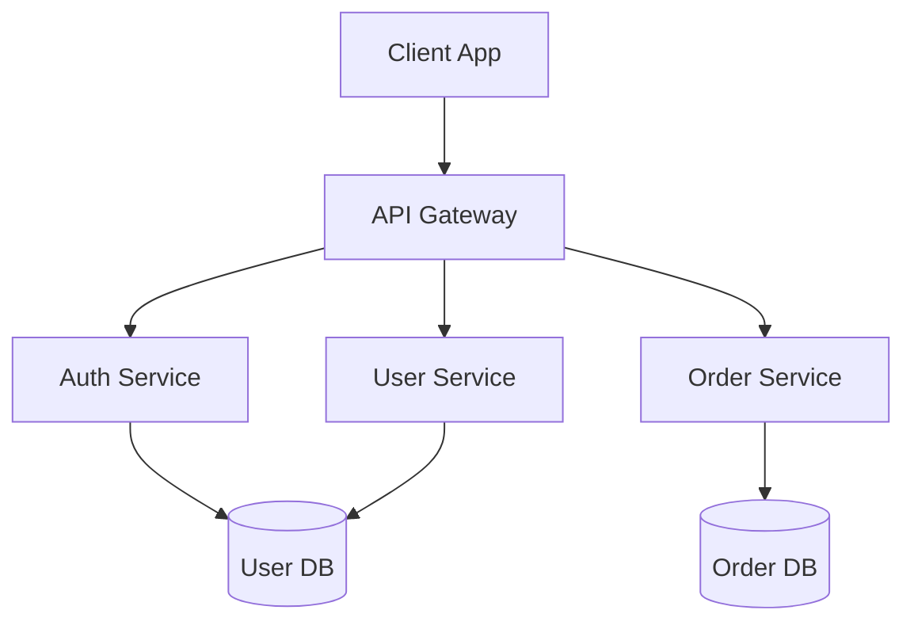

Learn from experienced users and adopt proven practices for effective reverse engineering and documentation generation.

## Table of Contents

- [Documentation Strategy](#documentation-strategy)
- [Code Preparation](#code-preparation)
- [Analysis Workflow](#analysis-workflow)
- [Output Quality](#output-quality)
- [Team Collaboration](#team-collaboration)
- [CI/CD Integration](#cicd-integration)
- [Maintenance](#maintenance)
- [Common Pitfalls](#common-pitfalls)

## Documentation Strategy

### Start with Clear Goals

**✅ Do:**
```
Define what you need before running analysis:
- Onboarding documentation for new team members?
- API documentation for external consumers?
- Compliance documentation for auditors?
- Architecture documentation for modernization?
```

**❌ Don't:**
```
Generate all documentation types "just because"
Without clear purpose, documentation becomes noise
```

**Example Goal-Oriented Approach:**

```bash
# Goal: Onboard new developer
recue --spec --use-cases --description "User authentication system"
# Focus on business logic and workflows

# Goal: Document API for partners
recue --api-contract --description "Public REST API"
# Focus on API contracts and examples

# Goal: Plan modernization
recue --spec --plan --data-model --description "Legacy order system"
# Focus on architecture and data structures
```

### Treat Generated Docs as Starting Points

**✅ Do:**
- Review and refine all generated documentation
- Add business context that code can't provide
- Include diagrams and visual aids
- Update with domain-specific terminology
- Add examples and use cases

**❌ Don't:**
- Commit generated docs without review
- Assume AI-generated content is 100% accurate
- Skip validation of technical details
- Ignore outdated or incorrect information

**Review Checklist:**

```markdown
## Documentation Review Checklist

### Accuracy
- [ ] All endpoints correctly documented
- [ ] Data types and validations accurate
- [ ] Relationships properly described
- [ ] Business rules correctly extracted

### Completeness
- [ ] All major features covered
- [ ] Error scenarios documented
- [ ] Security requirements included
- [ ] Performance characteristics noted

### Clarity
- [ ] Technical jargon explained
- [ ] Acronyms defined
- [ ] Examples provided
- [ ] Diagrams added where helpful

### Maintenance
- [ ] Regeneration process documented
- [ ] Responsible party identified
- [ ] Update schedule established
```

### Version Documentation

**✅ Do:**
```bash
# Version generated documentation
recue --spec --output "docs/v1.0/spec.md"
recue --spec --output "docs/v2.0/spec.md"

# Tag with version info
echo "Generated from codebase version: $(git rev-parse HEAD)" >> docs/spec.md

# Maintain changelog
cat >> docs/CHANGELOG.md << EOF
## Documentation v2.0 - $(date)
- Updated user authentication flows
- Added new payment endpoints
- Revised data model for orders
EOF
```

**❌ Don't:**
```
Overwrite previous documentation without backup
Lose history of how system evolved
```

## Code Preparation

### Optimize for Analysis

**Before running RE-cue, ensure your code has:**

#### 1. Clear Annotations

**✅ Good:**
```java
@RestController
@RequestMapping("/api/v1/users")
@PreAuthorize("hasRole('ADMIN')")
public class UserController {
    
    @PostMapping
    @Transactional(propagation = Propagation.REQUIRES_NEW)
    public ResponseEntity<User> createUser(
        @Valid @RequestBody CreateUserRequest request
    ) {
        // Implementation
    }
}
```

**❌ Poor:**
```java
public class UserController {
    public Object create(Object request) {
        // Implementation
    }
}
```

#### 2. Meaningful Names

**✅ Good:**
```java
public class CustomerOrderService {
    public Order placeOrder(Customer customer, List<OrderItem> items) {
        return orderRepository.save(buildOrder(customer, items));
    }
}
```

**❌ Poor:**
```java
public class Service1 {
    public Object process(Object o1, Object o2) {
        return repo.save(build(o1, o2));
    }
}
```

#### 3. Validation Annotations

**✅ Good:**
```java
public class CreateUserRequest {
    @NotNull(message = "Email is required")
    @Email(message = "Invalid email format")
    private String email;
    
    @Size(min = 8, max = 50, message = "Password must be 8-50 characters")
    @Pattern(regexp = "^(?=.*[A-Z])(?=.*\\d).*$", 
             message = "Password must contain uppercase and number")
    private String password;
}
```

**❌ Poor:**
```java
public class CreateUserRequest {
    private String email;
    private String password;
}
```

#### 4. Documentation Comments

**✅ Good:**
```java
/**
 * Creates a new customer order with payment processing.
 * 
 * <p>This endpoint handles the complete order placement workflow including:
 * <ul>
 *   <li>Inventory validation and reservation</li>
 *   <li>Payment authorization</li>
 *   <li>Order confirmation email</li>
 * </ul>
 * 
 * @param customerId The ID of the customer placing the order
 * @param request Order details including items and shipping address
 * @return Confirmed order with tracking number
 * @throws InsufficientInventoryException if items are out of stock
 * @throws PaymentDeclinedException if payment authorization fails
 */
@PostMapping("/orders")
public OrderResponse createOrder(
    @PathVariable Long customerId,
    @Valid @RequestBody CreateOrderRequest request
) {
    // Implementation
}
```

**❌ Poor:**
```java
// creates order
@PostMapping("/orders")
public OrderResponse createOrder(Long id, CreateOrderRequest req) {
    // Implementation
}
```

### Clean Up Before Analysis

**✅ Do:**
```bash
# Remove build artifacts
mvn clean
rm -rf target/ build/

# Remove generated code
rm -rf generated-sources/

# Remove vendor dependencies
rm -rf node_modules/ vendor/

# Remove test files from analysis (if desired)
# RE-cue will analyze them by default
```

**❌ Don't:**
```
Include build artifacts in analysis
Analyze generated code (reduces quality)
Include vendor libraries
```

## Analysis Workflow

### Progressive Analysis

**Start small, expand gradually:**

```bash
# Phase 1: Quick analysis to verify setup
recue --spec --path src/main/java/com/company/core/

# Phase 2: Add more documentation types
recue --spec --plan --path src/main/java/com/company/

# Phase 3: Full analysis
recue --spec --plan --data-model --use-cases --path src/

# Phase 4: Add API contracts
recue --api-contract --path src/
```

### Regular Regeneration

**Establish a regular cadence:**

```bash
# Daily: Quick spec updates
0 8 * * 1-5 cd /project && recue --spec --quiet

# Weekly: Comprehensive updates
0 8 * * 1 cd /project && recue --spec --plan --use-cases

# Monthly: Full documentation refresh
0 8 1 * * cd /project && recue --spec --plan --data-model --api-contract --use-cases
```

### Validation After Changes

**Always regenerate after significant changes:**

```bash
# After adding new features
git commit -m "feat: Add user profile management"
recue --spec --plan

# After refactoring
git commit -m "refactor: Restructure authentication module"
recue --spec --plan --data-model

# Before releases
git tag v2.0.0
recue --spec --plan --data-model --api-contract --use-cases
git add docs/
git commit -m "docs: Update documentation for v2.0.0"
```

## Output Quality

### Enhance Generated Documentation

**Add what RE-cue can't generate:**

```markdown
<!-- spec.md -->
# User Authentication System

<!-- RE-cue generates: -->
## Features
- User registration
- Login/logout
- Password reset

<!-- You should add: -->
## Business Context
This system handles authentication for our e-commerce platform,
supporting 50,000 daily active users with 99.9% uptime SLA.

## Security Considerations
- All passwords encrypted with bcrypt (cost factor: 12)
- 2FA required for administrator accounts
- Session timeout: 30 minutes of inactivity
- Failed login attempts: 5 lockout threshold

## Integration Points
- **Email Service**: SendGrid for transactional emails
- **Analytics**: Segment for user tracking
- **Monitoring**: DataDog for security alerts

## Known Limitations
- Single sign-on (SSO) not yet implemented
- Social login limited to Google and Facebook
- Password rotation policy not enforced
```

### Structure Long Documents

**Break large files into sections:**

```bash
# Instead of one huge spec.md:
docs/
├── spec/
│   ├── 01-overview.md
│   ├── 02-authentication.md
│   ├── 03-user-management.md
│   ├── 04-order-processing.md
│   └── 05-payment-integration.md
├── plan/
│   ├── architecture.md
│   ├── components.md
│   └── deployment.md
└── use-cases/
    ├── customer-flows.md
    └── admin-flows.md
```

### Add Visual Aids

**Supplement text with diagrams:**

```markdown
## System Architecture

RE-cue generated the component list, but the diagram 
provides essential visual context:



## Component Descriptions
<!-- RE-cue generated content -->
...
```

## Team Collaboration

### Establish Documentation Ownership

**✅ Do:**
```markdown
## Documentation Ownership

| Document | Owner | Reviewer | Update Frequency |
|----------|-------|----------|------------------|
| spec.md | Product Team | Tech Lead | Weekly |
| plan.md | Tech Lead | Engineering | Bi-weekly |
| data-model.md | DBA | Backend Team | Monthly |
| use-cases.md | Business Analyst | Product Team | Weekly |
| api-spec.json | API Team | Integration Team | Per release |
```

**❌ Don't:**
```
Leave documentation ownership unclear
Skip review process
Update inconsistently
```

### Code Review Integration

**Include documentation in code reviews:**

```markdown
## Pull Request Template

### Description
[Describe the changes]

### Documentation Updates
- [ ] Regenerated spec.md
- [ ] Regenerated plan.md
- [ ] Updated use-cases.md with new flows
- [ ] Refreshed API contract
- [ ] Added business context to generated docs
- [ ] Reviewed for accuracy

### Documentation Review Checklist
- [ ] All new endpoints documented
- [ ] Data model changes reflected
- [ ] Security annotations present
- [ ] Validation rules documented
- [ ] Error scenarios covered
```

### Knowledge Sharing

**Use documentation for onboarding:**

```bash
# Create onboarding package
mkdir onboarding-docs
cp re-myapp/spec.md onboarding-docs/
cp re-myapp/use-cases.md onboarding-docs/
cp re-myapp/plan.md onboarding-docs/

# Add onboarding guide
cat > onboarding-docs/README.md << 'EOF'
# New Developer Onboarding

Welcome! This documentation was generated from our codebase to help you understand the system.

## Start Here
1. Read [spec.md](spec.md) for business context
2. Review [use-cases.md](use-cases.md) for user workflows
3. Study [plan.md](plan.md) for technical architecture

## Next Steps
- Set up development environment
- Review key components in plan.md
- Walk through use cases with your mentor
- Make your first contribution

## Questions?
Contact the team in #engineering-support
EOF
```

## CI/CD Integration

### Automated Quality Checks

**Fail build if documentation is outdated:**

```yaml
# .github/workflows/docs-check.yml
name: Documentation Check

on: [pull_request]

jobs:
  check-docs:
    runs-on: ubuntu-latest
    steps:
      - uses: actions/checkout@v3
      
      - name: Generate Fresh Documentation
        uses: cue-3/re-cue/.github/actions/re-cue@v1
        with:
          generate-spec: true
          generate-plan: true
      
      - name: Check for Differences
        run: |
          if ! git diff --exit-code re-myapp/; then
            echo "❌ Documentation is out of date!"
            echo "Run 'recue --spec --plan' and commit the changes"
            exit 1
          fi
          echo "✅ Documentation is up to date"
```

### Automatic Updates on Main

**Keep main branch docs fresh:**

```yaml
# .github/workflows/docs-update.yml
name: Update Documentation

on:
  push:
    branches: [main]
    paths:
      - 'src/**'
      - 'pom.xml'

jobs:
  update-docs:
    runs-on: ubuntu-latest
    steps:
      - uses: actions/checkout@v3
      
      - name: Generate Documentation
        uses: cue-3/re-cue/.github/actions/re-cue@v1
        with:
          generate-all: true
          commit-changes: true
      
      - name: Create PR if Changes
        if: github.event_name == 'push'
        uses: peter-evans/create-pull-request@v5
        with:
          commit-message: "docs: Update generated documentation"
          title: "Update Documentation"
          body: "Automated documentation update from recent code changes"
          branch: docs-update
```

### Release Documentation

**Tag documentation with releases:**

```bash
#!/bin/bash
# release-docs.sh

VERSION=$1

# Generate comprehensive documentation for release
recue --spec --plan --data-model --api-contract --use-cases \
      --output "docs/releases/$VERSION/"

# Add version metadata
cat > "docs/releases/$VERSION/README.md" << EOF
# Documentation for Release $VERSION

**Release Date**: $(date)
**Git Commit**: $(git rev-parse HEAD)
**Generated By**: RE-cue v1.0.0

## Contents
- [Feature Specification](spec.md)
- [Implementation Plan](plan.md)
- [Data Model](data-model.md)
- [Use Cases](use-cases.md)
- [API Contract](contracts/api-spec.json)
EOF

# Commit and tag
git add docs/releases/$VERSION/
git commit -m "docs: Add documentation for release $VERSION"
git tag -a "docs-$VERSION" -m "Documentation for release $VERSION"
```

## Maintenance

### Regular Audits

**Periodically review documentation quality:**

```bash
#!/bin/bash
# audit-docs.sh

echo "Documentation Audit Report - $(date)"
echo "======================================="
echo

# Check file sizes (detect bloat)
echo "File Sizes:"
find re-myapp/ -name "*.md" -exec ls -lh {} \; | awk '{print $9, $5}'
echo

# Check last update dates
echo "Last Modified:"
find re-myapp/ -name "*.md" -exec stat -f "%Sm %N" -t "%Y-%m-%d" {} \;
echo

# Count use cases
echo "Use Case Count:"
grep -c "### UC-" re-myapp/use-cases.md
echo

# Count API endpoints
echo "API Endpoint Count:"
grep -c "## Endpoint" re-myapp/spec.md
echo

# Check for TODOs or FIXMEs
echo "Documentation TODOs:"
grep -r "TODO\|FIXME" re-myapp/
```

### Keep RE-cue Updated

**Stay current with latest version:**

```bash
# Check for updates
pip list --outdated | grep reverse-engineer

# Update to latest version
pip install --upgrade re-cue

# Test with your project
recue --spec --path ~/projects/test-project

# If successful, update production usage
```

### Archive Old Documentation

**Don't let docs accumulate:**

```bash
# Archive old versions
mkdir -p docs/archive/$(date +%Y)
mv docs/v1.* docs/archive/2024/

# Keep only recent versions in main docs/
ls -t docs/v* | tail -n +4 | xargs -I {} mv {} docs/archive/$(date +%Y)/
```

## Common Pitfalls

### Pitfall 1: Over-Generating

**❌ Problem:**
```
Generating all documentation types for every small change
Creates noise and reduces trust in documentation
```

**✅ Solution:**
```bash
# Only regenerate what's affected
# Changed API endpoints? → spec.md and api-spec.json
# Changed database? → data-model.md
# New feature? → spec.md and use-cases.md

git diff --name-only HEAD~1 | grep -q "Controller" && recue --spec
git diff --name-only HEAD~1 | grep -q "Entity" && recue --data-model
```

### Pitfall 2: Ignoring Context

**❌ Problem:**
```
Using generated docs as-is without adding business context
Results in technically accurate but business-meaningless documentation
```

**✅ Solution:**
```markdown
<!-- Add business context to generated content -->

## User Registration (RE-cue generated)

<!-- ADD BUSINESS CONTEXT: -->
**Business Driver**: Increase user acquisition by 25% through
simplified registration process.

**Compliance**: Must comply with GDPR Article 7 for consent collection.

**Success Metrics**:
- Registration completion rate > 85%
- Average registration time < 90 seconds
- Email verification rate > 70%

<!-- THEN show RE-cue generated technical details -->
```

### Pitfall 3: Stale Documentation

**❌ Problem:**
```
Generated documentation once, never updated
Documentation diverges from codebase over time
```

**✅ Solution:**
```yaml
# Set up automated reminders
# .github/workflows/docs-reminder.yml
name: Documentation Reminder

on:
  schedule:
    - cron: '0 9 * * 1'  # Every Monday at 9 AM

jobs:
  remind:
    runs-on: ubuntu-latest
    steps:
      - uses: actions/checkout@v3
      
      - name: Check Last Update
        run: |
          LAST_UPDATE=$(git log -1 --format=%cd --date=short re-myapp/)
          DAYS_OLD=$(( ($(date +%s) - $(date -d $LAST_UPDATE +%s)) / 86400 ))
          
          if [ $DAYS_OLD -gt 30 ]; then
            echo "⚠️ Documentation is $DAYS_OLD days old!"
            echo "Consider regenerating with: recue --spec --plan"
          fi
```

### Pitfall 4: No Ownership

**❌ Problem:**
```
Nobody responsible for documentation quality
Generated docs committed without review
```

**✅ Solution:**
```markdown
# CODEOWNERS
re-myapp/*.md @product-team
re-myapp/plan.md @tech-leads
re-myapp/api-spec.json @api-team
```

### Pitfall 5: Analysis of Wrong Code

**❌ Problem:**
```
Analyzing build artifacts, generated code, or test files
Results in cluttered, inaccurate documentation
```

**✅ Solution:**
```bash
# .recueignore file
target/
build/
node_modules/
generated-sources/
**/test/**
**/*Test.java
**/*.spec.ts
```

## Summary

### Key Takeaways

1. **Documentation is a starting point** - Always review and enhance generated content
2. **Prepare code for analysis** - Clear annotations and naming improve output quality
3. **Regenerate regularly** - Keep documentation in sync with code
4. **Add business context** - Supplement technical details with business knowledge
5. **Integrate with workflow** - Make documentation generation part of development process
6. **Review and validate** - Don't commit generated docs without verification
7. **Establish ownership** - Assign clear responsibility for documentation quality
8. **Automate where possible** - Use CI/CD for consistency and freshness

### Quick Checklist

Before using RE-cue in production:

- [ ] Code has clear annotations and naming
- [ ] Documentation goals defined
- [ ] Review process established
- [ ] CI/CD integration configured
- [ ] Team trained on reviewing generated docs
- [ ] Ownership assigned
- [ ] Update schedule defined
- [ ] Template customization completed (if needed)
- [ ] Initial documentation generated and reviewed
- [ ] Feedback process established

## Next Steps

- **[User Guide](./USER-GUIDE.md)** - Comprehensive feature documentation
- **[Advanced Usage](./ADVANCED-USAGE.md)** - Power user techniques
- **[Troubleshooting](../TROUBLESHOOTING.md)** - Common issues and solutions
- **[Framework Guides](../frameworks/README.md)** - Framework-specific best practices

---

**Questions?** [Create an issue](https://github.com/cue-3/re-cue/issues) or join our [discussions](https://github.com/cue-3/re-cue/discussions).
