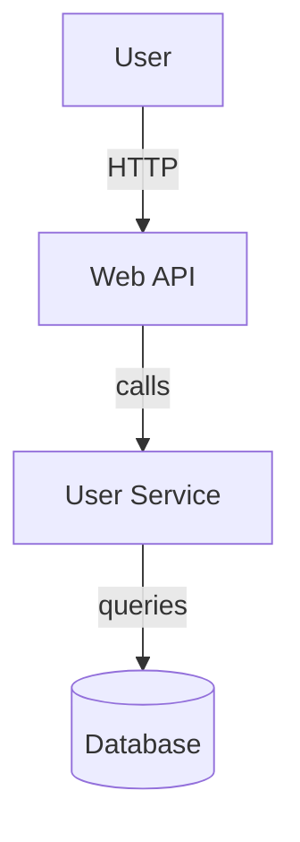

The RE-cue VS Code extension brings powerful reverse engineering capabilities directly into your editor, enabling seamless code analysis, documentation generation, and architectural insights without leaving VS Code.

## Table of Contents

- [Overview](#overview)
- [Installation](#installation)
- [Getting Started](#getting-started)
- [Core Features](#core-features)
- [Analysis Workflows](#analysis-workflows)
- [Documentation Generation](#documentation-generation)
- [Configuration](#configuration)
- [Advanced Usage](#advanced-usage)
- [Troubleshooting](#troubleshooting)

## Overview

The RE-cue VS Code extension provides:

- **Right-click Analysis**: Analyze files or folders directly from context menus
- **Side Panel Views**: Organized results for use cases, actors, boundaries, and endpoints
- **Inline Documentation**: Hover tooltips and CodeLens references
- **Auto-Update**: Keep documentation in sync with code changes
- **Multi-Language Support**: Java, Python, TypeScript, JavaScript, Ruby, and C#

### Key Benefits

- **No Context Switching**: Analyze and document without leaving VS Code
- **Interactive Exploration**: Click through analysis results to source code
- **Real-Time Updates**: Auto-analyze on save to keep documentation fresh
- **Comprehensive Views**: Multiple perspectives on your codebase architecture

## Installation

### Prerequisites

**⚠️ CRITICAL DEPENDENCY: The extension requires the RE-cue Python CLI to be installed.**

The VS Code extension provides IDE integration features (hover tooltips, CodeLens, tree views, navigation) but depends on the Python package for all analysis operations.

Before installing the extension, ensure you have:

1. **VS Code**: Version 1.80.0 or higher
2. **Python**: Version 3.6 or higher installed and accessible
3. **RE-cue Python Package**: **MUST be installed** (extension will not work without it)

#### Why Python CLI is Required

The extension architecture:
- **IDE Integration Layer** (TypeScript): Provides VS Code UI, hover, CodeLens, tree views
- **Analysis Engine** (Python): Performs actual code analysis, pattern detection, documentation generation
- **Direct Parser** (TypeScript): Parses code for hover/CodeLens without Python (limited features)

**What works without Python analysis:**
- Basic hover information from direct parsing (Java, TypeScript, JavaScript, Python)
- Code navigation
- File watching

**What requires Python CLI:**
- Complete analysis results
- Use case generation
- Actor detection
- Business context analysis
- Documentation generation
- All advanced features

#### Installing RE-cue Python Package

```bash
# From the repository root
cd reverse-engineer-python
pip install -e .

# Or using pip directly from GitHub
pip install git+https://github.com/cue-3/re-cue.git#subdirectory=reverse-engineer-python
```

Verify installation:

```bash
python3 -c "import reverse_engineer; print('RE-cue installed successfully')"
recue --version
```

### Installing the Extension

#### Option 1: From Source (Development)

1. Clone the repository:
```bash
git clone https://github.com/cue-3/re-cue.git
cd re-cue/vscode-extension
```

2. Install dependencies:
```bash
npm install
```

3. Compile the extension:
```bash
npm run compile
```

4. Launch Extension Development Host:
   - Press `F5` in VS Code
   - Or run: **Debug: Start Debugging** from Command Palette

#### Option 2: From VSIX Package

1. Download the latest `.vsix` file from releases
2. Install via command line:
```bash
code --install-extension re-cue-1.0.1.vsix
```

3. Or install via VS Code:
   - Open VS Code
   - Press `Ctrl+Shift+P` (or `Cmd+Shift+P` on macOS)
   - Run: **Extensions: Install from VSIX**
   - Select the downloaded `.vsix` file

#### Option 3: From Marketplace (Coming Soon)

Once published, install directly from the VS Code Marketplace:
1. Open Extensions view (`Ctrl+Shift+X` / `Cmd+Shift+X`)
2. Search for "RE-cue"
3. Click **Install**

### Post-Installation Setup

After installation, configure the Python path:

1. Open Settings: **File > Preferences > Settings** (or `Cmd+,` on macOS)
2. Search for "RE-cue"
3. Set **Recue: Python Path** to your Python executable:
   - macOS/Linux: `/usr/local/bin/python3` or `/usr/bin/python3`
   - Windows: `C:\Python39\python.exe`

Or add to your `settings.json`:

```json
{
  "recue.pythonPath": "/usr/local/bin/python3"
}
```

### Framework Support & Limitations

The extension inherits framework support from the Python CLI:

| Framework | Analysis Support | Direct Parsing | Hover/CodeLens |
|-----------|------------------|----------------|----------------|
| **Java Spring Boot** | ✅ Full | ✅ Yes | ✅ Full |
| **TypeScript (NestJS/Express)** | 🚧 In Development | ✅ Yes | ✅ Full |
| **JavaScript (Express/Node)** | 🚧 In Development | ✅ Yes | ✅ Full |
| **Python (Django/Flask/FastAPI)** | 🚧 In Development | ✅ Yes | ✅ Full |
| **Ruby on Rails** | ✅ Full | ❌ No | ⚠️ Python CLI only |
| **C# ASP.NET Core** | 🚧 Planned | ❌ No | ⚠️ Python CLI only |

**Direct Parsing vs Python CLI:**
- **Direct Parsing**: Fast, TypeScript-based, works for hover/CodeLens without running Python
- **Python CLI**: Complete analysis, all features, slower but comprehensive

**Limitations:**

1. **Not Standalone**: Extension cannot work without Python CLI installed
2. **Direct Parsing Languages**: Only Java, TypeScript, JavaScript, Python
3. **Ruby/C# Hover**: Falls back to Python CLI (slower, requires analysis run)
4. **Framework Detection**: Same limitations as Python CLI
5. **Large Codebases**: Background indexing may take time on first load
6. **Memory Usage**: Parsing large projects increases memory usage

### Performance Considerations

**First Analysis:**
- Background indexing builds code index (one-time, can take 30-60s for large projects)
- Python CLI analysis runs (time varies by project size)

**Subsequent Operations:**
- Hover/CodeLens: Instant (uses cached index)
- Auto-update on save: Incremental (fast)
- Re-analysis: Benefits from caching (5-6x faster)

**Optimization Tips:**
- Use `recue.parsingExclude` to skip `node_modules`, `target`, `build` directories
- Disable `recue.backgroundIndexing` if not using hover/CodeLens
- Enable `recue.enableCache` for faster repeated analysis
- Use `recue.enableParallelProcessing` for large codebases

## Getting Started

### Your First Analysis

Let's analyze a simple project:

1. **Open a Project**: Open a folder containing supported code (Java, Python, etc.)

2. **Analyze the Workspace**:
   - Press `Ctrl+Shift+P` / `Cmd+Shift+P`
   - Type: **RE-cue: Analyze Workspace**
   - Press Enter

3. **View Results**: Click the RE-cue icon in the Activity Bar (left sidebar)

4. **Explore Findings**:
   - Click on any item in the tree views
   - Navigate to source code locations
   - Review discovered use cases, actors, and endpoints

### Quick Start Example

Let's try with a Java Spring Boot project:

```java
// src/main/java/com/example/UserController.java
@RestController
@RequestMapping("/api/users")
public class UserController {
    
    @GetMapping("/{id}")
    public ResponseEntity<User> getUser(@PathVariable Long id) {
        // Implementation
    }
    
    @PostMapping
    public ResponseEntity<User> createUser(@RequestBody User user) {
        // Implementation
    }
}
```

**Steps:**

1. Right-click the file in Explorer
2. Select **RE-cue: Analyze File**
3. View the API Endpoints panel to see discovered routes
4. Check the Use Cases panel for extracted functionality

## Core Features

### 1. Context Menu Analysis

The extension adds analysis commands to right-click menus:

#### Analyze File

**Location**: Editor context menu, Explorer context menu

**Action**: Analyzes a single file

**Usage**:
1. Right-click any supported file (`.java`, `.py`, `.ts`, `.js`, `.rb`, `.cs`)
2. Select **RE-cue: Analyze File**
3. View results in the side panel

**Supported File Types**:
- Java (`.java`)
- Python (`.py`)
- TypeScript (`.ts`)
- JavaScript (`.js`)
- Ruby (`.rb`)
- C# (`.cs`)

#### Analyze Folder

**Location**: Explorer context menu

**Action**: Analyzes all supported files in a folder recursively

**Usage**:
1. Right-click any folder in Explorer
2. Select **RE-cue: Analyze Folder**
3. Wait for analysis to complete (progress shown in status bar)

**Best For**:
- Module-level analysis
- Package or namespace analysis
- Feature-focused exploration

#### Analyze Workspace

**Location**: Command Palette

**Action**: Analyzes the entire workspace

**Usage**:
1. Press `Ctrl+Shift+P` / `Cmd+Shift+P`
2. Type: **RE-cue: Analyze Workspace**
3. Press Enter

**Best For**:
- Complete project analysis
- Initial project exploration
- Full documentation generation

### 2. Side Panel Views

The extension provides five organized views in the RE-cue Activity Bar panel:

#### Analysis Results View

**Overview**: Shows high-level analysis summary

**Contents**:
- Analyzed files count
- Discovered components
- Framework detection results
- Recent analysis timestamp

**Actions**:
- Refresh results
- Clear all results
- Re-analyze files

#### Use Cases View

**Overview**: Displays extracted use cases with actors and scenarios

**Contents**:
- Use case titles
- Primary actors
- Preconditions and postconditions
- Success/failure scenarios
- Related code locations

**Actions**:
- Click to navigate to implementation
- Expand to view scenarios
- See related actors

**Example View**:
```
📋 Use Cases
  └─ 👤 User Management
      ├─ Create User Account
      ├─ Update User Profile
      └─ Delete User Account
  └─ 🔒 Authentication
      ├─ User Login
      └─ User Logout
```

#### Actors View

**Overview**: Lists discovered system actors

**Actor Types**:
- **Human Actors** (👤): End users, administrators, operators
- **System Actors** (⚙️): Internal services, modules, components
- **External Actors** (🌐): Third-party APIs, external systems

**Contents**:
- Actor name and type
- Related use cases
- Actor responsibilities
- Source locations

**Actions**:
- Filter by actor type
- View actor interactions
- Navigate to actor references

#### System Boundaries View

**Overview**: Shows detected architectural boundaries

**Contents**:
- Boundary names (e.g., Web API, Database Layer, Service Layer)
- Components within each boundary
- Boundary responsibilities
- Cross-boundary interactions

**Actions**:
- Explore boundary components
- View boundary interfaces
- Check dependency relationships

**Example View**:
```
🏛️ System Boundaries
  ├─ 🌐 Web API Layer
  │   ├─ UserController
  │   └─ OrderController
  ├─ 💼 Business Logic Layer
  │   ├─ UserService
  │   └─ OrderService
  └─ 💾 Data Access Layer
      ├─ UserRepository
      └─ OrderRepository
```

#### API Endpoints View

**Overview**: Lists all discovered REST API endpoints

**Contents**:
- HTTP method (GET, POST, PUT, DELETE, etc.)
- Endpoint path
- Request/response models
- Query parameters
- Path variables

**Actions**:
- Click to navigate to handler
- View request/response schemas
- Check authentication requirements

**Example View**:
```
🔌 API Endpoints
  ├─ GET /api/users
  ├─ GET /api/users/{id}
  ├─ POST /api/users
  ├─ PUT /api/users/{id}
  └─ DELETE /api/users/{id}
```

### 3. Inline Documentation

#### Hover Information

**Description**: Rich tooltips appear when hovering over code elements

**Triggered On**:
- API endpoint definitions
- Service classes
- Model classes
- Controller methods
- Repository interfaces

**Shows**:
- Element type and purpose
- Related use cases
- API contract details (for endpoints)
- Actor relationships

**Example**:
```java
@GetMapping("/api/users/{id}")  // ← Hover here
public ResponseEntity<User> getUser(@PathVariable Long id) { ... }
```

**Tooltip Shows**:
```
🔌 API Endpoint: GET /api/users/{id}

Retrieves user information by ID

Related Use Cases:
- View User Profile
- User Management System

Parameters:
- id (path): User identifier

Returns: User object
```

#### CodeLens References

**Description**: Inline annotations showing use case and actor references

**Appears Above**:
- Class definitions
- Method definitions
- Controller endpoints

**Shows**:
- Use case references count
- Actor references
- Clickable links to navigate

**Example**:
```java
// 2 use cases | 1 actor
@RestController
public class UserController { ... }
```

**Toggle**: Enable/disable via settings: `recue.enableCodeLens`

### 4. Auto-Update on Save

**Description**: Automatically re-analyze files when saved

**Enable**:
```json
{
  "recue.autoAnalyzeOnSave": true
}
```

**Behavior**:
- Analyzes only the saved file (incremental)
- Updates affected views
- Shows progress in status bar
- Caches results for performance

**Best For**:
- Active development
- Documentation-driven development
- Keeping analysis fresh

**Performance Tips**:
- Enable caching: `"recue.enableCache": true`
- Use for specific file types only
- Disable for very large files

## Analysis Workflows

### Workflow 1: New Project Exploration

**Goal**: Understand an unfamiliar codebase

**Steps**:

1. **Initial Scan**:
   ```
   Command Palette → RE-cue: Analyze Workspace
   ```

2. **Review System Boundaries**:
   - Open System Boundaries view
   - Identify major architectural layers
   - Understand component organization

3. **Explore Use Cases**:
   - Open Use Cases view
   - Read high-level functionality
   - Click through to implementations

4. **Check API Surface**:
   - Open API Endpoints view
   - Review available endpoints
   - Understand API design patterns

5. **Generate Documentation**:
   ```
   Command Palette → RE-cue: Generate All Documentation
   ```

6. **Review Output**:
   - Check `re-<project>/` directory
   - Read `spec.md` for overview
   - Study `diagrams.md` for visualizations

### Workflow 2: Feature Development

**Goal**: Add a new feature with proper documentation

**Steps**:

1. **Analyze Related Code**:
   - Right-click feature folder
   - Select **RE-cue: Analyze Folder**

2. **Identify Integration Points**:
   - Check System Boundaries view
   - Find related actors
   - Review existing use cases

3. **Develop Feature**:
   - Enable auto-analyze on save
   - Write code with real-time feedback

4. **Document as You Go**:
   - Use CodeLens to see use case connections
   - Verify actor relationships
   - Check API endpoint documentation

5. **Generate Feature Docs**:
   ```
   Command Palette → RE-cue: Generate Use Cases
   Command Palette → RE-cue: Generate API Contract
   ```

6. **Validate**:
   - Review generated use cases
   - Check API specification
   - Verify against requirements

### Workflow 3: Code Review Preparation

**Goal**: Prepare comprehensive review materials

**Steps**:

1. **Analyze Changed Files**:
   - Right-click modified files
   - Select **RE-cue: Analyze File**

2. **Check Impact**:
   - Review Use Cases view for affected functionality
   - Check System Boundaries for layer violations
   - Verify API Endpoints for breaking changes

3. **Generate Review Docs**:
   ```
   Command Palette → RE-cue: Generate Specification
   Command Palette → RE-cue: Generate Diagrams
   ```

4. **Create Review Package**:
   - Include generated specifications
   - Add Mermaid diagrams
   - Document architectural decisions

### Workflow 4: API Documentation

**Goal**: Generate and maintain API documentation

**Steps**:

1. **Analyze API Layer**:
   - Right-click controllers/routes folder
   - Select **RE-cue: Analyze Folder**

2. **Review Endpoints**:
   - Open API Endpoints view
   - Verify all endpoints discovered
   - Check request/response models

3. **Generate OpenAPI Spec**:
   ```
   Command Palette → RE-cue: Generate API Contract
   ```

4. **Output Location**:
   ```
   re-<project>/contracts/api-spec.json
   ```

5. **Integrate**:
   - Import to Swagger UI
   - Use in API testing tools
   - Share with frontend teams

## Documentation Generation

### Generate Specification

**Command**: `RE-cue: Generate Specification`

**Output**: `re-<project>/spec.md`

**Contents**:
- Project overview
- Feature list
- High-level requirements
- Technology stack
- System context

**Usage**:
```
Command Palette → RE-cue: Generate Specification
```

**Best For**:
- Project onboarding
- Stakeholder communication
- Requirements documentation

### Generate Implementation Plan

**Command**: `RE-cue: Generate Implementation Plan`

**Output**: `re-<project>/plan.md`

**Contents**:
- Implementation phases
- Task breakdown
- Dependencies
- Technical considerations
- Risk assessment

**Usage**:
```
Command Palette → RE-cue: Generate Implementation Plan
```

**Best For**:
- Project planning
- Sprint planning
- Technical proposals

### Generate Use Cases

**Command**: `RE-cue: Generate Use Cases`

**Output**: `re-<project>/phase4-use-cases.md`

**Contents**:
- Detailed use case descriptions
- Actors and responsibilities
- Preconditions and postconditions
- Main success scenarios
- Extension scenarios
- Related system components

**Usage**:
```
Command Palette → RE-cue: Generate Use Cases
```

**Best For**:
- Functional documentation
- Test case design
- Requirements traceability

### Generate Data Model

**Command**: `RE-cue: Generate Data Model`

**Output**: `re-<project>/data-model.md`

**Contents**:
- Entity definitions
- Relationships (one-to-many, many-to-many)
- Field types and constraints
- Database schema
- Entity diagrams (Mermaid)

**Usage**:
```
Command Palette → RE-cue: Generate Data Model
```

**Best For**:
- Database design
- ORM configuration
- Data migration planning

### Generate API Contract

**Command**: `RE-cue: Generate API Contract`

**Output**: `re-<project>/contracts/api-spec.json`

**Contents**:
- OpenAPI 3.0 specification
- Endpoint definitions
- Request/response schemas
- Authentication schemes
- Example payloads

**Usage**:
```
Command Palette → RE-cue: Generate API Contract
```

**Best For**:
- API documentation
- Frontend integration
- API testing
- Contract-first development

**Import to Swagger**:
```bash
# Serve locally with Swagger UI
docker run -p 8080:8080 \
  -e SWAGGER_JSON=/api-spec.json \
  -v $(pwd)/re-<project>/contracts:/usr/share/nginx/html \
  swaggerapi/swagger-ui
```

### Generate Diagrams

**Command**: `RE-cue: Generate Diagrams`

**Output**: `re-<project>/diagrams.md`

**Contents**:
- System context diagram
- Component diagram
- Sequence diagrams
- Entity-relationship diagrams
- Use case diagrams

**Format**: Mermaid syntax (renders in VS Code, GitHub, etc.)

**Usage**:
```
Command Palette → RE-cue: Generate Diagrams
```

**View Diagrams**:
1. Open `diagrams.md`
2. VS Code renders Mermaid automatically
3. Or use Mermaid Live Editor: https://mermaid.live

**Example Diagram**:


### Generate All Documentation

**Command**: `RE-cue: Generate All Documentation`

**Output**: Complete documentation set in `re-<project>/`

**Includes**:
- Specification
- Implementation plan
- Use cases
- Data model
- API contract
- Diagrams
- Phase analysis files

**Usage**:
```
Command Palette → RE-cue: Generate All Documentation
```

**Best For**:
- Complete project documentation
- Initial setup
- Documentation refresh
- Handoff preparation

**Typical Output Structure**:
```
your-project/
└── re-your-project/
    ├── spec.md                    # Feature specification
    ├── plan.md                    # Implementation plan
    ├── data-model.md              # Data model documentation
    ├── diagrams.md                # Visual diagrams
    ├── phase1-structure.md        # Project structure
    ├── phase2-actors.md           # Actor discovery
    ├── phase3-boundaries.md       # System boundaries
    ├── phase4-use-cases.md        # Use cases
    └── contracts/
        └── api-spec.json          # OpenAPI specification
```

## Configuration

### Settings Reference

Access settings via: **File > Preferences > Settings > Extensions > RE-cue**

Or use: `Command Palette → RE-cue: Open Settings`

#### recue.pythonPath

**Type**: `string`  
**Default**: `"python3"`

Path to Python executable for running RE-cue analysis.

**Examples**:
```json
{
  "recue.pythonPath": "/usr/local/bin/python3",
  "recue.pythonPath": "/opt/homebrew/bin/python3",
  "recue.pythonPath": "C:\\Python39\\python.exe"
}
```

**Find Your Python**:
```bash
which python3           # macOS/Linux
where python            # Windows
```

#### recue.autoAnalyzeOnSave

**Type**: `boolean`  
**Default**: `false`

Automatically analyze files when saved.

```json
{
  "recue.autoAnalyzeOnSave": true
}
```

**Recommendations**:
- Enable for small to medium projects
- Disable for large codebases
- Use with caching enabled

#### recue.outputDirectory

**Type**: `string`  
**Default**: `""` (auto-generated)

Custom output directory for generated documentation.

```json
{
  "recue.outputDirectory": "docs/generated"
}
```

**Default Behavior**: Creates `re-<project-name>/` in workspace root

#### recue.defaultFramework

**Type**: `string`  
**Default**: `"auto"`  
**Options**: `auto`, `java_spring`, `nodejs_express`, `nodejs_nestjs`, `python_django`, `python_flask`, `python_fastapi`, `ruby_rails`, `dotnet`

Default framework for analysis.

```json
{
  "recue.defaultFramework": "java_spring"
}
```

**Use Cases**:
- Override auto-detection
- Force specific framework parsing
- Handle ambiguous projects

#### recue.enableDiagnostics

**Type**: `boolean`  
**Default**: `true`

Show analysis issues as VS Code diagnostics (Problems panel).

```json
{
  "recue.enableDiagnostics": true
}
```

**Shows**:
- Missing documentation
- Incomplete use cases
- API contract issues
- Architectural violations

#### recue.enableHover

**Type**: `boolean`  
**Default**: `true`

Show inline documentation on hover.

```json
{
  "recue.enableHover": true
}
```

#### recue.enableCodeLens

**Type**: `boolean`  
**Default**: `true`

Show use case and actor references as CodeLens.

```json
{
  "recue.enableCodeLens": true
}
```

**Example CodeLens**:
```java
// 3 use cases | 2 actors ← Click to view
@Service
public class UserService { ... }
```

#### recue.verboseOutput

**Type**: `boolean`  
**Default**: `false`

Enable verbose output in the Output panel.

```json
{
  "recue.verboseOutput": true
}
```

**View Output**: **View > Output > RE-cue**

#### recue.enableCache

**Type**: `boolean`  
**Default**: `true`

Enable caching for faster repeated analysis.

```json
{
  "recue.enableCache": true
}
```

**Performance Impact**:
- Cached: ~100ms per file
- Uncached: ~1-2s per file

**Cache Location**: `.recue-cache/` in workspace

#### recue.enableParallelProcessing

**Type**: `boolean`  
**Default**: `true`

Enable parallel processing for large codebases.

```json
{
  "recue.enableParallelProcessing": true
}
```

**Recommendations**:
- Enable for projects with >100 files
- Disable if experiencing memory issues
- Adjust based on system resources

### Workspace-Specific Settings

Configure per-workspace in `.vscode/settings.json`:

```json
{
  "recue.pythonPath": "/usr/local/bin/python3",
  "recue.autoAnalyzeOnSave": true,
  "recue.outputDirectory": "docs/reverse-engineering",
  "recue.defaultFramework": "java_spring",
  "recue.enableCache": true,
  "recue.enableParallelProcessing": true,
  "recue.verboseOutput": false
}
```

### Recommended Configurations

#### Configuration 1: Rapid Development

```json
{
  "recue.autoAnalyzeOnSave": true,
  "recue.enableCache": true,
  "recue.enableHover": true,
  "recue.enableCodeLens": true,
  "recue.enableDiagnostics": true
}
```

#### Configuration 2: Large Codebase

```json
{
  "recue.autoAnalyzeOnSave": false,
  "recue.enableCache": true,
  "recue.enableParallelProcessing": true,
  "recue.enableHover": false,
  "recue.enableCodeLens": false
}
```

#### Configuration 3: Documentation Focus

```json
{
  "recue.autoAnalyzeOnSave": false,
  "recue.outputDirectory": "docs/architecture",
  "recue.enableDiagnostics": true,
  "recue.verboseOutput": false
}
```

## Advanced Usage

### Status Bar Integration

The RE-cue status bar item shows:
- Current analysis status
- Last analysis time
- Quick action menu (click to open)

**Click Actions**:
- Analyze Workspace
- Generate All Documentation
- Refresh Results
- Open Settings

### Quick Actions Menu

**Access**: `Command Palette → RE-cue: Quick Actions`

**Or**: Click RE-cue status bar item

**Menu Options**:
1. Analyze Workspace
2. Analyze Current File
3. Generate Specification
4. Generate Use Cases
5. Generate API Contract
6. Generate All Documentation
7. Refresh Results
8. Clear Results
9. Open Settings

### Keyboard Shortcuts

Define custom shortcuts in **Keyboard Shortcuts** (`Ctrl+K Ctrl+S`):

```json
{
  "key": "ctrl+shift+r a",
  "command": "recue.analyzeFile"
},
{
  "key": "ctrl+shift+r w",
  "command": "recue.analyzeWorkspace"
},
{
  "key": "ctrl+shift+r d",
  "command": "recue.generateAll"
}
```

### Output Panel

**Access**: **View > Output** → Select **RE-cue** from dropdown

**Shows**:
- Analysis progress
- Command execution logs
- Python output
- Error messages
- Performance metrics (with verbose mode)

**Enable Verbose**:
```json
{
  "recue.verboseOutput": true
}
```

### Diagnostics Panel

**Access**: **View > Problems** (`Ctrl+Shift+M` / `Cmd+Shift+M`)

**Shows**:
- Incomplete use cases
- Missing actor definitions
- API documentation issues
- Boundary violations

**Example Diagnostics**:
```
⚠ UserService.java [Line 45]: Use case "Update User" missing postconditions
ℹ UserController.java [Line 23]: API endpoint missing request schema documentation
```

### Integration with Other Extensions

#### With REST Client

Generate and test API endpoints:

1. Generate API contract:
   ```
   Command Palette → RE-cue: Generate API Contract
   ```

2. Create REST Client file:
   ```http
   ### Get User
   GET http://localhost:8080/api/users/1
   
   ### Create User
   POST http://localhost:8080/api/users
   Content-Type: application/json
   
   {
     "name": "John Doe",
     "email": "john@example.com"
   }
   ```

#### With Draw.io

Export diagrams for editing:

1. Generate diagrams:
   ```
   Command Palette → RE-cue: Generate Diagrams
   ```

2. Copy Mermaid code
3. Import to Draw.io or mermaid.live
4. Edit and export as PNG/SVG

#### With Markdown Preview

View documentation inline:

1. Generate documentation
2. Open any `.md` file in `re-<project>/`
3. Press `Ctrl+Shift+V` / `Cmd+Shift+V` for preview
4. Mermaid diagrams render automatically

## Troubleshooting

### Python Not Found

**Symptom**: Error message "Python executable not found"

**Solutions**:

1. Verify Python installation:
   ```bash
   python3 --version
   which python3
   ```

2. Set correct path in settings:
   ```json
   {
     "recue.pythonPath": "/usr/local/bin/python3"
   }
   ```

3. Add Python to PATH (Windows):
   - System Properties > Environment Variables
   - Add Python installation directory to PATH
   - Restart VS Code

### RE-cue Module Not Found

**Symptom**: Error "No module named 'reverse_engineer'"

**Solution**:

1. Install RE-cue package:
   ```bash
   cd /path/to/re-cue/reverse-engineer-python
   pip install -e .
   ```

2. Verify installation:
   ```bash
   python3 -c "import reverse_engineer; print('OK')"
   ```

3. Check Python interpreter:
   - Ensure extension uses same Python as installation
   - Update `recue.pythonPath` if needed

### No Results Showing

**Symptom**: Analysis completes but no results in side panel

**Troubleshooting**:

1. Check Output panel for errors:
   ```
   View > Output > RE-cue
   ```

2. Enable verbose output:
   ```json
   {
     "recue.verboseOutput": true
   }
   ```

3. Verify framework detection:
   - Check if project has recognizable structure
   - Set framework manually: `recue.defaultFramework`

4. Try manual analysis:
   ```bash
   cd your-project
   recue --spec --path .
   ```

5. Refresh results:
   ```
   Command Palette → RE-cue: Refresh Analysis Results
   ```

### Analysis is Slow

**Symptom**: Analysis takes several minutes

**Solutions**:

1. Enable caching:
   ```json
   {
     "recue.enableCache": true
   }
   ```

2. Enable parallel processing:
   ```json
   {
     "recue.enableParallelProcessing": true
   }
   ```

3. Analyze incrementally:
   - Right-click specific files/folders
   - Avoid full workspace analysis
   - Use auto-analyze on save for changed files only

4. Exclude large directories:
   - Add to `.gitignore` or `.vscodeignore`
   - Extension respects VS Code file exclusions

### Extension Not Activating

**Symptom**: RE-cue commands not available

**Solutions**:

1. Check activation events:
   - Open a supported file type (`.java`, `.py`, etc.)
   - Or open a workspace with recognizable project files

2. Reload window:
   ```
   Command Palette → Developer: Reload Window
   ```

3. Check extension is enabled:
   - Extensions view (`Ctrl+Shift+X`)
   - Search for "RE-cue"
   - Ensure not disabled

4. Review extension logs:
   ```
   Help > Toggle Developer Tools > Console
   ```

### Diagnostics Not Showing

**Symptom**: No issues in Problems panel

**Solution**:

1. Enable diagnostics:
   ```json
   {
     "recue.enableDiagnostics": true
   }
   ```

2. Run analysis first:
   ```
   Command Palette → RE-cue: Analyze Workspace
   ```

3. Check if issues exist:
   - Review generated documentation
   - Look for incomplete sections

### CodeLens Not Appearing

**Symptom**: No inline references showing

**Solutions**:

1. Enable CodeLens:
   ```json
   {
     "recue.enableCodeLens": true
   }
   ```

2. Check global CodeLens setting:
   ```json
   {
     "editor.codeLens": true
   }
   ```

3. Run analysis to populate data:
   ```
   Command Palette → RE-cue: Analyze File
   ```

4. Reload window:
   ```
   Command Palette → Developer: Reload Window
   ```

### Memory Issues

**Symptom**: VS Code becomes unresponsive or crashes

**Solutions**:

1. Disable parallel processing:
   ```json
   {
     "recue.enableParallelProcessing": false
   }
   ```

2. Disable auto-analyze:
   ```json
   {
     "recue.autoAnalyzeOnSave": false
   }
   ```

3. Analyze smaller scopes:
   - Single files instead of workspace
   - Specific folders instead of entire project

4. Increase VS Code memory:
   ```bash
   code --max-memory=4096
   ```

### Getting Help

If you continue to experience issues:

1. **Check Documentation**: Review this guide and the main [README](../../README.md)

2. **Search Issues**: Check [GitHub Issues](https://github.com/cue-3/re-cue/issues)

3. **Enable Verbose Output**: Gather detailed logs
   ```json
   {
     "recue.verboseOutput": true
   }
   ```

4. **Create an Issue**: Include:
   - VS Code version
   - Python version
   - RE-cue version
   - Operating system
   - Error messages from Output panel
   - Steps to reproduce

## Best Practices

### 1. Start Small

- Begin with single file analysis
- Expand to folders once familiar
- Full workspace analysis as final step

### 2. Use Incremental Analysis

- Enable auto-analyze for active development files
- Disable for entire workspace
- Manually analyze related files when needed

### 3. Leverage Caching

- Always enable caching for repeated analysis
- Clear cache when framework detection changes
- Cache improves performance 10-20x

### 4. Organize Documentation

- Use custom output directory for documentation
- Keep generated docs in version control
- Update documentation with code changes

### 5. Integrate with Workflow

- Generate specs during planning phase
- Use API contracts for frontend integration
- Update diagrams for architectural reviews

### 6. Configure Per Project

- Use workspace settings for project-specific config
- Document extension setup in project README
- Share settings with team via version control

### 7. Monitor Performance

- Enable verbose output initially
- Check analysis times in Output panel
- Adjust parallel processing based on system

### 8. Regular Documentation Updates

- Schedule periodic full documentation generation
- Keep use cases synchronized with code
- Review and update specifications quarterly

## Additional Resources

- **Main Documentation**: [RE-cue User Guides](../user-guides/)
- **Python Package**: [Reverse Engineer Python README](../../reverse-engineer-python/README.md)
- **API Reference**: [API Documentation](../api/)
- **Examples**: [Framework Guides](../frameworks/)
- **GitHub**: [RE-cue Repository](https://github.com/cue-3/re-cue)

## Contributing

Found a bug or have a feature request? Please see:
- [Contributing Guidelines](../../CONTRIBUTING.md)
- [GitHub Issues](https://github.com/cue-3/re-cue/issues)
- [Development Guide](../developer-guides/)

## License

The RE-cue VS Code extension is licensed under the MIT License. See [LICENSE](../../LICENSE) for details.
